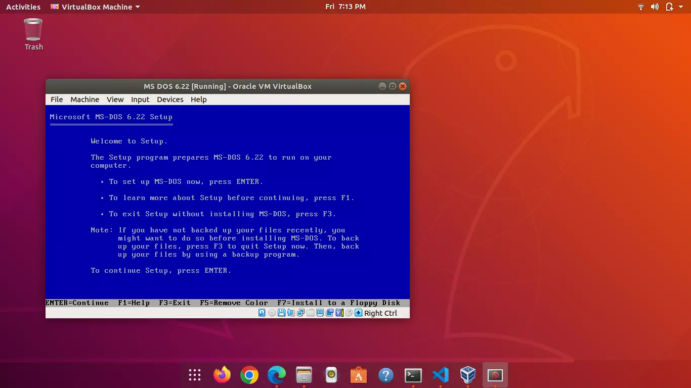

:::note

This blog post is old and may contain wrong info. I no longer use this setup.

:::

Do not worry! I am not going to start the VirtualHub website from scratch once again. Instead, this post is about the Operating System I use.<!-- truncate --> I plan to start blogging about everything I do related to VirtualHub from the start, from installing the operating system.

I plan to install a total of 5 operating systems:

- Ubuntu 18.04 (Default Gnome edition)
- Ubuntu 20.04 (Default Gnome edition)
- Ubuntu 22.04 (Default Gnome edition)
- Debian Testing (with KDE)
- Fedora Workstation (Default Gnome edition)

I will update Ubuntu 22.04 and Kubuntu 22.04 to 22.10 when the update comes. I will post about all of these - how I install them, configure them, and make them usable.

Furthermore, I am going to use Ubuntu 22.04 as my main operating system, while using others to create tutorials occasionally.

I have been thinking about doing this for a long time. I will also probably upload videos on YouTube, but no promise. Here is a picture for you:

Stay tuned!

