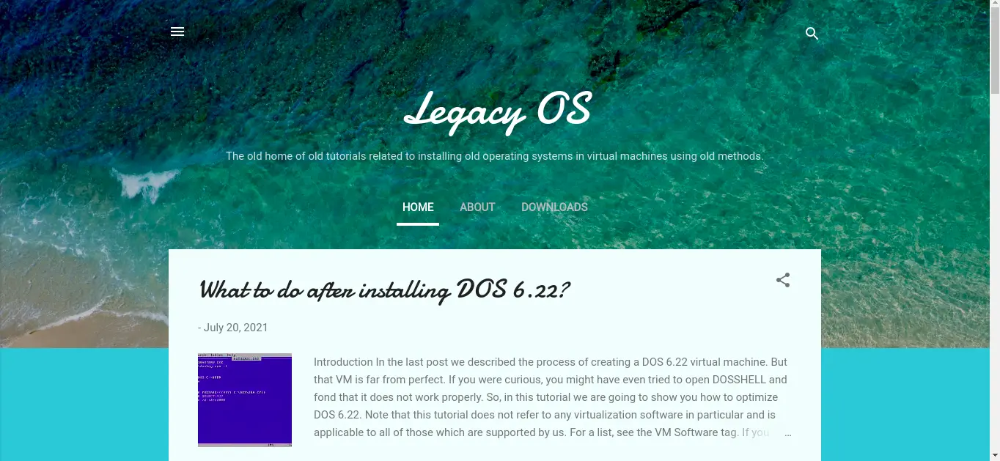
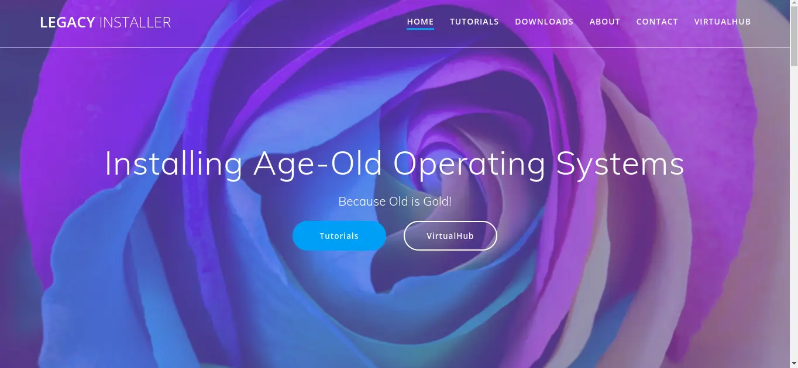
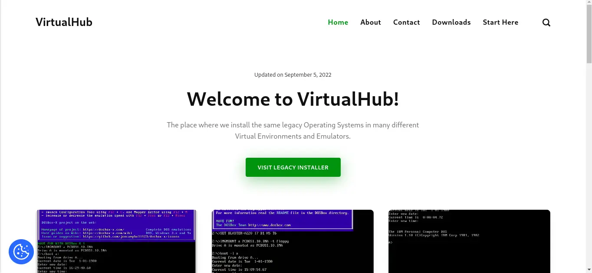
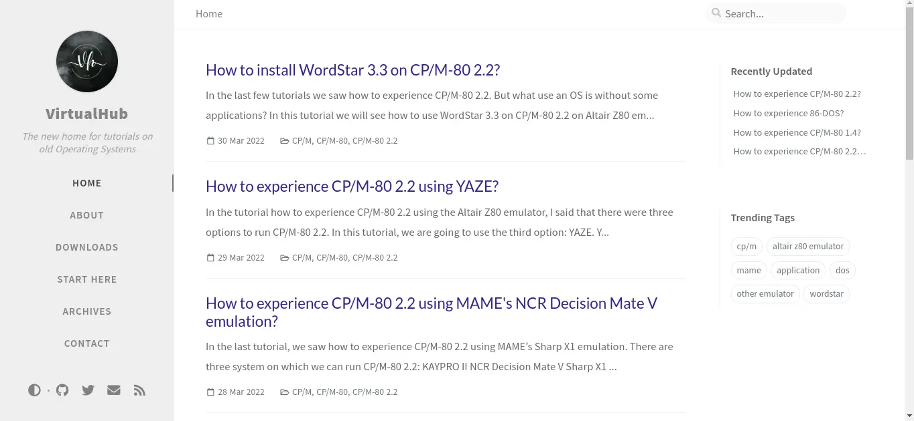

:::note

This version of VirtualHub is powered by [Docusaurus](https://docusaurus.io/). This blog post is old and may contain wrong info. No VirtualHub website use Jekyll now. The VirtualHub blog is now merged in the main VirtualHub site.

:::

Hello and Welcome to the new VirtualHub Blog experience! This new experience is a part of something big - a complete overhaul of VirtualHub.<!-- truncate --> To tell the story of this new VirtualHub, I need to tell you some history first. Once upon a time when the COVID-19 pandemic was at its peak in India, and I was trapped in my home due to lockdown, I was exploring the internet and saw something new - a [tutorial to install Windows 3.1 on VirtualBox](https://socket3.wordpress.com/2016/08/25/install-configure-ms-dos-6-22-and-windows-3-1-using-oracle-virtualbox/). This awakened my interest in old software.

## Legacy OS

I decided to start my own blog and started with [Blogger](https://www.blogger.com/) like any other novice. The blog is still available at [https://tutorialsonlegacyos.blogspot.com](https://tutorialsonlegacyos.blogspot.com), but some of the older posts now redirect to the Legacy Installer site (See below for more info).

## Legacy Installer

But like everyone, I soon grew tired of Blogger's limits. I started a new website this time using [WordPress](https://wordpress.org). It is available at [https://legacyinstaller.pcriot.com](https://legacyinstaller.pcriot.com).

## VirtualHub

### Old VirtualHub

But again, I found WordPress too slow for my liking. I started to search for alternatives and found [Publii](https://getpublii.com). The site I created using it is now available at [https://old.virtualhub.eu.org](https://old.virtualhub.eu.org). It was fast in writing and editing and the website also was very fast, but the building step took a long time even with only 30 posts, and it was nowhere close to my purpose.

Also, this version of VirtualHub was to complement the Legacy Installer website and not replace it. To know more about what I planned, see its [About page](https://old.virtualhub.eu.org/about-virtualhub/).

### NeoVirtualHub

The next alternative: Jekyll. It was fast. It built fast. I found [a theme that met my expectations](/blog/a-bit-about-your-favorite-theme.../). So, I started to port the VirtualHub website to Jekyll. You can view my work here - [https://neo.virtualhub.eu.org](https://neo.virtualhub.eu.org).

Then this happened - [A fresh start](/blog/a-fresh-start.../). It was not a success, but I got a new idea.

## The New VirtualHub experience

:::note

This version of VirtualHub is powered by [Docusaurus](https://docusaurus.io/). This blog post is old and may contain wrong info. No VirtualHub website use Jekyll now. The VirtualHub blog is now merged in the main VirtualHub site.

:::

I am happy to announce the new bunch of VirtualHub sites that complement each other. They are built using Jekyll and Hugo, and they are _fast_. These are the websites:

- [VirtualHub](https://virtualhub.eu.org) - A hub of tutorials on installing old OS.
- [VirtualHub Setup](https://setup.virtualhub.eu.org) - Set up your system for VirtualHub.
- [VirtualHub Screenshots](https://screenshots.virtualhub.eu.org) - Screenshots of old Software.
- [VirtualHub DOSBox-X](https://dosbox-x.virtualhub.eu.org) - Installing old software on DOSBox-X.
- [VirtualHub Blog](https://blog.virtualhub.eu.org) - The story about VirtualHub.

Surprised to see the last one? I told you in the beginning, this redesign is a part of something big. Now, this blog is powered by Hugo instead of Jekyll.

This is not all. I have also created YouTube channels for VirtualHub and VirtualHub Setup. The YouTube channels for VirtualHub Screencasts and VirtualHub DOSBox-X will come soon.

- [VirtualHub YouTube Channel](https://www.youtube.com/@Virtua1Hub)
- [VirtualHub Setup YouTube Channel](https://www.youtube.com/@virtualhubsetup)

Now every tutorial will be accompanied by a video.

I will use [Storj](https://www.storj.io/) to deliver large files to you.

Stay tuned for more stories about VirtualHub!
