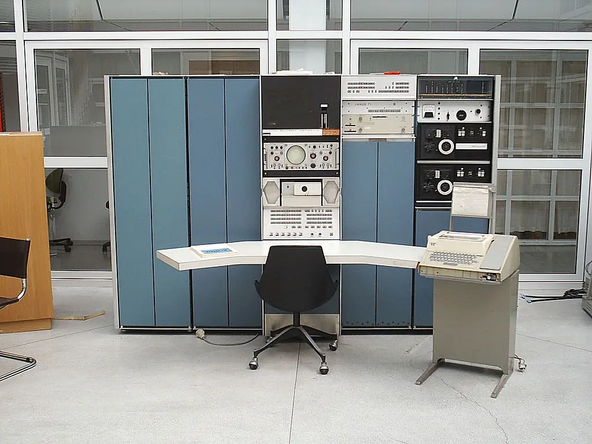

After a lot of research, I have decided to start from the 1960s instead of the 80s. No personal/microcomputer was there in the 60s, hence no personal operating system.<!-- truncate --> There were mainframe operating systems and some minicomputer operating systems.

We will not cover Mainframe operating systems here at VirtualHub. We _will_ cover Mini Computer operating systems. They will be prefixed with a "!" to denote that they are not a personal/microcomputer operating system. There are not many such operating systems. Actually, there are only 3, which I have identified to run on an emulator.

I _will_ cover some mainframe operating systems here in this blog, which I have successfully run on an emulator using instructions elsewhere. Those posts will have screenshots of the operating systems as well as links to the instructions on how to install them.

That's it.

Stay tuned!

Cover Image from [en:User:Toresbe](https://commons.wikimedia.org/wiki/File:Pdp7-oslo-2005.jpeg), [CC SA 1.0](http://creativecommons.org/licenses/sa/1.0/), via Wikimedia Commons
