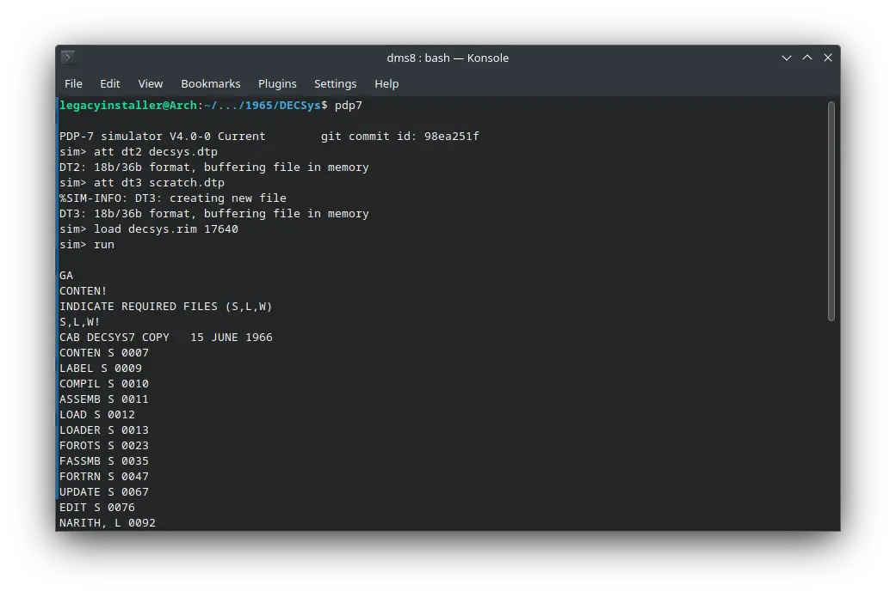

There were two operating systems of our interest which were released in the year 1965. They are ! DECSys-7 and ! 4K DMS.<!-- truncate --> Both of them can be installed on SIMH emulators. ! DECSys-7 can be used on ! PDP-7 emulator and ! 4K DMS on ! PDP-8 emulator.

I will cover them soon.

Stay tuned!
