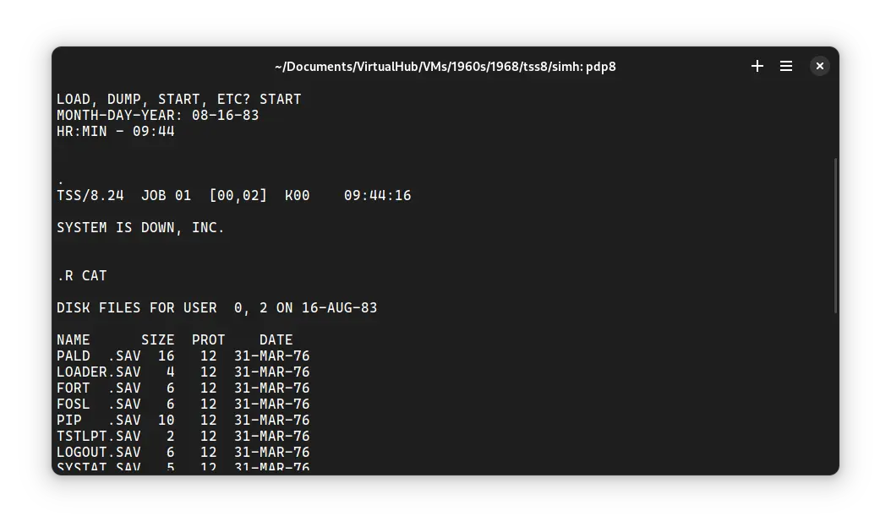

There was one operating system of our interest which was released in the year 1968. It was ! TSS/8. It can be installed on SIMH ! PDP-8 emulator.

<!-- truncate -->

I will cover it soon.

Stay tuned!
