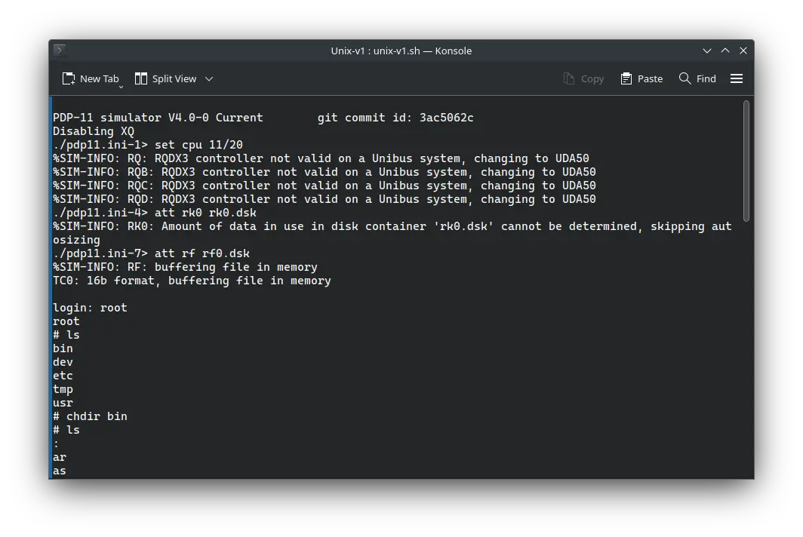

There were two operating system of our interest which was released in the year 1971. They were:

<!-- truncate -->

- ! Unix v1
- ! OS/8

Sadly, we do not have a complete copy of Unix v1, but we do have a copy with v1 [kernel](<https://en.wikipedia.org/wiki/Kernel_(operating_system)>) and v2 [userland](https://en.wikipedia.org/wiki/User_space). It can be used on SIMH PDP-11 emulator.

OS/8 can be used on SIMH PDP-8 emulator.

I will cover them soon.

Stay tuned!
