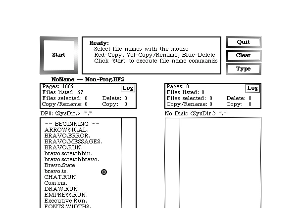

There were two operating system of our interest which was released in the year 1973. They were:

<!-- truncate -->

- Alto OS
- ! Unix v4

Alto OS can be used on the [ContrAlto](https://github.com/livingcomputermuseum/ContrAlto) emulator.

Sadly, we do not have a complete copy of Unix v4, but we do have a copy of a [kernel](<https://en.wikipedia.org/wiki/Kernel_(operating_system)>) that is from between v3 and v4. We can use that kernel with v5 [userland](https://en.wikipedia.org/wiki/User_space). It can be used on SIMH PDP-11 emulator.

I will cover them soon.

Stay tuned!
