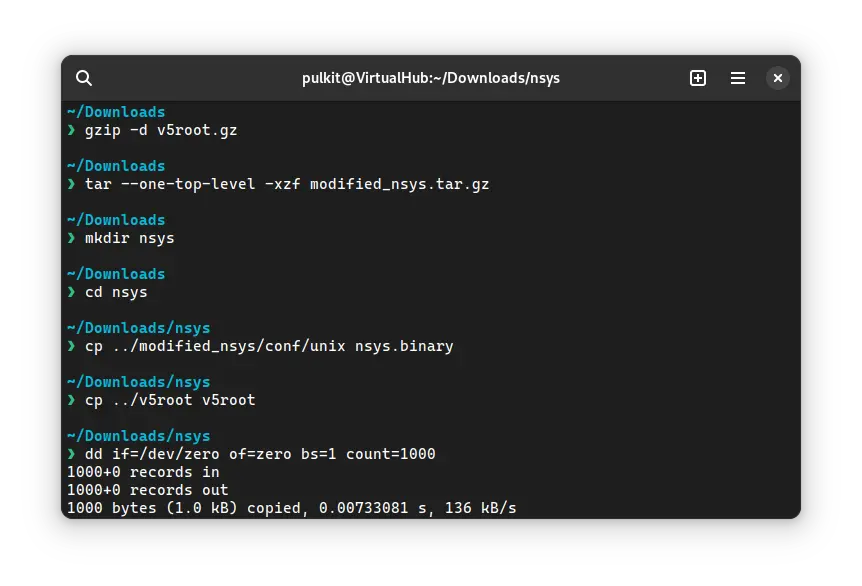

In this post, we will see how you can put the `nsys` kernel on a disk image of Unix v5.

<!-- truncate -->

This post assumes that you are running a Linux distribution. If you have not installed Linux yet, see [our tutorials on how to install Kubuntu, a beginner-friendly distro](https://setup.virtualhub.eu.org/tag/os/). If you really want to use Windows, you can use [WSL](https://learn.microsoft.com/en-us/windows/wsl/) to follow this tutorial.

:::note

You need the SIMH `pdp11` emulator for this tutorial. If you have not already installed it, follow the [VirtualHub Setup tutorial](https://setup.virtualhub.eu.org/simh-pdp11/) on how to do so.

:::

First, you need to download a Unix v5 disk image and the `nsys` kernel modified to run with Unix v5 userland.

- [Modified `nsys` kernel archive](https://www.tuhs.org/Archive/Distributions/Research/Dennis_v3/modified_nsys.tar.gz)
- [Unix v5 disk image](https://www.tuhs.org/Archive/Distributions/Research/Dennis_v5/v5root.gz)

Extract both archives, and move the file in the folder `modified_nsys/conf/` called `unix` as well as the file called `v5root` into a new folder. Rename the file called `unix` to `nsys.binary` to avoid any confusion. You can do all this with these commands:

```bash
gzip -d v5root.gz
tar --one-top-level -xzf modified_nsys.tar.gz
mkdir nsys
cd nsys
cp ../modified_nsys/conf/unix nsys.binary
cp ../v5root v5root
```

Now, we need to add a buffer to the `nsys.binary` file. You can run the following command to buffer it with zeroes:

```bash
dd if=/dev/zero of=zero bs=1 count=1000
cat zero >> nsys.binary
```

Now run `pdp11`. After the emulator has started, run the following commands:

```ini
set cpu 11/45
att rk0 v5root
att rk1 nsys.binary
boot rk0
```

You will get to a `@` prompt. Type `unix` and press enter to boot into Unix v5. Once you get a `login:` prompt, type `root` and press enter. Now we need to set up the `/dev/` entries of the disks. Run the following commands:

```bash
/etc/mknod /dev/rrk0 b 0 0
/etc/mknod /dev/rrk1 b 0 1
```

Now we will extract the `nsys` kernel. Run the following files:

```bash
dd if=/dev/rrk1 count=50 of=z
dd if=z of=nsys bs=11761 count=2
rm z
sync
```

Now press `Ctrl` + `e` to pause the emulation and then run `exit` to quit the emulator. Rename the file called `v5root` to something more appropriate, like `nsysroot`.

```bash
mv v5root nsysroot
```

That's it. Now you can use the image called `nsysroot` with the tutorial on [how to install ! Unix v4 on SIMH](/1970s/1973/unix-v4/simh/).
