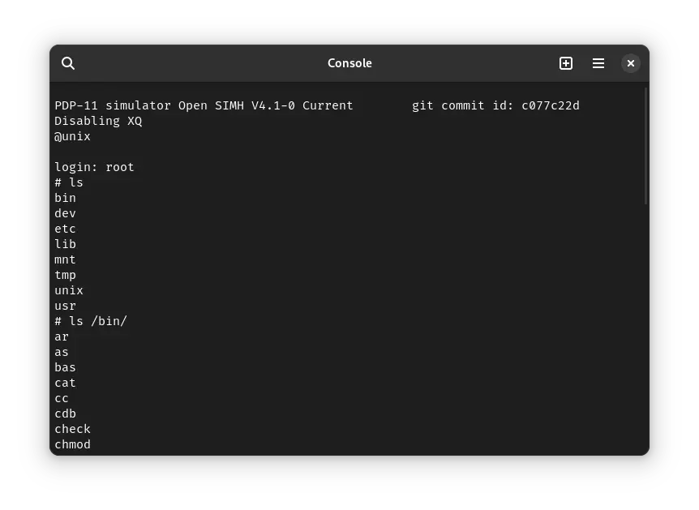

There was only one operating system of our interest, which was released in the year 1974. It was:

<!-- truncate -->

- ! Unix v5

It can be used on the SIMH PDP-11 emulator.

I will cover it soon.

Stay tuned!
