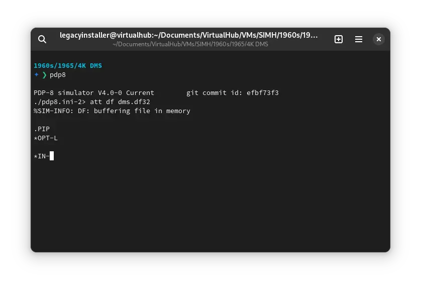
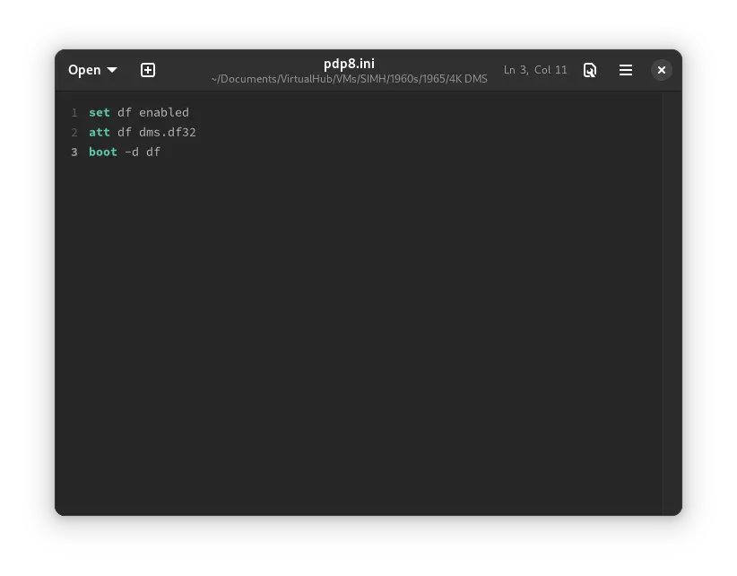
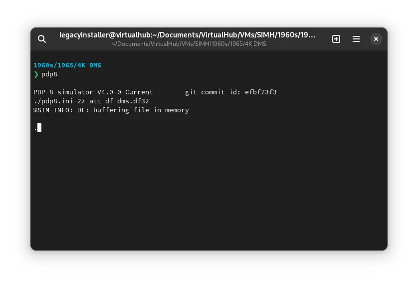
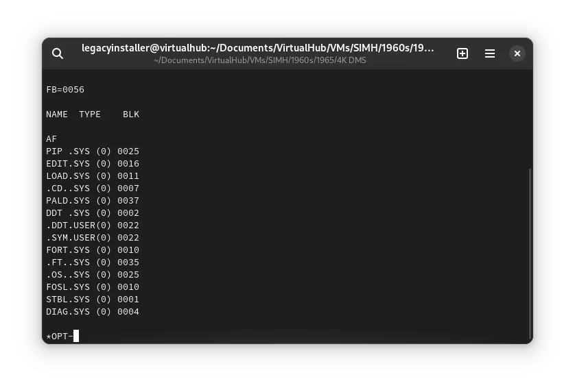

# How to install ! 4K DMS on SIMH?



We can run [! 4K DMS](/1960s/1965/4kdms) on the SIMH PDP-8 emulator. First, we need to download the ! 4K DMS kit.

## Downloads

You can download the kit needed to run ! 4K DMS on the SIMH PDP-8 emulator from the ["SIMH Legacy" website](http://simh.trailing-edge.com/):

- [! 4K DMS kit](http://simh.trailing-edge.com/kits/dms8.zip)

## Using ! 4K DMS

:::tip

If you have not already installed SIMH PDP-8 emulator, see [the VirtualHub Setup tutorial on how to do so](https://setup.virtualhub.eu.org/simh-pdp8/) on Linux and Windows.

:::

Extract the kit you downloaded. Inside you will find several files. Create a folder somewhere to store the files for this VM, and move the file named `dms.df32` into it.

Now we will create a config file for our VM. Create a text file called `pdp8.ini` with the following content in the VM folder:

```ini
set df enabled
att df dms.df32
boot -d df
```



Now open a terminal and move to the VM folder. Run the following command to start the emulator:

```bash
pdp8
```



After the emulator starts, type `PIP` and press enter. Then press `L`. You will see the following screen:


Type `S:` and press enter. It will list all the files available on the disk.



That's it! We used ! 4K DMS. We can create a shell script to make it easy to launch the VM. Create a file called `4K-DMS.sh` with the following content:

```bash
#!/bin/bash
pdp8
```

Now make the file executable:

```bash
chmod +x 4K-DMS.sh
```

Now you can start the VM using the shell script. For example, on KDE you can right-click the file and choose `Run in Konsole` or on GNOME, where you can right-click the file and choose `Run as executable`. The VM will start.

See the [manuals section](/1960s/1965/4kdms/#manuals) on the [main ! 4K DMS page](/1960s/1965/4kdms/) to learn how to use it.

### Windows

:::tip

You should use Linux. If you don’t know how to install a Linux distro, see [our tutorials on how to install Kubuntu](https://setup.virtualhub.eu.org/tag/os/), a beginner-friendly distro.

:::

On Windows, you need to place the `PDP8.exe` file you downloaded in [this tutorial](https://setup.virtualhub.eu.org/simh-pdp8#windows) in the VM folder. Then you can follow the above tutorial as usual. The shell script will not work on Windows. You need to rename it to `4K-DMS.bat`. Then you can double-click the file to launch the VM, no need to make it executable.

## Credits

- The disk image and other files used above are from a kit available on [SimH "Classic" website](http://simh.trailing-edge.com/).

## Video tutorial

Do you want to follow the tutorial by watching a video? Here it is:

<iframe width="560" height="315" src="https://www.youtube-nocookie.com/embed/j-EA1iLc02Y?si=TYw9Wmd05zw2EDer" title="YouTube video player" frameborder="0" allow="accelerometer; autoplay; clipboard-write; encrypted-media; gyroscope; picture-in-picture; web-share" allowfullscreen></iframe>

<hr/>

Archives of this tutorial are available on [Wayback Machine](https://web.archive.org/web/*/https://virtualhub.eu.org/1960s/1965/4kdms/simh/).
