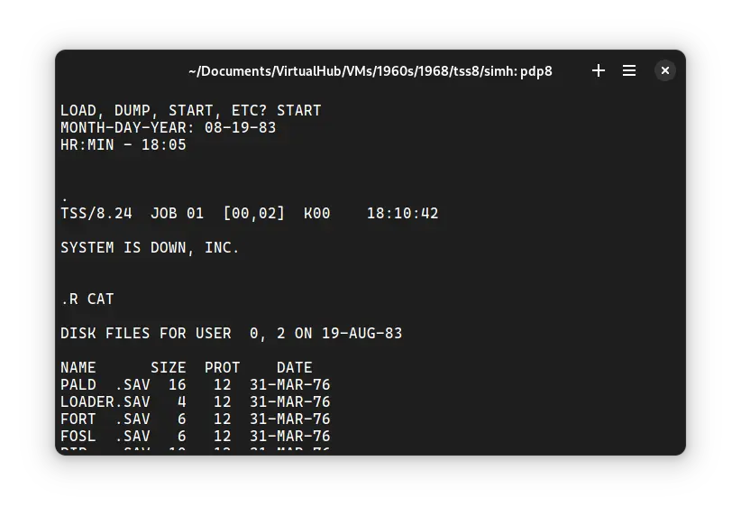
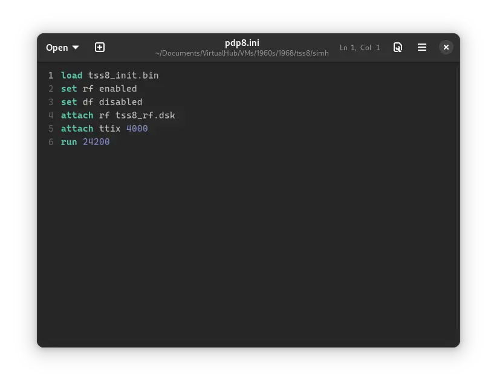
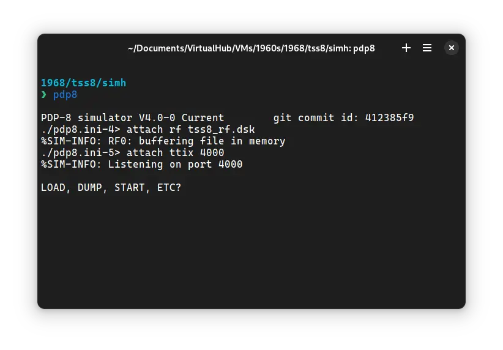
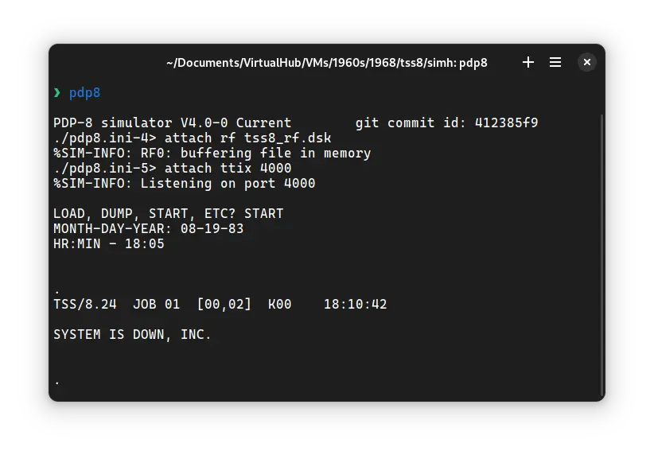
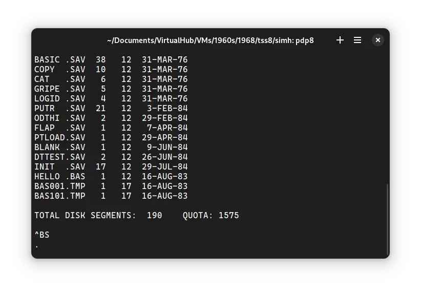

# How to install ! TSS/8 on SIMH?



We can run [! TSS/8](/1960s/1968/tss8) on the SIMH PDP-8 emulator. First, we need to download the ! TSS/8 kit.

## Downloads

You can download the kit needed to run ! TSS/8 on the SIMH PDP-8 emulator from the ["SIMH Legacy" website](http://simh.trailing-edge.com/):

- [! TSS/8 kit](http://simh.trailing-edge.com/kits/tss8.zip)

## Using ! TSS/8

:::tip

If you have not already installed SIMH PDP-8 emulator, see [the VirtualHub Setup tutorial on how to do so](https://setup.virtualhub.eu.org/simh-pdp8/) on Linux and Windows.

:::

Extract the kit you downloaded. Inside you will find several files. Create a folder somewhere to store the files for this VM and move the files named `tss8_init.bin` and `tss8_rf.dsk` into it.

Now we will create a config file for our VM. Create a text file called `pdp8.ini` with the following content in the VM folder:

```ini
load tss8_init.bin
set rf enabled
set df disabled
attach rf tss8_rf.dsk
attach ttix 4000
run 24200
```



Now open a terminal and move to the VM folder. Run the following command to start the emulator:

```bash
pdp8
```



After the emulator starts, type `START` and press enter. When asked, enter the date in `MM-DD-YY` format. Year should be between 74 and 85. Then enter time in `HH:MM` 24-hour format.

Press enter until you get a `.` prompt. Then type the following:

```bash
LOGIN 2 LXHE
```

There will be no output on screen as you type this, but it is being typed. Press enter after you are done. Here, 2 is the username and `LXHE` is the password. There are other users too. You can learn about them from Manuals and site listed below. Finally, you will get to this screen:



Type `R CAT` and press enter. It will list all the files available on the disk.



That's it! We used ! TSS/8. We can create a shell script to make it easy to launch the VM. Create a file called `TSS8.sh` with the following content:

```bash
#!/bin/bash
pdp8
```

Now make the file executable:

```bash
chmod +x TSS8.sh
```

Now you can start the VM using the shell script. For example, on KDE you can right-click the file and choose `Run in Konsole` or on GNOME, where you can right-click the file and choose `Run as executable`. The VM will start.

See the [manuals section](/1960s/1968/tss8/#manuals) on the [main ! TSS/8 page](/1960s/1968/tss8/) and [this website](https://raymii.org/s/articles/Running_TSS_8_on_the_DEC_PiDP-8_i_and_SIMH.html) to learn how to use it.

### Windows

:::tip

You should use Linux. If you don’t know how to install a Linux distro, see [our tutorials on how to install Kubuntu](https://setup.virtualhub.eu.org/tag/os/), a beginner-friendly distro.

:::

On Windows, you need to place the `PDP8.exe` file you downloaded in [this tutorial](https://setup.virtualhub.eu.org/simh-pdp8#windows) in the VM folder. Then you can follow the above tutorial as usual. The shell script will not work on Windows. You need to rename it to `TSS8.bat`. Then you can double-click the file to launch the VM, no need to make it executable.

## Credits

- The disk image and other files used above are from a kit available on [SimH "Classic" website](http://simh.trailing-edge.com/).

## Video tutorial

Do you want to follow the tutorial by watching a video? Here it is:

<iframe width="560" height="315" src="https://www.youtube-nocookie.com/embed/yzhpLOdqkJ8?si=TYw9Wmd05zw2EDer" title="YouTube video player" frameborder="0" allow="accelerometer; autoplay; clipboard-write; encrypted-media; gyroscope; picture-in-picture; web-share" allowfullscreen></iframe>

<hr/>

Archives of this tutorial may be available on [Wayback Machine](https://web.archive.org/web/*/https://virtualhub.eu.org/1960s/1968/tss8/simh/).
