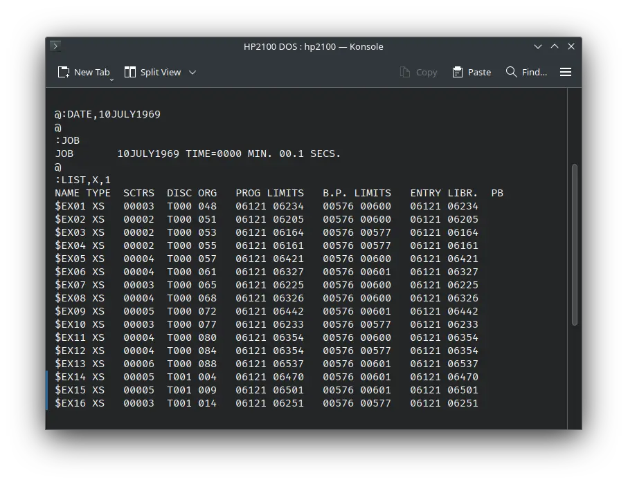
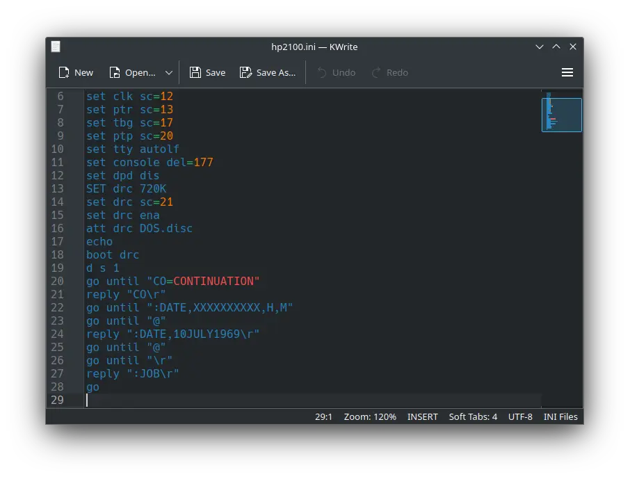
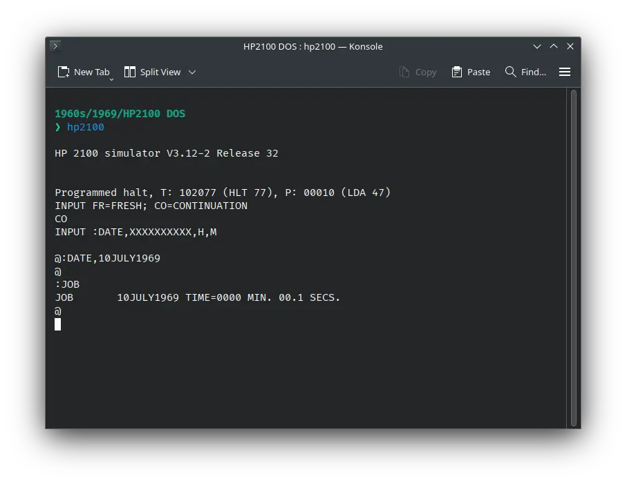

# How to install ! HP 2100 DOS on SIMH?



We can run [! HP 2100 DOS](/1960s/1969/hp2100dos) on the SIMH HP 2100 emulator. First, we need to download the ! HP 2100 DOS kit.

## Downloads

You can download the kit needed to run ! HP 2100 DOS on the SIMH HP 2100 emulator from the ["SIMH Legacy" website](http://simh.trailing-edge.com/):

- [! HP 2100 DOS kit](http://simh.trailing-edge.com/kits/DOS.zip)

## Using ! HP 2100 DOS

:::tip

If you have not already installed SIMH HP 2100 emulator, see [the VirtualHub Setup tutorial on how to do so](https://setup.virtualhub.eu.org/simh-hp2100/) on Linux and Windows.

:::

Extract the kit you downloaded. Inside you will find several files. Create a folder somewhere to store the files for this VM and move the file named `DOS.disc` into it.

Now we will create a config file for our VM. Create a text file called `hp2100.ini` with the following content in the VM folder:

```ini
set cpu 2116
set cpu 32k
SET CPU EAU
SET MP ena
set tty sc=11
set clk sc=12
set ptr sc=13
set tbg sc=17
set ptp sc=20
set tty autolf
set console del=177
set dpd dis
SET drc 720K
set drc sc=21
set drc ena
att drc DOS.disc
echo
boot drc
d s 1
go until "CO=CONTINUATION"
reply "CO\r"
go until ":DATE,XXXXXXXXXX,H,M"
go until "@"
reply ":DATE,10JULY1969\r"
go until "@"
go until "\r"
reply ":JOB\r"
go
```



Now open a terminal and move to the VM folder. Run the following command to start the emulator:

```bash
hp2100
```



After the emulator starts, type `:LIST,X,1` and press enter. It will list all the files available on the disk.


That's it! We used ! HP 2100 DOS. We can create a shell script to make it easy to launch the VM. Create a file called `HP-2100-DOS.sh` with the following content:

```bash
#!/bin/bash
hp2100
```

Now make the file executable:

```bash
chmod +x HP-2100-DOS.sh
```

Now you can start the VM using the shell script. For example, on KDE you can right-click the file and choose `Run in Konsole` or on GNOME, where you can right-click the file and choose `Run as executable`. The VM will start.

See the [manuals section](/1960s/1969/hp2100dos/#manuals) on the [main ! HP 2100 DOS page](/1960s/1969/hp2100dos/) to learn how to use it.

### Windows

:::tip

You should use Linux. If you don’t know how to install a Linux distro, see [our tutorials on how to install Kubuntu](https://setup.virtualhub.eu.org/tag/os/), a beginner-friendly distro.

:::

On Windows, you need to place the `hp2100.exe` file you downloaded in [this tutorial](https://setup.virtualhub.eu.org/simh-hp2100#windows) in the VM folder. Then you can follow the above tutorial as usual. The shell script will not work on Windows. You need to rename it to `HP-2100-DOS.bat`. Then you can double-click the file to launch the VM, no need to make it executable.

## Credits

- The disk image and other files used above are from a kit available on [SimH "Classic" website](http://simh.trailing-edge.com/).

## Video tutorial

Do you want to follow the tutorial by watching a video? We will post a video on our [YouTube channel](https://www.youtube.com/@virtua1hub) soon.

Archives of this tutorial are available on [Wayback Machine](https://web.archive.org/web/*/https://virtualhub.eu.org/1960s/1969/hp2100dos/simh/).
