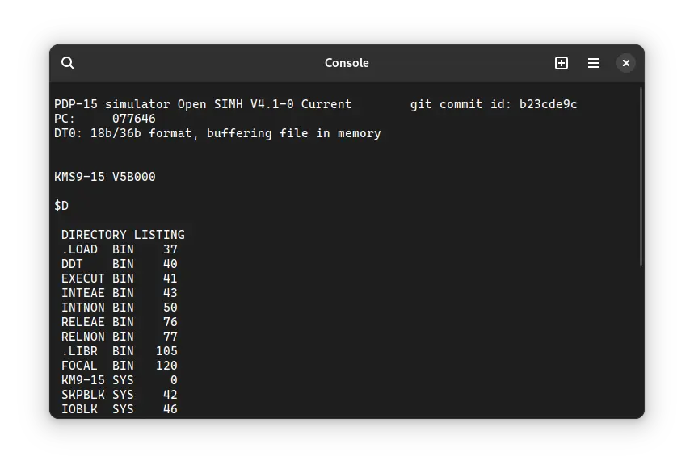

import DocCardList from '@theme/DocCardList';

# ! ADSS-15

! ADSS-15 (PDP-**15** **Ad**vanced **S**oftware **S**ystem) was an operating system for the DEC PDP-15 computer. We can run it in the SIMH PDP-15 emulator.

<DocCardList />

## Manuals

You can download the ! ADSS-15 manual from here:

- [! ADSS-15 Programmer's Reference Manual](http://www.bitsavers.org/pdf/dec/pdp15/DEC-15-MR2B-D_AdvMonPgmRef.pdf)

You may also be interested in the PDP-15 manuals. It was the computer on which ! ADSS-15 was supposed to run. You can download them from Bitsavers:

- [PDP-15 Manuals](http://www.bitsavers.org/pdf/dec/pdp15/)

## Related Pages

- [VirtualHub Screenshots](https://screenshots.virtualhub.eu.org/1970s/1970/adss-15/)
- [Wikipedia PDP-15 page](https://en.wikipedia.org/wiki/PDP-15)
- [Computer History Wiki PDP-15 page](http://gunkies.org/wiki/PDP-15)

## Credits

- The manuals were taken from [Bitsavers](http://bitsavers.org).
