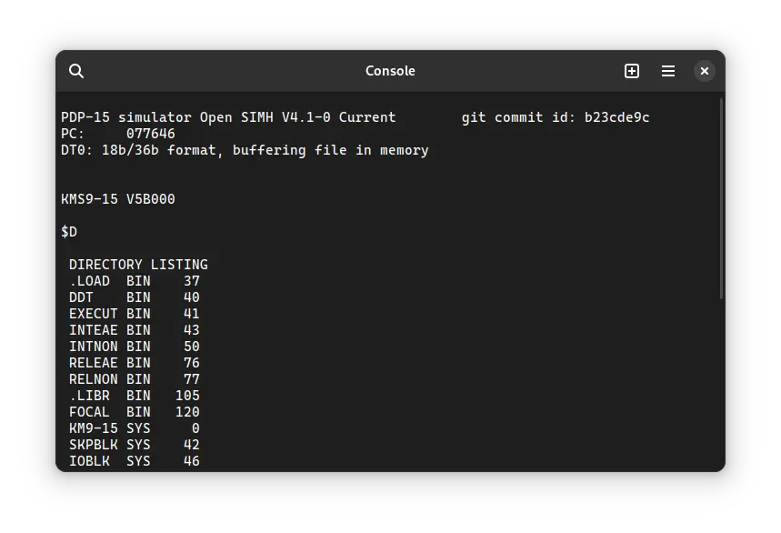
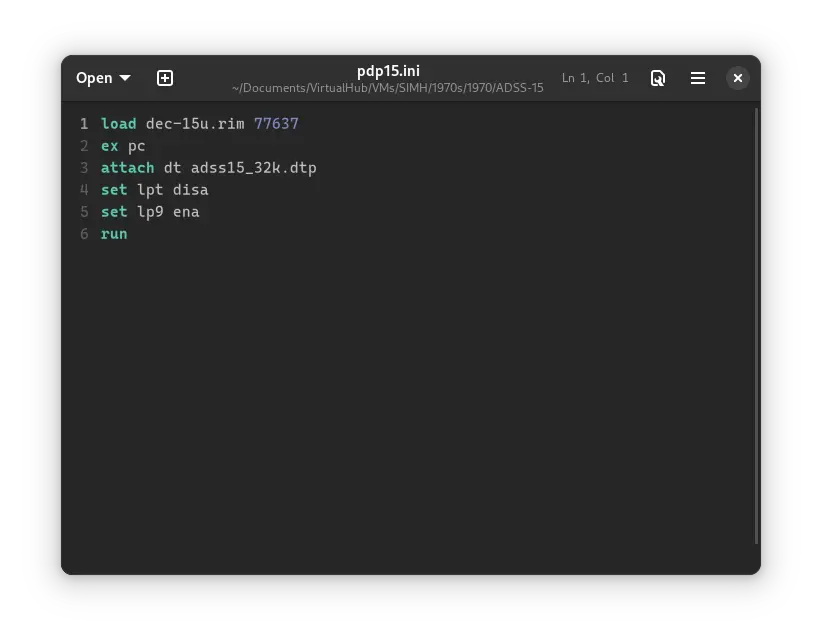
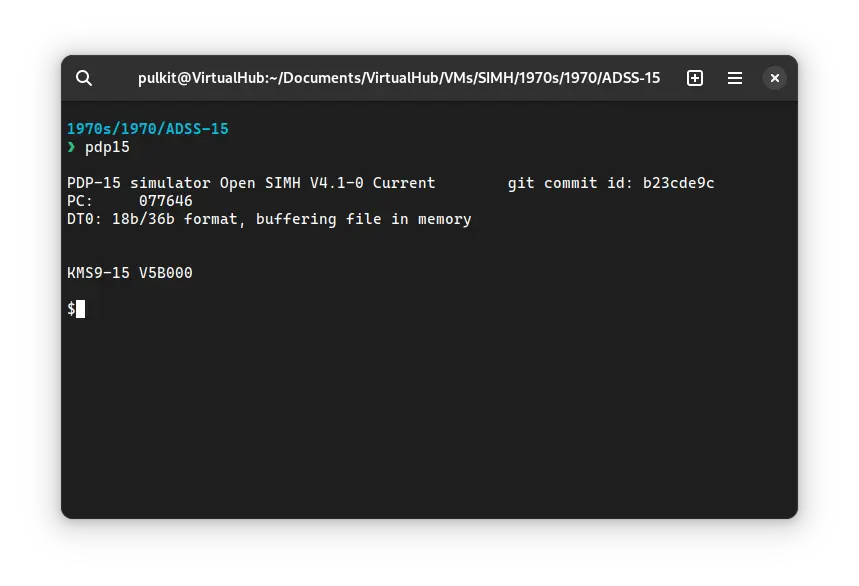

# How to install ! ADSS-15 on SIMH?



We can run [! ADSS-15](/1970s/1970/adss-15) on the SIMH PDP-15 emulator. First, we need to download the ! ADSS-15 kit.

## Downloads

You can download the kit needed to run ! ADSS-15 on the SIMH PDP-15 emulator from the ["SIMH Legacy"](http://simh.trailing-edge.com/) website:

- [! ADSS-15 kit](http://simh.trailing-edge.com/kits/adss15.zip)

## Using ! ADSS-15

:::tip

If you have not already installed SIMH PDP-15 emulator, see [the VirtualHub Setup tutorial on how to do so](https://setup.virtualhub.eu.org/simh-pdp15/) on Linux and Windows.

:::

Extract the kit you downloaded. Inside you will find several files. Create a folder somewhere to store the files for this VM and move those two files named `adss15_32k.dtp` and `dec-15u.rim` into it.

Now we will create a config file for our VM. Create a text file called `pdp15.ini` with the following content in the VM folder:

```ini
load dec-15u.rim 77637
ex pc
attach dt adss15_32k.dtp
set lpt disa
set lp9 ena
run
```



Now open a terminal and move to the VM folder. Run the following command to start the emulator:

```bash
pdp15
```



After the emulator starts, you can enter `D` to see the list of files:


That's it! We used ! ADSS-15. We can create a shell script to make it easy to launch the VM. Create a file called `adss-15.sh` with the following content:

```bash
#!/bin/bash
pdp15
```

Now make the file executable:

```bash
chmod +x adss-15.sh
```

Now you can start the VM using the shell script. For example, on KDE you can right-click the file and choose `Run in Konsole` or on GNOME, where you can right-click the file and choose `Run as executable`. The VM will start.

See the [manuals section](/1970s/1970/adss-15/#manuals) on the [main ! ADSS-15 page](/1970s/1970/adss-15) to learn how to use it.

### Windows

:::tip

You should use Linux. If you don’t know how to install a Linux distro, see [our tutorials on how to install Kubuntu](https://setup.virtualhub.eu.org/tag/os/), a beginner-friendly distro.

:::

On Windows, you need to place the `PDP15.exe` file you downloaded in [this tutorial](https://setup.virtualhub.eu.org/simh-pdp15#windows) in the VM folder. Then you can follow the above tutorial as usual. The shell script will not work on Windows. You need to rename it to `adss-15.bat`. Then you can double-click the file to launch the VM, no need to make it executable.

## Credits

- The disk image and other files used above are from a kit available on [SimH “Classic” website](http://simh.trailing-edge.com/).

## Video tutorial

Do you want to follow the tutorial by watching a video? We will post a video on our [YouTube channel](https://www.youtube.com/@virtua1hub) soon.

Archives of this tutorial are available on [Wayback Machine](https://web.archive.org/web/*/https://virtualhub.eu.org/1970s/1970/adss-15/simh/).
