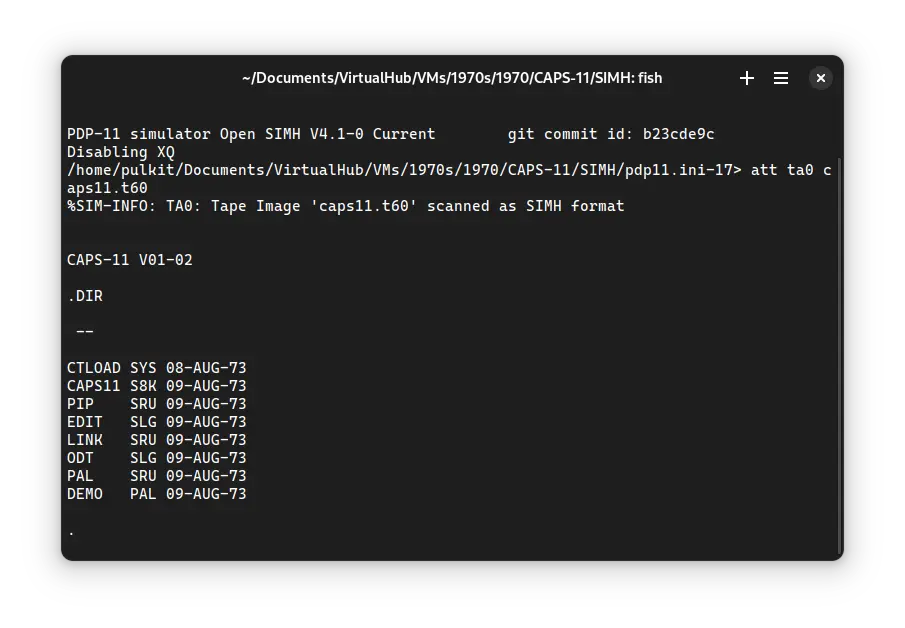

import DocCardList from '@theme/DocCardList';

# ! CAPS-11

! CAPS-11 (**Ca**ssette **P**rogramming **S**ystem) was an operating system for the DEC PDP-11 computer. It is one of the earliest available operating system to be run on a PDP-11.

<DocCardList />

## Manuals

You can download the ! CAPS-11 manual from here:

- [! CAPS-11 User Guide](http://www.bitsavers.org/pdf/dec/pdp11/caps-11/DEC-11-OTUGA-A-D_CAPS-11_Users_Guide_Oct73.pdf)

You may also be interested in the PDP-11 manuals. It was the computer on which ! CAPS-11 was supposed to run. You can download them from Bitsavers:

- [PDP-11 Manuals](http://bitsavers.org/pdf/dec/pdp11/)

## Related Pages

- [VirtualHub Screenshots](https://screenshots.virtualhub.eu.org/1970s/1970/caps-11/)
- [Wikipedia](https://en.wikipedia.org/wiki/PDP-11#Operating_systems)
- [A third-party PDP-11 + CAPS-11 restoration bog post (with a YouTube video)](http://www.datormuseum.se/computers/digital-equipment-corporation/pdp-11-04.html)

## Credits

- The manuals were taken from [Bitsavers](http://bitsavers.org).
