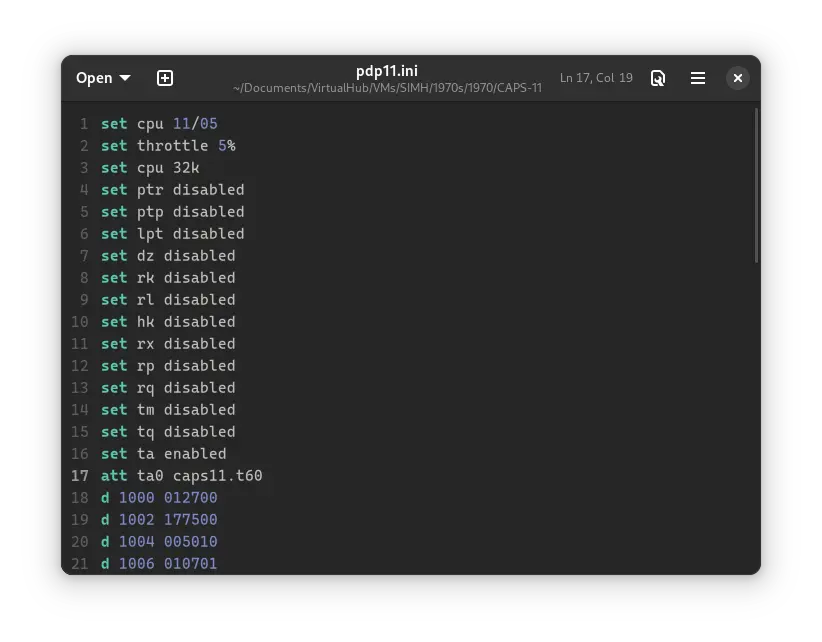

# How to install ! CAPS-11 on SIMH?


We can run [! CAPS-11](/1970s/1970/caps-11) on the SIMH PDP-11 emulator. First, we need to download the ! CAPS-11 kit.

## Downloads

You can download the kit needed to run ! CAPS-11 on the SIMH PDP-11 emulator from the [“SIMH Legacy” website](http://simh.trailing-edge.com/):

- [! CAPS-11 kit](http://simh.trailing-edge.com/kits/caps11_system.zip)

## Using ! CAPS-11

:::tip

If you have not already installed SIMH PDP-11 emulator, see [the VirtualHub Setup tutorial on how to do so](https://setup.virtualhub.eu.org/simh-pdp11/) on Linux and Windows.

:::

Extract the kit you downloaded. Inside you will find two files. Create a folder somewhere to store the files for this VM, and move the file named `caps11.t60` into it.

Now we will create a config file for our VM. Create a text file called `pdp11.ini` with the following content in the VM folder:

```ini
set cpu 11/05
set throttle 5%
set cpu 32k
set ptr disabled
set ptp disabled
set lpt disabled
set dz disabled
set rk disabled
set rl disabled
set hk disabled
set rx disabled
set rp disabled
set rq disabled
set tm disabled
set tq disabled
set ta enabled
att ta0 caps11.t60
d 1000 012700
d 1002 177500
d 1004 005010
d 1006 010701
d 1010 062701
d 1012 000052
d 1014 012702
d 1016 000375
d 1020 112103
d 1022 112110
d 1024 100413
d 1026 130310
d 1030 001776
d 1032 105202
d 1034 100772
d 1036 116012
d 1040 000002
d 1042 120337
d 1044 000000
d 1046 001767
d 1050 000000
d 1052 000755
d 1054 005710
d 1056 100774
d 1060 005007
d 1062 017640
d 1064 002415
d 1066 112024
d sr 0
run 1000
```



Now open a terminal and move to the VM folder. Run the following command to start the emulator:

```bash
pdp11
```


After the emulator starts, you can type `dir` followed by enter. It will list all the files available on the disk.


That's it! We used ! CAPS-11. We can create a shell script to make it easy to launch the VM. Create a file called `caps-11.sh` with the following content:

```bash
#!/bin/bash
pdp11
```

Now make the file executable:

```bash
chmod +x caps-11.sh
```

Now you can start the VM using the shell script. For example, on KDE you can right-click the file and choose `Run in Konsole` or on GNOME, where you can right-click the file and choose `Run as executable`. The VM will start.

See the [manuals section](/1970s/1970/caps-11/#manuals) on the [main ! CAPS-11 page](/1970s/1970/caps-11) to learn how to use it.

### Windows

:::tip

You should use Linux. If you don’t know how to install a Linux distro, see [our tutorials on how to install Kubuntu](https://setup.virtualhub.eu.org/tag/os/), a beginner-friendly distro.

:::

On Windows, you need to place the `PDP11.exe` file you downloaded in [this tutorial](https://setup.virtualhub.eu.org/simh-pdp11#windows) in the VM folder. Then you can follow the above tutorial as usual. The shell script will not work on Windows. You need to rename it to `caps-11.bat`. Then you can double-click the file to launch the VM, no need to make it executable.

## Credits

- The disk image and other files used above are from a kit available on [SimH “Classic” website](http://simh.trailing-edge.com/).

## Video tutorial

Do you want to follow the tutorial by watching a video? We will post a video on our [YouTube channel](https://www.youtube.com/@virtua1hub) soon.

Archives of this tutorial are available on [Wayback Machine](https://web.archive.org/web/*/https://virtualhub.eu.org/1970s/1970/caps-11/simh/).
