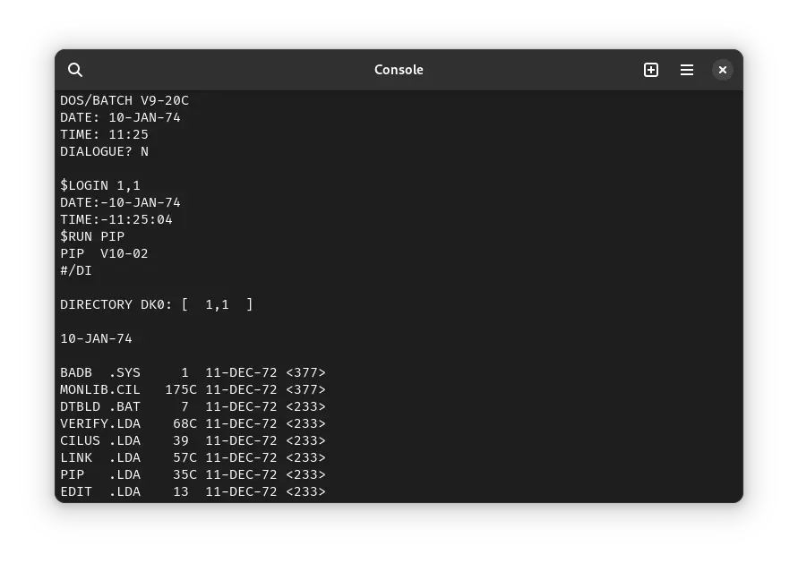

import DocCardList from '@theme/DocCardList';

# ! DOS-11

! DOS-11 (**D**isk **O**perating **S**ystem - 11) was an operating system for the DEC PDP-11 computer. It has no relation with MS-DOS/PC-DOS other than the fact that all of them are **_disk_** operating systems. We can run DOS-11 on SIMH.

<DocCardList />

## Manuals

You can download the ! DOS-11 Handbook from here (it is broken into several PDFs):

- [! DOS-11 Handbook](http://www.bitsavers.org/pdf/dec/pdp11/dos-batch/V9/DosBatchHandbook_v9_Apr74/)

There are many other additional DOS-11 manuals on Bitsavers:

- [Other DOS-11 Manuals](http://www.bitsavers.org/pdf/dec/pdp11/dos-batch/)

You may also be interested in the PDP-11 manuals. It was the computer on which ! DOS-11 was supposed to run. You can download them from Bitsavers:

- [PDP-11 Manuals](http://bitsavers.org/pdf/dec/pdp11/)

## Related Pages

- [! DOS-11 Wikipedia page](https://en.wikipedia.org/wiki/DEC_BATCH-11/DOS-11)
- [PDP-11 Wikipedia page](https://en.wikipedia.org/wiki/PDP-11)
- [Computer History Wiki ! DOS-11 page](https://gunkies.org/wiki/DOS-11)
- [A third-party tutorial (on which our tutorial is based)](http://iamvirtual.ca/PDP-11/DOS-11/Install.htm)

## Credits

- The manuals were taken from [Bitsavers](http://bitsavers.org).
