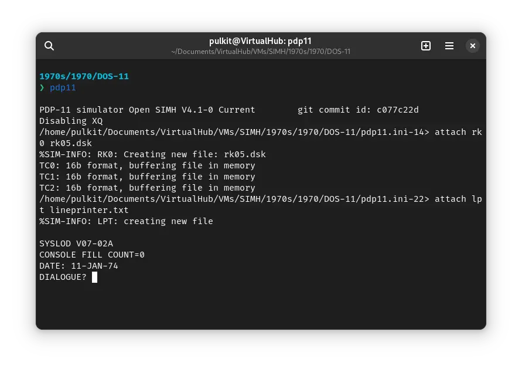
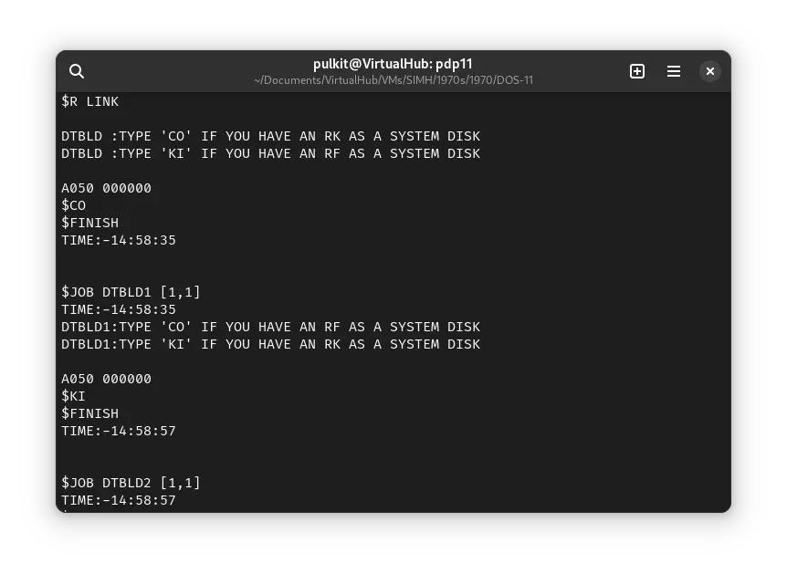
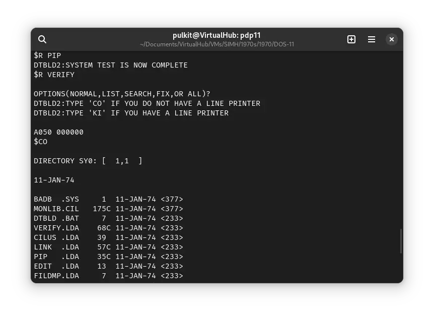

# How to install ! DOS-11 on SIMH?


We can run [! DOS-11](/1970s/1970/dos-11) on the SIMH PDP-11 emulator. First, we need to download the ! DOS-11 tapes.

## Downloads

You can download the tapes needed to install ! DOS-11 on the SIMH PDP-11 emulator from Bitsavers:

- [! DOS-11 tape 1 of 3](http://bitsavers.org/bits/DEC/pdp11/dectape/BS/v920c1.dta)
- [! DOS-11 tape 2 of 3](http://bitsavers.org/bits/DEC/pdp11/dectape/BS/v920c2.dta)
- [! DOS-11 tape 3 of 3](http://bitsavers.org/bits/DEC/pdp11/dectape/BS/v920c3.dta)

## Installing ! DOS-11

:::tip

If you have not already installed SIMH PDP-11 emulator, see [the VirtualHub Setup tutorial on how to do so](https://setup.virtualhub.eu.org/simh-pdp11/) on Linux and Windows.

:::

:::tip

If you want, you can skip these installation steps, and download a pre-installed image from this website: [http://iamvirtual.ca/PDP-11/DOS-11/DOSv9-20C-RK05.DSK](http://iamvirtual.ca/PDP-11/DOS-11/DOSv9-20C-RK05.DSK). Rename the file to `rk05.dsk` and move it to the VM folder. Now you can start [using DOS-11](#using-dos-11)!

:::

Create a folder somewhere to store the for this VM, and move the tapes into it.

Now we will create a config file for our VM. Create a text file called `pdp11.ini` with the following content in the VM folder:

```ini
set cpu 11/05
set cpu 64K
set hk disable
set ptr disable
set ptp disable
set dz disable
set rl disable
set rx disable
set rp disable
set rq disable
set tm disable
set tq disable
set rk enable
attach rk0 rk05.dsk
set tc enable
attach tc0 v920c1.dta
set tc0 locked
attach tc1 v920c2.dta
set tc1 locked
attach tc2 v920c3.dta
set tc2 locked
attach lpt lineprinter.txt
boot tc0
```


Now open a terminal and move to the VM folder. Run the following command to start the emulator:

```bash
pdp11
```


After the emulator starts, you will be asked for `CONSOLE FILL COUNT`. Type `0` and press enter. Then, you will be asked for a date. Enter the date in the `DD-MMM-YY` format. For example, enter `11-JAN-74`. To avoid various issues. Enter a date from the 1970s.



To the `DIALOGUE?` prompt, type `Y` and press enter. When asked if you want help, type `N` and press enter. When asked `LP ONLINE ?`, enter `Y`.


You will get a `#` prompt. Type `DK0:MONLIB.CIL/ZERO/HOOK/BOOT<DT0:MONLIB.LCL` and press enter.


Then you will get `ANSWER WITH CARRET OR 'Y'CARRET:- IS YOUR LINE FREQUENCY 50 HERTZ?`. Type `^` and press enter. When asked if you want to disable dialogue forever, type `N` and press enter.

The system will restart.


You will be asked for date again. Enter the date in the same format as above. Then you will be asked for time. Enter the time in `HH:MM` format. For example, enter `09:12`. When prompted `DIALOGUE?` type `Y` and press enter. You will be asked whether you want to reset "fill count". Type `N` and press enter. When asked if any devices are down, type `N` and press enter.


You will be asked if you want to change line printer. Press `Y` and press enter. When prompted with `LS11?` enter `Y`.


When asked `HOW MANY COLUMNS ?`, enter `132`. Type `N` and press enter when asked `LOWER CASE?`, `Y` when asked `OVERPRINT?`, `Y` when asked `ELONGATION` and `N` when asked if you got RK02 disks.


You will get a `$` prompt. Type `LOGIN 1,1` to log in.


Then type `RUN DT0:PIP16` and press enter. The prompt will change to `#`.


Type `SY:<DT0:DTBLD.BAT` and press enter. Then press `Ctrl` + `C`. The prompt will change to `.`. Type `KI` and press enter to exit `PIP`.


The prompt will turn back to `$`. Type `BATCH SY:DTBLD.BAT` and press enter.


When you get a `$` prompt, type `CO` and press enter to continue.


You will get a `$` prompt, asking to type `CO` or `KI`, three times. Type `CO` the first time (RF or RK disk), `KI` the second time (RF or RK disk) and `CO` the third time (Line Printer or not) and press enter to continue.





At last, you will be asked to type `TE`. Do so, and press enter to finish the installation.


Now, press `Ctrl` + `e` to pause the emulation, and then enter `exit` to exit the emulator.


That's it, we have installed DOS-11. We can now start using it. You can delete all the files other than the `rk05.dsk` disk image. We will create a fresh `pdp11.ini` file.

## Using DOS-11

Now we will create a fresh config file for using DOS-11. Create a text file called `pdp11.ini` with the following content in the VM folder:

```ini
set cpu 11/05
set cpu 64K
set hk disable
set ptr disable
set ptp disable
set dz disable
set rl disable
set rx disable
set rp disable
set rq disable
set tm disable
set tq disable
set rk enable
attach rk0 rk05.dsk
set tc enable
attach lpt lineprinter.txt
boot rk0
```


Now open a terminal and move to the VM folder. Run the following command to start the emulator:

```bash
pdp11
```

After the emulator starts, you will be asked for a date. Enter the date in the `DD-MMM-YY` format. For example, enter `11-JAN-74`. To avoid various issues. Enter a date from the 1970s. Then, you will be asked for time. Enter the time in `HH:MM` format. For example, enter `15:09`. Next, you will be asked if you want dialogue. Type `N` and press enter to continue.


Type `LOGIN 1,1` and press enter to log in. The system date and time will be printed.


Now type `RUN PIP` and press enter to start `PIP`.


The prompt will change to `#`. Type `/DI` to see a list of files in the `1,1` account.


To exit `PIP`, you can press `Ctrl` + `C`. After the prompt turns to `.`, type `KI` and press enter. To quit the emulation, press `Ctrl` + `e` and then enter `exit`.

That's it! We used ! DOS-11. We can create a shell script to make it easy to launch the VM.

### Linux

Create a file called `dos-11.sh` with the following content:

```bash
#!/bin/bash
pdp11
```

Now make the file executable:

```bash
chmod +x dos-11.sh
```

Now you can start the VM using the shell script. For example, on KDE you can right-click the file and choose `Run in Konsole` or on GNOME, where you can right-click the file and choose `Run as executable`. The VM will start.

See the [manuals section](/1970s/1970/dos-11/#manuals) on the [main ! DOS-11 page](/1970s/1970/dos-11) to learn how to use it.

### Windows

Create a file called `dos-11.bat` with the following content:

```bash
pdp11
```

Now you can start the VM by double-clicking the shell script. See the [manuals section](/1970s/1970/dos-11/#manuals) on the [main ! DOS-11 page](/1970s/1970/dos-11) to learn how to use it.

## Credits

- The DOS-11 tapes used above were taken from [Bitsavers](http://bitsavers.org).
- This tutorial is based on the tutorial from this website: [http://iamvirtual.ca/PDP-11/DOS-11/Install.htm](http://iamvirtual.ca/PDP-11/DOS-11/Install.htm)

## Video tutorial

Do you want to follow the tutorial by watching a video? We will post a video on our [YouTube channel](https://www.youtube.com/@virtua1hub) soon.

Archives of this tutorial are available on [Wayback Machine](https://web.archive.org/web/*/https://virtualhub.eu.org/1970s/1970/dos-11/simh/).
