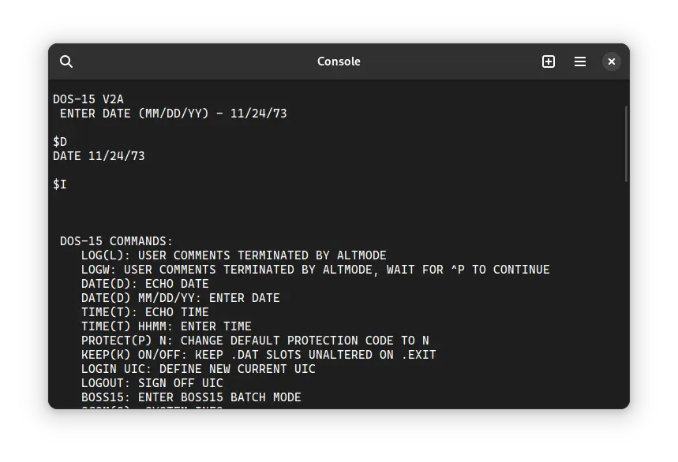

import DocCardList from '@theme/DocCardList';

# ! DOS-15

! DOS-15 (not to be confused with MS-DOS or IBM PC-DOS) was an operating system for the DEC PDP-15 computer. We can run it in the SIMH PDP-15 emulator.

<DocCardList />

## Manuals

You can download the ! DOS-15 manuals from here:

- [! DOS-15 Users Manual](http://www.bitsavers.org/pdf/dec/pdp15/DEC-15-ODUMA-B-D_DOS-15_USERS_MANUAL.pdf)
- [! DOS-15 System Manual](http://www.bitsavers.org/pdf/dec/pdp15/DEC-15-ODFFA-B-D_DOS-15_SYSTEM_MANUAL.pdf)
- [! PIP DOS Monitor Utility Program Manual](http://www.bitsavers.org/pdf/dec/pdp15/DEC-15-UPIPA-A-D_PIP_DOS_MONITOR_UTILITY_PROGRAM.pdf)
- [! SGEN DOS Utility Program Manual](http://www.bitsavers.org/pdf/dec/pdp15/DEC-15-USGNA-A-D_SGEN_DOS_Utility_Program.pdf)

You may also be interested in the PDP-15 manuals. It was the computer on which ! DOS-15 was supposed to run. You can download them from Bitsavers:

- [PDP-15 Manuals](http://www.bitsavers.org/pdf/dec/pdp15/)

## Related Pages

- [VirtualHub Screenshots](https://screenshots.virtualhub.eu.org/1970s/1970/dos-15/)
- [Wikipedia PDP-15 page](https://en.wikipedia.org/wiki/PDP-15)
- [Computer History Wiki PDP-15 page](http://gunkies.org/wiki/PDP-15)

## Credits

- The manuals were taken from [Bitsavers](http://bitsavers.org).
