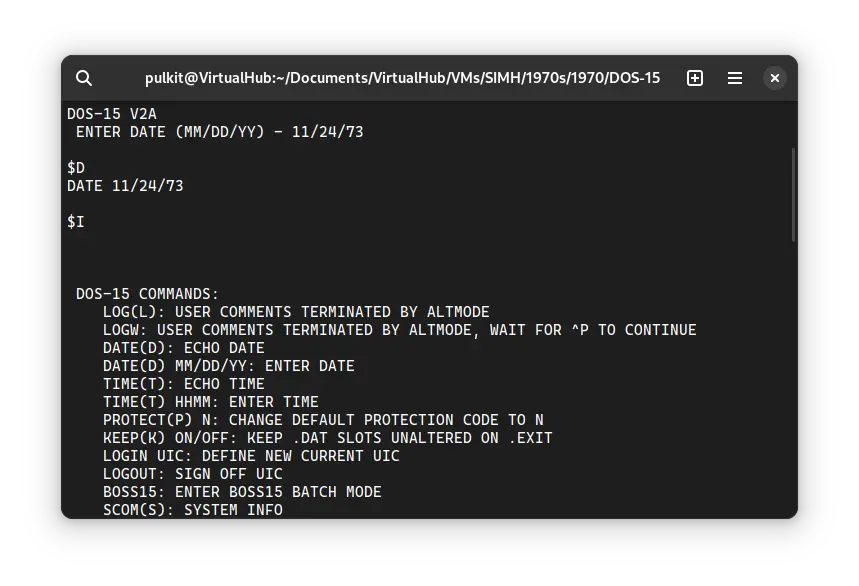
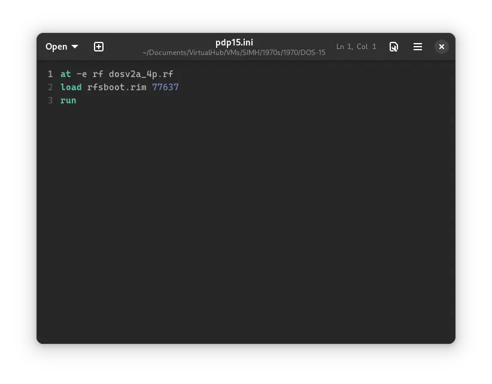
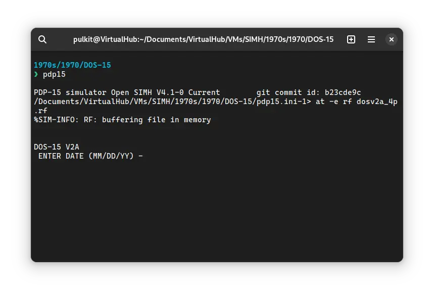
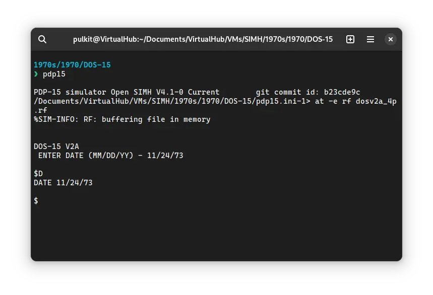

# How to install ! DOS-15 on SIMH?



We can run [! DOS-15](/1970s/1970/dos-15) on the SIMH PDP-15 emulator. First, we need to download the ! DOS-15 kit.

## Downloads

You can download the kit needed to run ! DOS-15 on the SIMH PDP-15 emulator from the ["SIMH Legacy"](http://simh.trailing-edge.com/) website:

- [! DOS-15 kit](http://simh.trailing-edge.com/kits/dos15.zip)

## Using ! DOS-15

:::tip

If you have not already installed SIMH PDP-15 emulator, see [the VirtualHub Setup tutorial on how to do so](https://setup.virtualhub.eu.org/simh-pdp15/) on Linux and Windows.

:::

Extract the kit you downloaded. Inside you will find several files. Create a folder somewhere to store the files for this VM and move those two files named `dosv2a_4p.rf` and `rfsboot.rim` into it.

Now we will create a config file for our VM. Create a text file called `pdp15.ini` with the following content in the VM folder:

```ini
at -e rf dosv2a_4p.rf
load rfsboot.rim 77637
run
```



Now open a terminal and move to the VM folder. Run the following command to start the emulator:

```bash
pdp15
```



When asked for a date, enter it in `MM/DD/YY` format. You _cannot_ use backspace to erase characters, even if it looks like you can. Try entering a date before the year 2000, to avoid problems related to [Y2K](https://en.wikipedia.org/wiki/Year_2000_problem).


Now that DOS-15 is ready, let's run some commands on it. Type `D` and press enter to see the system's date:



You can run `I` to see a list of commands you can run:


That's it! We used ! DOS-15. We can create a shell script to make it easy to launch the VM.

### Linux

Create a file called `dos-15.sh` with the following content:

```bash
#!/bin/bash
pdp15
```

Now make the file executable:

```bash
chmod +x dos-15.sh
```

Now you can start the VM using the shell script. For example, on KDE you can right-click the file and choose `Run in Konsole` or on GNOME, where you can right-click the file and choose `Run as executable`. The VM will start.

See the [manuals section](/1970s/1970/dos-15/#manuals) on the [main ! DOS-15 page](/1970s/1970/dos-15) to learn how to use it.

### Windows

Create a file called `dos-15.bat` with the following content:

```bash
pdp15
```

Now you can start the VM by double-clicking the shell script. See the [manuals section](/1970s/1970/dos-15/#manuals) on the [main ! DOS-15 page](/1970s/1970/dos-15) to learn how to use it.

## Credits

- The disk image and other files used above are from a kit available on [SimH “Classic” website](http://simh.trailing-edge.com/).

## Video tutorial

Do you want to follow the tutorial by watching a video? We will post a video on our [YouTube channel](https://www.youtube.com/@virtua1hub) soon.

Archives of this tutorial are available on [Wayback Machine](https://web.archive.org/web/*/https://virtualhub.eu.org/1970s/1970/dos-15/simh/).
