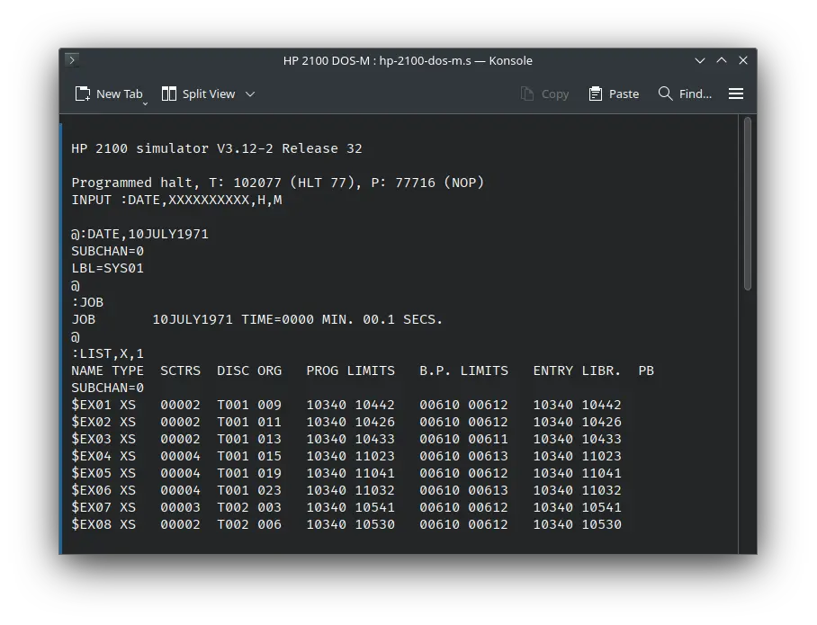

# ! HP 2100 DOS-M

import DocCardList from '@theme/DocCardList';

! HP 2100 DOS-M, as the name suggests, was an operating system for the HP 2100 computer. We can run using the SIMH emulator.

<DocCardList />

## Manuals

You can download the ! HP 2100 DOS-M manual from here:

- [! HP 2100 DOS-M Manual](https://github.com/rsanchovilla/SimH_cpanel/raw/master/Manual/HP2100/DOS-M/MovingHead_DiscOperatingSystem_02116-91779_244pages_Mar71.pdf)
- [! System Analyst DOS-M Course manual](http://www.bitsavers.org/pdf/hp/21xx/dosm/DOS-M_SysAnalyCourse_Jan71.pdf)

You may also be interested in the HP 2100 manuals. They were the computers on which ! HP 2100 DOS-M was supposed to run. You can download them from Bitsavers:

- [HP 2100 Manuals](http://www.bitsavers.org/pdf/hp/21xx/)

## Related Pages

- [VirtualHub Screenshots](https://screenshots.virtualhub.eu.org/1970s/1970/hp2100dos-m/)
- [HP 2100 Wikipedia page](https://en.wikipedia.org/wiki/HP_2100)
- [Third Party HP2100 Archive (via Wayback Machine)](https://web.archive.org/web/20160430080039/http://oscar.taurus.com/~jeff/2100/index.html)

## Credits

- The manuals were taken from [Bitsavers](http://bitsavers.org) and GitHub user [rsanchovilla's](https://github.com/rsanchovilla/) [SimH_cpanel repository](https://github.com/rsanchovilla/SimH_cpanel).

