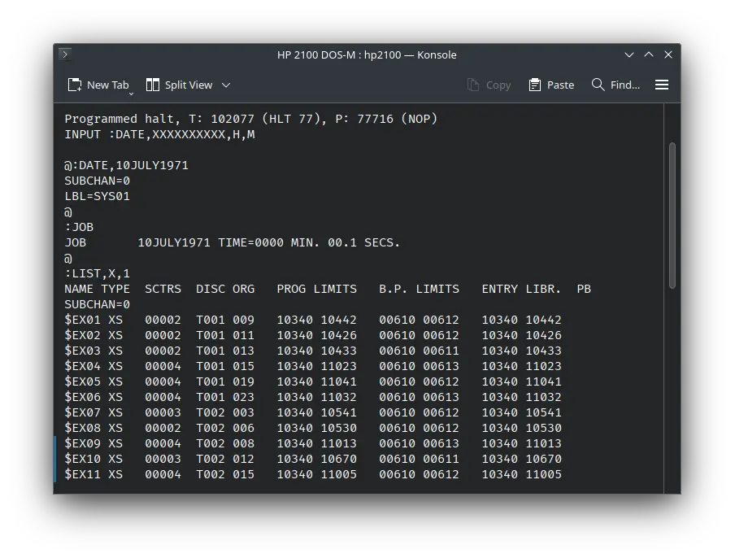
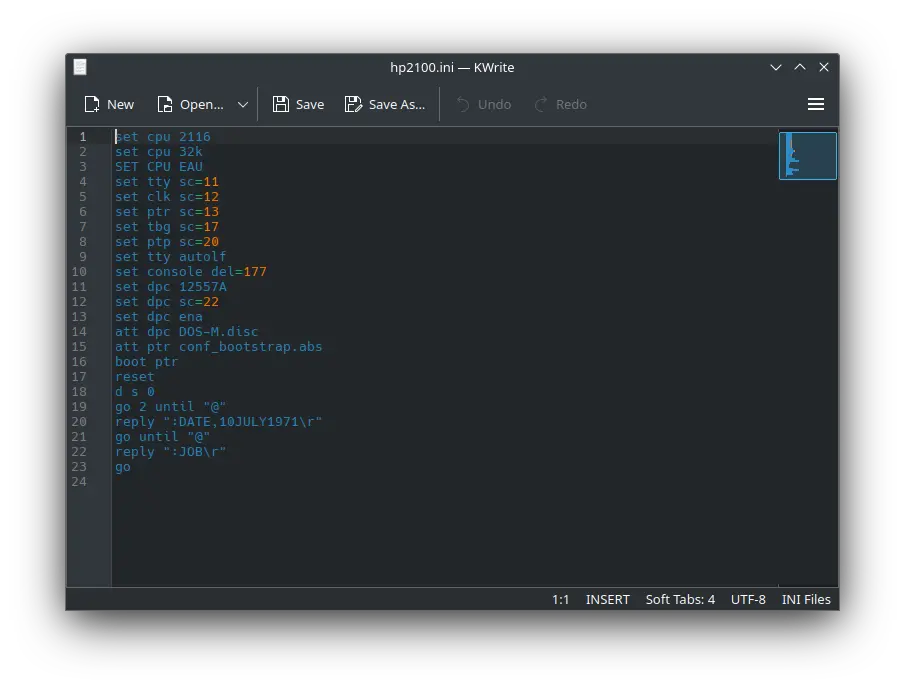
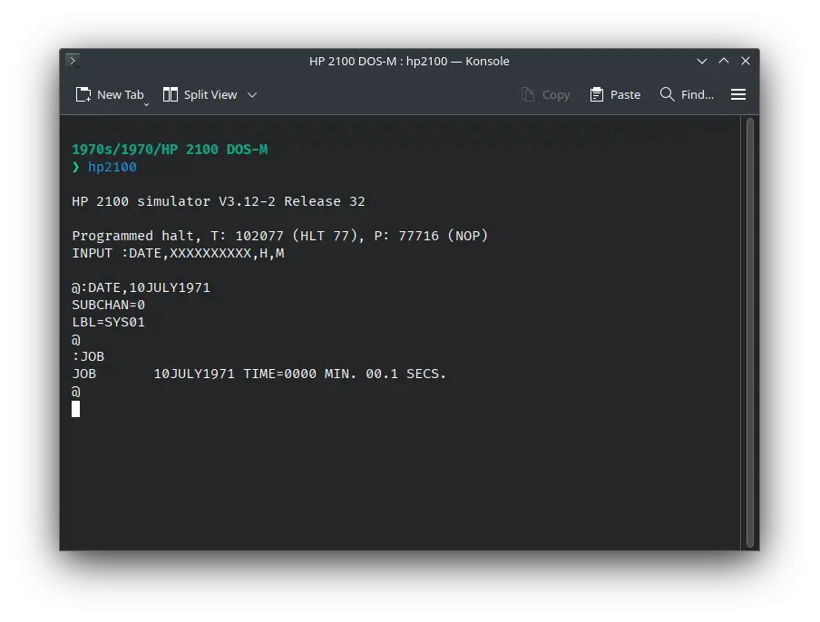

# How to install ! HP 2100 DOS-M on SIMH?



We can run [! HP 2100 DOS-M](/1970s/1970/hp2100dos-m) on the SIMH HP 2100 emulator. First, we need to download the ! HP 2100 DOS-M kit.

## Downloads

You can download the kit needed to run ! HP 2100 DOS-M on the SIMH HP 2100 emulator from the ["SIMH Legacy" website](http://simh.trailing-edge.com/):

- [! HP 2100 DOS-M kit](http://simh.trailing-edge.com/kits/DOS-M.zip)

## Using ! HP 2100 DOS-M

:::tip

If you have not already installed SIMH HP 2100 emulator, see [the VirtualHub Setup tutorial on how to do so](https://setup.virtualhub.eu.org/simh-hp2100/) on Linux and Windows.

:::

Extract the kit you downloaded. Inside you will find several files. Create a folder somewhere to store the files for this VM and move the file named `DOS-M.disc` into it. Open the `dsgen` folder inside the extracted folder and move the file called `conf_bootstrap.abs` to the VM folder.

Now we will create a config file for our VM. Create a text file called `hp2100.ini` with the following content in the VM folder:

```ini
set cpu 2116
set cpu 32k
SET CPU EAU
set tty sc=11
set clk sc=12
set ptr sc=13
set tbg sc=17
set ptp sc=20
set tty autolf
set console del=177
set dpc 12557A
set dpc sc=22
set dpc ena
att dpc DOS-M.disc
att ptr conf_bootstrap.abs
boot ptr
reset
d s 0
go 2 until "@"
reply ":DATE,10JULY1971\r"
go until "@"
reply ":JOB\r"
go
```



Now open a terminal and move to the VM folder. Run the following command to start the emulator:

```bash
hp2100
```



After the emulator starts, type `:LIST,X,1` and press enter. It will list all the files available on the disk.


That's it! We used ! HP 2100 DOS-M. We can create a shell script to make it easy to launch the VM.

### Linux

Create a file called `HP-2100-DOS-M.sh` with the following content:

```bash
#!/bin/bash
hp2100
```

Now make the file executable:

```bash
chmod +x HP-2100-DOS-M.sh
```

Now you can start the VM using the shell script. For example, on KDE you can right-click the file and choose `Run in Konsole` or on GNOME, where you can right-click the file and choose `Run as executable`. The VM will start.

See the [manuals section](/1970s/1970/hp2100dos-m/#manuals) on the [main ! HP 2100 DOS-M page](/1970s/1970/hp2100dos-m/) to learn how to use it.

### Windows

Create a file called `HP-2100-DOS-M.bat` with the following content:

```bash
hp2100
```

Now you can start the VM by double-clicking the shell script. See the [manuals section](/1970s/1970/hp2100dos-m/#manuals) on the [main ! HP 2100 DOS-M page](/1970s/1970/hp2100dos-m/) to learn how to use it.

## Credits

- The disk image and other files used above are from a kit available on [SimH "Classic" website](http://simh.trailing-edge.com/).

## Video tutorial

Do you want to follow the tutorial by watching a video? We will post a video on our [YouTube channel](https://www.youtube.com/@virtua1hub) soon.

Archives of this tutorial are available on [Wayback Machine](https://web.archive.org/web/*/https://virtualhub.eu.org/1970s/1970/hp2100dos-m/simh/).
