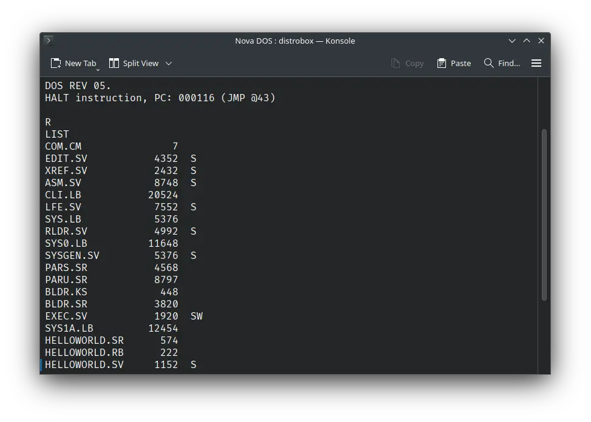

# ! Nova DOS

import DocCardList from '@theme/DocCardList';

! Nova DOS, as the name suggests, was an operating system for the Data General Nova computer. We can run using the Wild Hare Nova emulator.

<DocCardList />

## Manuals

You can download the ! Nova DOS manuals from here:

- [! Nova DOS User's Manual](http://www.novasareforever.org/archive/public/docs/dg/sw/os/dos5/093-000048-06__DOS_Disk_Operating_System_Users_Manual__1970-1972.pdf)
- [! Nova DOS Operator's Guide](http://www.novasareforever.org/archive/public/docs/dg/sw/os/dos5/093-000076-00__DOS_Operators_Guide__1972.pdf)

You may also be interested in the Data General Nova manuals. They were the computers on which ! Nova DOS was supposed to run. You can download them from here:

- [Data General Nova Manuals](http://www.novasareforever.org/dgdocs.hw/)

## Related Pages

- [VirtualHub Screenshots](https://screenshots.virtualhub.eu.org/1970s/1970/nova-dos/)
- [Data General Nova Wikipedia page](https://en.wikipedia.org/wiki/Data_General_Nova)
- [Data General Nova Computer History Wiki page](https://gunkies.org/wiki/Data_General_Nova)
- [History of Nova - Wild Hare Legacy Preservation Website](http://www.novasareforever.org/gallery/index.php?nova)

## Credits

- The manuals were taken from [Wild Hare Legacy Preservation Website](http://www.novasareforever.org).
