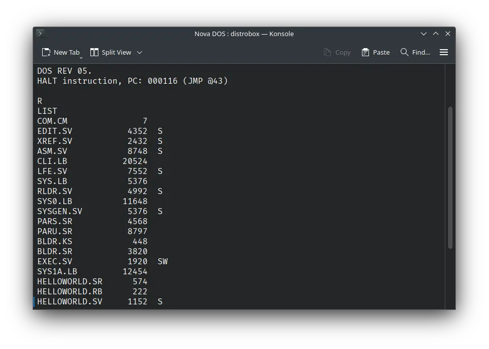
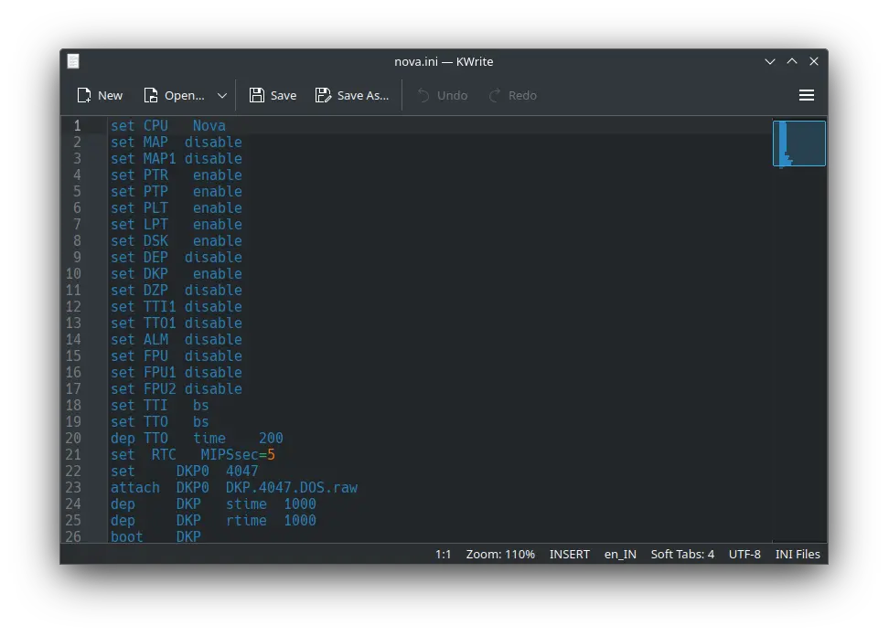
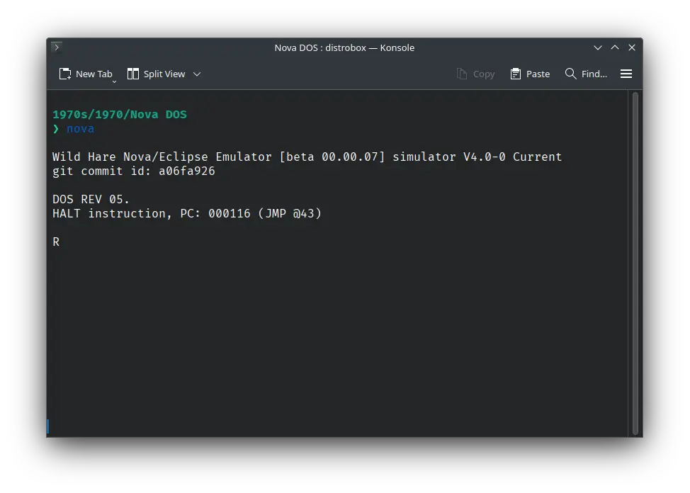

# How to install ! Nova DOS on Wild Hare Nova emulator?



We can run [! Nova DOS](/1970s/1970/nova-dos) on the Wild Hare Nova emulator. First, we need to download the ! Nova DOS disk image.

## Downloads

You can download the disk image needed to run ! Nova DOS on the Wild Hare Nova emulator from the [Wild Hare Legacy Preservation Website website](http://www.novasareforever.org/):

- [! Nova DOS disk image](http://www.novasareforever.org/archive/public/wh/simh/disks/DKP.4047.DOS.raw)

## Using ! Nova DOS

:::tip

If you have not already installed Wild Hare Nova emulator, see [the VirtualHub Setup tutorial on how to do so](https://setup.virtualhub.eu.org/wh-nova/) on Linux and Windows.

:::

Create a folder somewhere to store the files for this VM and move the disk image you just downloaded into it. Now we will create a config file for our VM. Create a text file called `nova.ini` with the following content in the VM folder:

```ini
set CPU Nova
set MAP disable
set MAP1 disable
set PTR enable
set PTP enable
set PLT enable
set LPT enable
set DSK enable
set DEP disable
set DKP enable
set DZP disable
set TTI1 disable
set TTO1 disable
set ALM disable
set FPU disable
set FPU1 disable
set FPU2 disable
set TTI bs
set TTO bs
dep TTO time 200
set RTC MIPSsec=5
set DKP0 4047
attach DKP0 DKP.4047.DOS.raw
dep DKP stime 1000
dep DKP rtime 1000
boot DKP
continue
```



Now open a terminal and move to the VM folder. Run the following command to start the emulator:

```bash
nova
```



After the emulator starts, type `LIST` and press enter. It will list all the files available on the disk.


That's it! We used ! Nova DOS. We can create a shell script to make it easy to launch the VM.

### Linux

Create a file called `Nova-DOS.sh` with the following content:

```bash
#!/bin/bash
nova
```

Now make the file executable:

```bash
chmod +x Nova-DOS.sh
```

Now you can start the VM using the shell script. For example, on KDE you can right-click the file and choose `Run in Konsole` or on GNOME, where you can right-click the file and choose `Run as executable`. The VM will start.

See the [manuals section](/1970s/1970/nova-dos/#manuals) on the [main ! Nova DOS page](/1970s/1970/nova-dos/) to learn how to use it.

### Windows

Create a file called `Nova-DOS.bat` with the following content:

```bash
nova
```

Now you can start the VM by double-clicking the shell script. See the [manuals section](/1970s/1970/nova-dos/#manuals) on the [main ! Nova DOS page](/1970s/1970/nova-dos/) to learn how to use it.

## Credits

- The disk image and other files used above are from the [Wild Hare Legacy Preservation Website website](http://www.novasareforever.org/).

## Video tutorial

Do you want to follow the tutorial by watching a video? We will post a video on our [YouTube channel](https://www.youtube.com/@virtua1hub) soon.

Archives of this tutorial are available on [Wayback Machine](https://web.archive.org/web/*/https://virtualhub.eu.org/1970s/1970/nova-dos/wh/).
