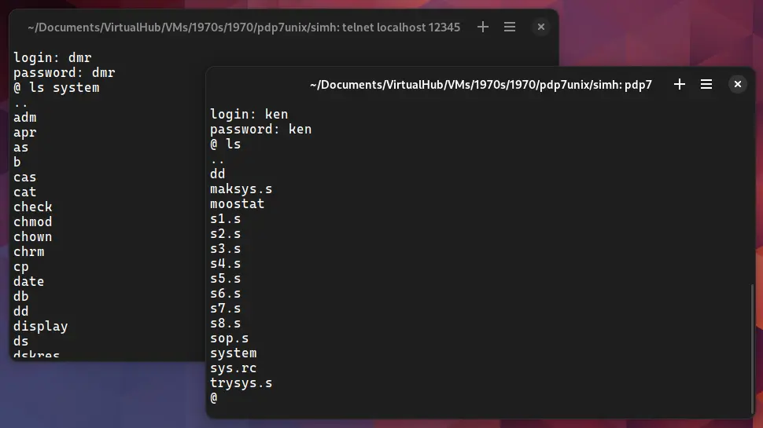

import DocCardList from '@theme/DocCardList';

# ! PDP7 Unix

! PDP7 Unix was an operating system for the DEC PDP-7 computer. It is the earliest available Unix version to be able to run in an emulator. We can run it on the SIMH PDP-7 emulator.

<DocCardList />

## Manuals

You can download the ! PDP7 Unix manual from here:

- [! Unix Edition Zero Manual](https://www.tuhs.org/Archive/Distributions/Research/McIlroy_v0/UnixEditionZero-Threshold_OCR.pdf)

You may also be interested in the PDP-7 manuals. It was the computer on which ! PDP7 Unix was supposed to run. You can download them from Bitsavers:

- [PDP-7 Manuals](http://bitsavers.org/pdf/dec/pdp7/)

## Related Pages

- [VirtualHub Screenshots](https://screenshots.virtualhub.eu.org/1970s/1970/pdp7unix/)
- [Wikipedia](https://en.wikipedia.org/wiki/UNIX)
- [Computer History Wiki ! PDP7 Unix page](https://gunkies.org/wiki/PDP-7_UNIX)
- [Computer History Wiki PDP-7 page](https://gunkies.org/wiki/PDP-7)
- [The Unix Heritage Society (TUHS) wiki page on ! PDP-7 Unix](https://wiki.tuhs.org/doku.php?id=systems:pdp7_unix)
- [The project to resurrect Unix on the PDP-7 from a scan of the original assembly code](https://github.com/DoctorWkt/pdp7-unix)

## Credits

- The manuals were taken from [The Unix Heritage Society (TUHS)](https://www.tuhs.org) and [Bitsavers](http://bitsavers.org).
