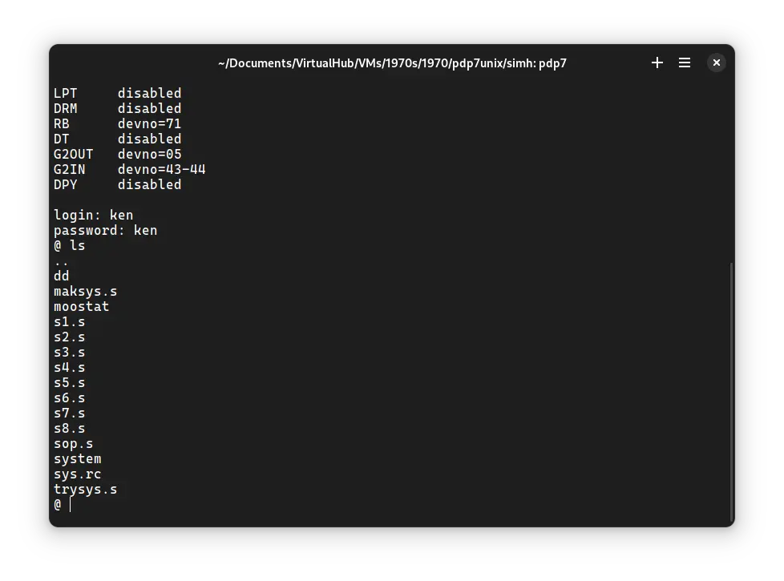
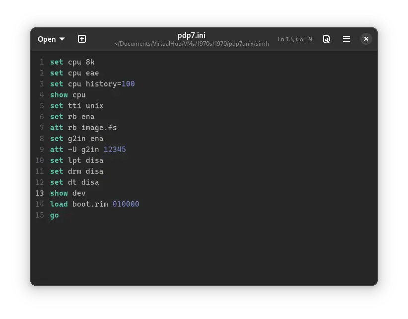
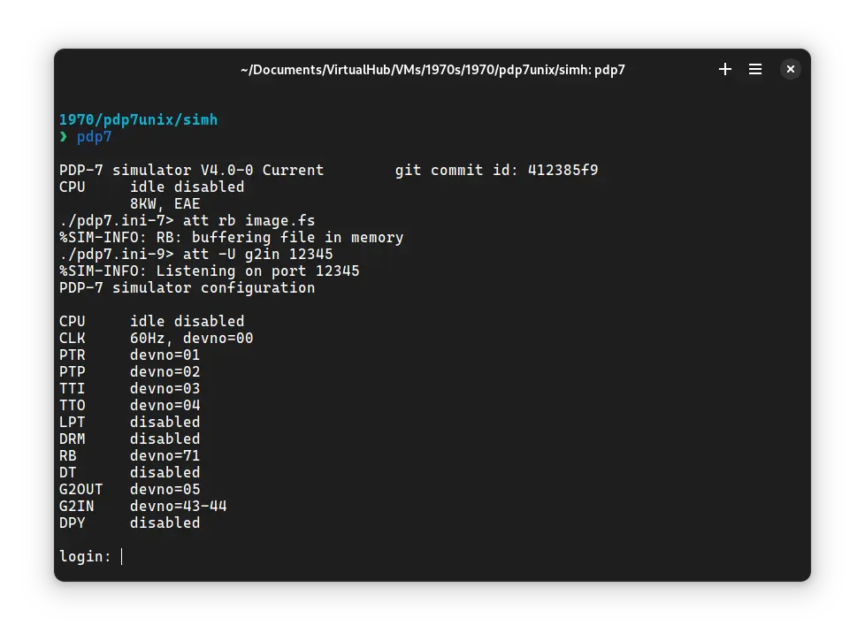
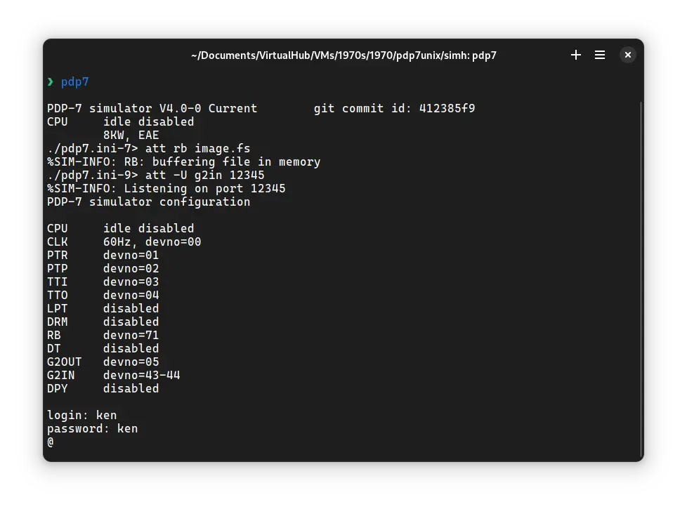

# How to install ! PDP7 Unix on SIMH?



We can run [! PDP7 Unix](/1970s/1970/pdp7unix) on the SIMH PDP-7 emulator. First, we need to download the ! PDP7 Unix kit.

## Downloads

You can download the kit needed to run ! PDP7 Unix on the SIMH PDP-7 emulator from [our GitHub repo fork](https://github.com/InstallerLegacy/pdp7-unix) of the original [project to resurrect Unix on the PDP-7 from a scan of the original assembly code](https://github.com/DoctorWkt/pdp7-unix):

- [! PDP7 Unix kit](https://github.com/InstallerLegacy/pdp7-unix/releases/latest/download/pdp7.zip)

If you want to build the kit yourself, refer to [our guide on how to do so](/blog/building-pdp7-unix-images-yourself/).

## Using ! PDP7 Unix

:::tip

If you have not already installed SIMH PDP-7 emulator, see [the VirtualHub Setup tutorial on how to do so](https://setup.virtualhub.eu.org/simh-pdp7/) on Linux and Windows.

:::

Extract the kit you downloaded. Inside you will find two files. Create a folder somewhere to store the files for this VM and move those two files named `boot.rim` and `image.fs` into it.

Now we will create a config file for our VM. Create a text file called `pdp7.ini` with the following content in the VM folder:

```ini
set cpu 8k
set cpu eae
set cpu history=100
show cpu
set tti unix
set rb ena
att rb image.fs
set g2in ena
att -U g2in 12345
set lpt disa
set drm disa
set dt disa
show dev
load boot.rim 010000
go
```



Now open a terminal and move to the VM folder. Run the following command to start the emulator:

```bash
pdp7
```



After the emulator starts, login using the ID `ken` and password `ken`. You will see the following screen:



:::tip

There are other user accounts on the image like `dmr` (password: `dmr`). Do you know who `dmr` and `ken` were? Check the first comment to find out, or search it on the web!

:::

Type `ls` followed by enter. It will list all the files available on the disk.


That's it! We used ! PDP7 Unix. We can create a shell script to make it easy to launch the VM.

### Linux

Create a file called `pdp7unix.sh` with the following content:

```bash
#!/bin/bash
pdp7
```

Now make the file executable:

```bash
chmod +x pdp7unix.sh
```

Now you can start the VM using the shell script. For example, on KDE you can right-click the file and choose `Run in Konsole` or on GNOME, where you can right-click the file and choose `Run as executable`. The VM will start.

See the [manuals section](/1970s/1970/pdp7unix/#manuals) on the [main ! PDP7 Unix page](/1970s/1970/pdp7unix) to learn how to use it.

### Windows

Create a file called `pdp7unix.bat` with the following content:

```bash
pdp7
```

Now you can start the VM by double-clicking the shell script. See the [manuals section](/1970s/1970/pdp7unix/#manuals) on the [main ! PDP7 Unix page](/1970s/1970/pdp7unix) to learn how to use it.

## Credits

- The disk image and other files used above are from a kit built from the [project to resurrect Unix on the PDP-7 from a scan of the original assembly code](https://github.com/DoctorWkt/pdp7-unix).

## Video tutorial

Do you want to follow the tutorial by watching a video? We will post a video on our [YouTube channel](https://www.youtube.com/@virtua1hub) soon.

Archives of this tutorial are available on [Wayback Machine](https://web.archive.org/web/*/https://virtualhub.eu.org/1970s/1970/pdp7unix/simh/).
