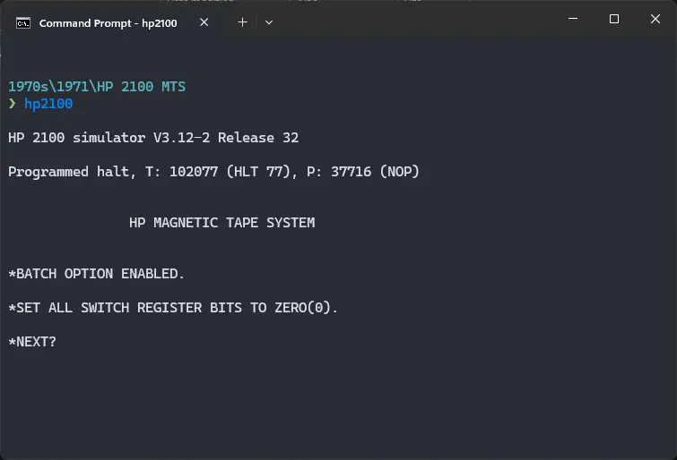
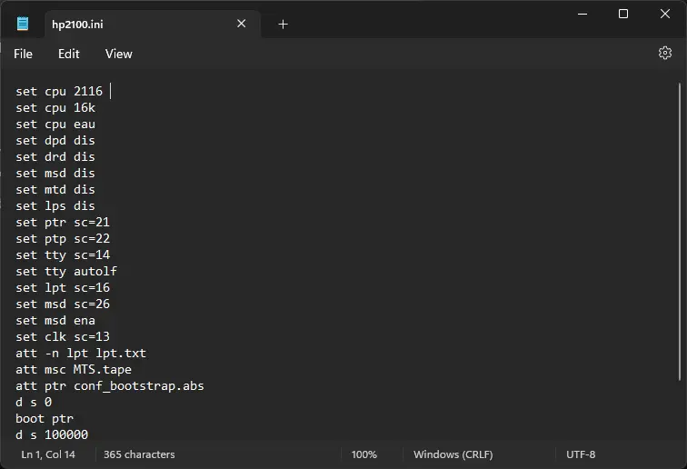

# How to install ! HP 2100 MTS on SIMH?



We can run [! HP 2100 MTS](/1970s/1971/hp2100mts) on the SIMH HP 2100 emulator. First, we need to download the ! HP 2100 MTS kit.

## Downloads

You can download the kit needed to run ! HP 2100 MTS on the SIMH HP 2100 emulator from the ["SIMH Legacy" website](http://simh.trailing-edge.com/):

- [! HP 2100 MTS kit](http://simh.trailing-edge.com/kits/MTS.zip)

## Using ! HP 2100 MTS

:::tip

If you have not already installed SIMH HP 2100 emulator, see [the VirtualHub Setup tutorial on how to do so](https://setup.virtualhub.eu.org/simh-hp2100/) on Linux and Windows.

:::

Extract the kit you downloaded. Inside you will find several files. Create a folder somewhere to store the files for this VM and move the file named `MTS.tape` into it. Open the `mtgen` folder inside the extrcted folder and move the file called `conf_bootstrap.abs` to the VM folder.

Now we will create a config file for our VM. Create a text file called `hp2100.ini` with the following content in the VM folder:

```ini
set cpu 2116 
set cpu 16k
set cpu eau
set dpd dis
set drd dis
set msd dis
set mtd dis
set lps dis
set ptr sc=21
set ptp sc=22
set tty sc=14
set tty autolf
set lpt sc=16
set msd sc=26
set msd ena
set clk sc=13
att -n lpt lpt.txt
att msc MTS.tape
att ptr conf_bootstrap.abs
d s 0
boot ptr
d s 100000
go 100 until "*SET ALL SWITCH REGISTER BITS TO ZERO(0)." 
d s 0
go 
```



Now open a terminal and move to the VM folder. Run the following command to start the emulator:

```bash
hp2100
```


That's it! We used ! HP 2100 MTS. We can create a shell script to make it easy to launch the VM.

### Linux

Create a file called `HP-2100-MTS.sh` with the following content:

```bash
hp2100
```

Now make the file executable:

```bash
chmod +x HP-2100-MTS.sh
```

Now you can start the VM using the shell script. For example, on KDE you can right-click the file and choose `Run in Konsole` or on GNOME, where you can right-click the file and choose `Run as executable`. The VM will start.

See the [manuals section](/1970s/1971/hp2100mts/#manuals) on the [main ! HP 2100 MTS page](/1970s/1971/hp2100mts/) to learn how to use it.

### Windows

Create a file called `HP-2100-MTS.bat` with the following content:

```bash
hp2100
```

Now you can start the VM by double-clicking the shell script. See the [manuals section](/1970s/1971/hp2100mts/#manuals) on the [main ! HP 2100 MTS page](/1970s/1971/hp2100mts/) to learn how to use it.

## Credits

- The disk image and other files used above are from a kit available on [SimH "Classic" website](http://simh.trailing-edge.com/).

## Video tutorial

Do you want to follow the tutorial by watching a video? We will post a video on our [YouTube channel](https://www.youtube.com/@virtua1hub) soon.

Archives of this tutorial are available on [Wayback Machine](https://web.archive.org/web/*/https://virtualhub.eu.org/1970s/1971/hp2100mts/simh/).
