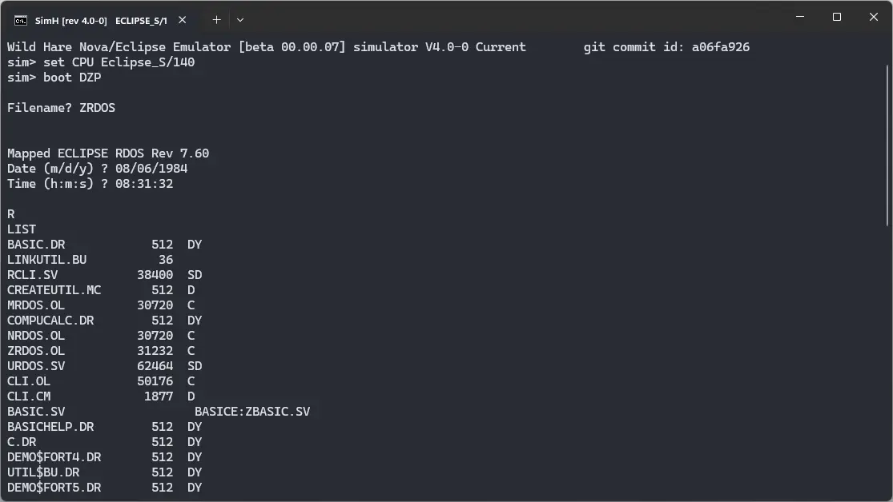

# ! Nova RDOS

import DocCardList from '@theme/DocCardList';

! Nova RDOS, as the name suggests, was an operating system for the Data General Nova computer. We can run it using the Wild Hare emulator, or the SIMH emulator.

<DocCardList />

## Manuals

You can download the ! Nova RDOS manuals from here:

- [! RDOS User Self-paced Orientation Course](http://www.novasareforever.org/archive/public/docs/dg/sw/os/rdos/053-000017-00__RDOS_User_Instruction_Course.c.p.pdf)
- [Learning to use your ! RDOS System](http://www.novasareforever.org/archive/public/docs/dg/sw/os/rdos/069-000022-01__Learning_to_Use_Your_RDOS_DOS_System__1979.pdf)
- [Introduction to ! RDOS](http://www.novasareforever.org/archive/public/docs/dg/sw/os/rdos/069-400011-00__Introduction_to_RDOS__1972-1983.pdf)
- [! RDOS User's Handbook](http://www.novasareforever.org/archive/public/docs/dg/sw/os/rdos/093-000105-04__RDOS-DOS_Users_Handbook__1974-1987.pdf)
- [! RDOS System Reference](http://www.novasareforever.org/archive/public/docs/dg/sw/os/rdos/093-400027-01__RDOS_System_Reference__1972-1985.pdf)
- [How to load and generate ! RDOS](http://www.novasareforever.org/archive/public/docs/dg/sw/os/rdos/069-400013-00__How_to_Load_and_Generate_RDOS__1975-1983.pdf)
- [! RDOS CLI](http://www.novasareforever.org/archive/public/docs/dg/sw/os/rdos/069-400015-01__RDOS_DOS_DG-RDOS_CLI_Command_Line_Interpreter__1983-1984.pdf)
- [! RDOS Text Editor](http://www.novasareforever.org/archive/public/docs/dg/sw/os/rdos/069-400016-00__RDOS-DOS_Text_Editor__1983.pdf)
- [! RDOS SuperEdit Text Editor](http://www.novasareforever.org/archive/public/docs/dg/sw/os/rdos/069-400017-01__RDOS-DOS_SuperEdit_Text_Editor__1983-1984.pdf)
- [! RDOS Assembly Language and Program Utilities Docs](http://www.novasareforever.org/archive/public/docs/dg/sw/os/rdos/069-400019-01__RDOS-DOS_Assembly_Language_and_Program_Utilities__1983-1984.pdf)
- [! RDOS Sort/Merge and Vertical Format Unit Utilities](http://www.novasareforever.org/archive/public/docs/dg/sw/os/rdos/069-400021-00__RDOS-DOS_Sort-Merge_and_Vertical_Format_Unit_Utilities__1983.pdf)
- [! RDOS Backup and Move Utilities](http://www.novasareforever.org/archive/public/docs/dg/sw/os/rdos/069-400022-01__RDOS-DOS-DG-RDOS_Backup_and_Move_Utilities__1983-1984.pdf)

You may be interested in the Nova computer manuals. They were the computers on which ! Nova RDOS was supposed to run. You can download them from here:

- [Data General Nova Manuals](http://www.novasareforever.org/dgdocs.hw/)

## Related Pages

- [VirtualHub Screenshots](https://screenshots.virtualhub.eu.org/1970s/1972/nova-rdos/)
- [Data General Nova Wikipedia Page](https://en.wikipedia.org/wiki/Data_General_Nova)
- [Data General Eclipse Wikipedia Page](https://en.wikipedia.org/wiki/Data_General_Eclipse)
- [Data General Nova Computer History Wiki page](https://gunkies.org/wiki/Data_General_Nova)
- [Data General Eclipse Computer History Wiki page](https://gunkies.org/wiki/Data_General_Eclipse)
- [Data General RDOS Wikipedia page](https://en.wikipedia.org/wiki/Data_General_RDOS)
- [History of Nova - Wild Hare Legacy Preservation Website](http://www.novasareforever.org/gallery/index.php?nova)
- [A third-party blog post about Nova emulation using SIMH](https://wconrad.github.io/20151207/simh-nova-hello-world.html)
- [Third-party Youtube video showing Nova emulation using SIMH](https://www.youtube.com/watch?v=oBO3z6FMA6g)

## Credits

- The manuals were taken from [Wild Hare Legacy Preservation Website](http://www.novasareforever.org).
