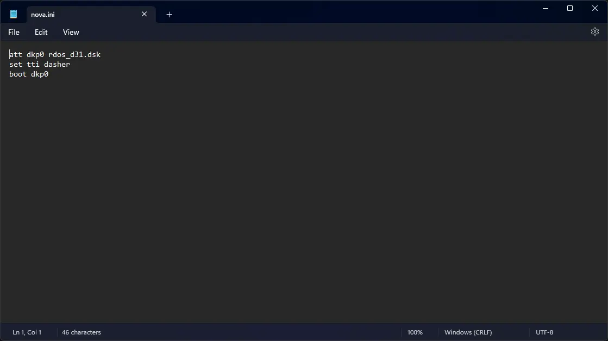

# How to install ! Nova RDOS on SIMH Nova Emulator?


We can run [! Nova RDOS](/1970s/1972/nova-rdos) on the SIMH Nova emulator. First, we need to download the ! Nova RDOS kit for SIMH Nova emulator.

## Downloads

You can download the needed kit from the ["SIMH Legacy" website](http://simh.trailing-edge.com/):

- [! Nova RDOS kit for SIMH Nova emulator](http://simh.trailing-edge.com/kits/rdosswre.tar.Z)

If you are on Windows, you may need to install additional software such as [7-Zip](https://www.7-zip.org/) to extract the kit.

## Using ! Nova RDOS

:::tip

If you have not already installed SIMH Nova emulator, see [the VirtualHub Setup tutorial on how to do so](https://setup.virtualhub.eu.org/simh-nova/) on Linux and Windows.

:::

Extract the kit you downloaded. Inside you will find two folders. Open the folder named `Disks`. Create a folder somewhere to store the files for this VM, and move the file named `rdos_d31.dsk` into it.

Now we will create a config file for our VM. Create a text file called `nova.ini` with the following content in the VM folder:

```ini
att dkp0 rdos_d31.dsk
set tti dasher
boot dkp0
```



Now open a terminal and move to the VM folder. Run the following command to start the emulator:

```bash
nova
```


After the emulator starts, press enter when asked for filename. When asked for date, enter it in `MM/DD/YY` format. For example, enter `04/13/74`. Keep the year in 1970s or 80s, to avoid any issues. Similarly, when asked for time, enter it in `HH:MM:SS` format. For example, enter `12:55:31`.

Now you can enter `LIST` to see a list of files available:


That's it! We used ! Nova RDOS on SIMH Nova emulator. We can create a shell script to make it easy to launch the VM.

### Linux

Create a file called `Nova-RDOS.sh` with the following content:

```bash
#!/bin/bash
nova
```

Now make the file executable:

```bash
chmod +x Nova-RDOS.sh
```

Now you can start the VM using the shell script. For example, on KDE you can right-click the file and choose `Run in Konsole` or on GNOME, where you can right-click the file and choose `Run as executable`. The VM will start.

See the [manuals section](/1970s/1972/nova-rdos/#manuals) on the [main ! Nova RDOS page](/1970s/1972/nova-rdos/) to learn how to use it.

### Windows

Create a file called `Nova-RDOS.bat` with the following content:

```bash
nova
```

Now you can start the VM by double-clicking the shell script. See the [manuals section](/1970s/1972/nova-rdos/#manuals) on the [main ! Nova RDOS page](/1970s/1972/nova-rdos/) to learn how to use it.

## Credits

- The disk image and other files used above are from a kit available on [SimH "Classic" website](http://simh.trailing-edge.com/).

## Video tutorial

Do you want to follow the tutorial by watching a video? We will post a video on our [YouTube channel](https://www.youtube.com/@virtua1hub) soon.

Archives of this tutorial may be available on [Wayback Machine](https://web.archive.org/web/*/https://virtualhub.eu.org/1970s/1972/nova-rdos/wh/).
