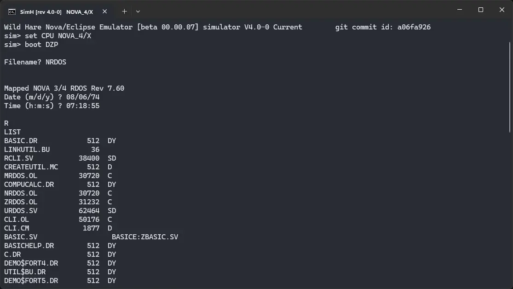
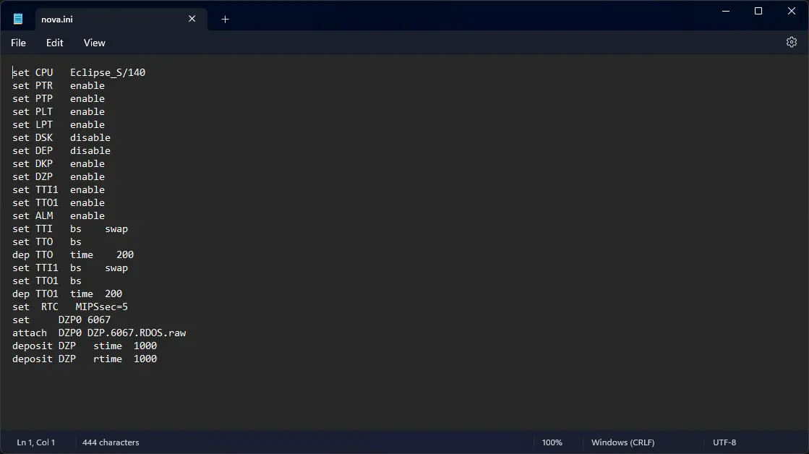
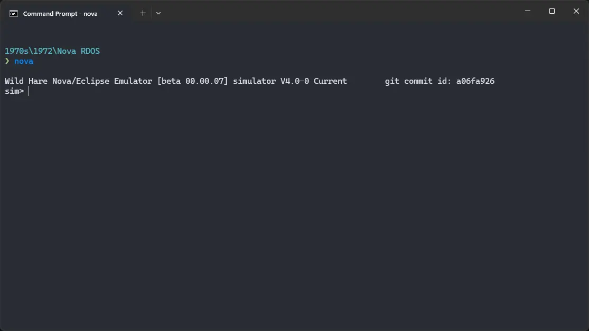

# How to install ! Nova RDOS on Wild Hare Nova emulator?



We can run [! Nova RDOS](/1970s/1972/nova-rdos) on the Wild Hare Nova emulator. First, we need to download the ! Nova RDOS disk image.

## Downloads

You can download the disk image needed to run ! Nova RDOS on the Wild Hare Nova emulator from the [Wild Hare Legacy Preservation Website website](http://www.novasareforever.org/):

- [! Nova RDOS disk image](http://www.novasareforever.org/archive/public/wh/simh/disks/DZP.6067.RDOS.raw)

## Using ! Nova RDOS

:::tip

If you have not already installed Wild Hare Nova emulator, see [the VirtualHub Setup tutorial on how to do so](https://setup.virtualhub.eu.org/wh-nova/) on Linux and Windows.

:::

Create a folder somewhere to store the files for this VM and move the disk image you just downloaded into it. Now we will create a config file for our VM. Create a text file called `nova.ini` with the following content in the VM folder:

```ini
set CPU   Eclipse_S/140
set PTR   enable
set PTP   enable
set PLT   enable
set LPT   enable
set DSK   disable
set DEP   disable
set DKP   enable
set DZP   enable
set TTI1  enable
set TTO1  enable
set ALM   enable
set TTI   bs    swap
set TTO   bs
dep TTO   time    200
set TTI1  bs    swap
set TTO1  bs
dep TTO1  time  200
set  RTC   MIPSsec=5
set     DZP0 6067
attach  DZP0 DZP.6067.RDOS.raw
deposit DZP   stime  1000
deposit DZP   rtime  1000
```



Now open a terminal and move to the VM folder. Run the following command to start the emulator:

```bash
nova
```



There are different versions of RDOS for different models of Nova computer. They are:

- URDOS
- MRDOS
- NRDOS
- ZRDOS

If you want to run URDOS, run the following commmand at the `sim>` prompt:

```bash
set CPU NOVA
boot DZP
```


If you want to run MRDOS, run the following commmand at the `sim>` prompt:

```bash
set CPU NOVA_840
boot DZP
```


If you want to run NRDOS, run the following commmand at the `sim>` prompt:

```bash
set CPU NOVA_4/X
boot DZP
```


If you want to run ZRDOS, run the following commmand at the `sim>` prompt:

```bash
set CPU Eclipse_S/140
boot DZP
```

When prompted `Filename? `, type the name of the type of RDOS you want to run. For example, for NRDOS, type `NRDOS` and press enter.

When asked for date, enter it in `MM/DD/YY` format. For example, enter `04/13/74`. Keep the year in 1970s or 80s, to avoid any issues. Similarly, when asked for time, enter it in `HH:MM:SS` format. For example, enter `12:55:31`.

Now you can type `LIST` and press enter. It will list all the files available on the disk.


That's it! We used ! Nova RDOS. We can create a shell script to make it easy to launch the VM.

### Linux

Create a file called `Nova-RDOS.sh` with the following content:

```bash
#!/bin/bash
nova
```

Now make the file executable:

```bash
chmod +x Nova-RDOS.sh
```

Now you can start the VM using the shell script. For example, on KDE you can right-click the file and choose `Run in Konsole` or on GNOME, where you can right-click the file and choose `Run as executable`. The VM will start.

See the [manuals section](/1970s/1972/nova-rdos/#manuals) on the [main ! Nova RDOS page](/1970s/1972/nova-rdos/) to learn how to use it.

### Windows

Create a file called `Nova-RDOS.bat` with the following content:

```bash
nova
```

Now you can start the VM by double-clicking the shell script. See the [manuals section](/1970s/1972/nova-rdos/#manuals) on the [main ! Nova RDOS page](/1970s/1972/nova-rdos/) to learn how to use it.

## Credits

- The disk image and other files used above are from the [Wild Hare Legacy Preservation Website website](http://www.novasareforever.org/).

## Video tutorial

Do you want to follow the tutorial by watching a video? We will post a video on our [YouTube channel](https://www.youtube.com/@virtua1hub) soon.

Archives of this tutorial are available on [Wayback Machine](https://web.archive.org/web/*/https://virtualhub.eu.org/1970s/1972/nova-rdos/wh/).
