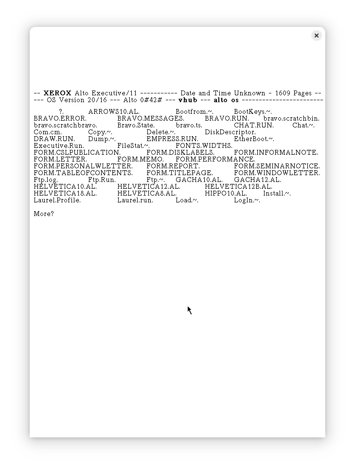
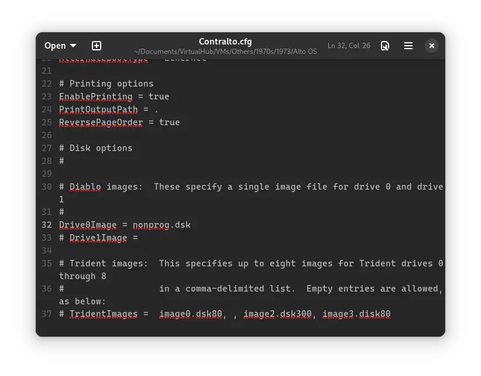
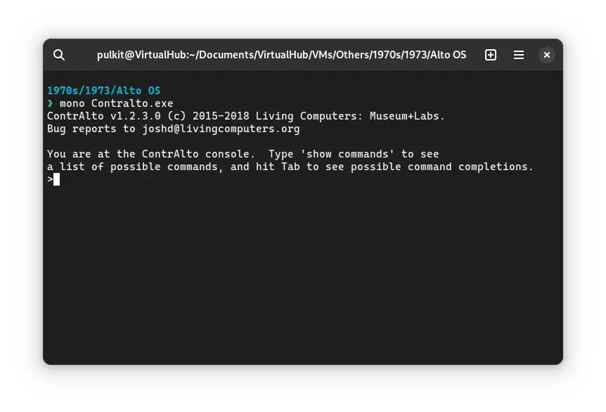
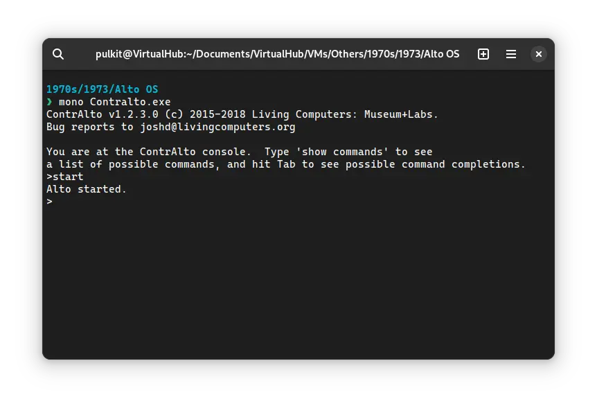
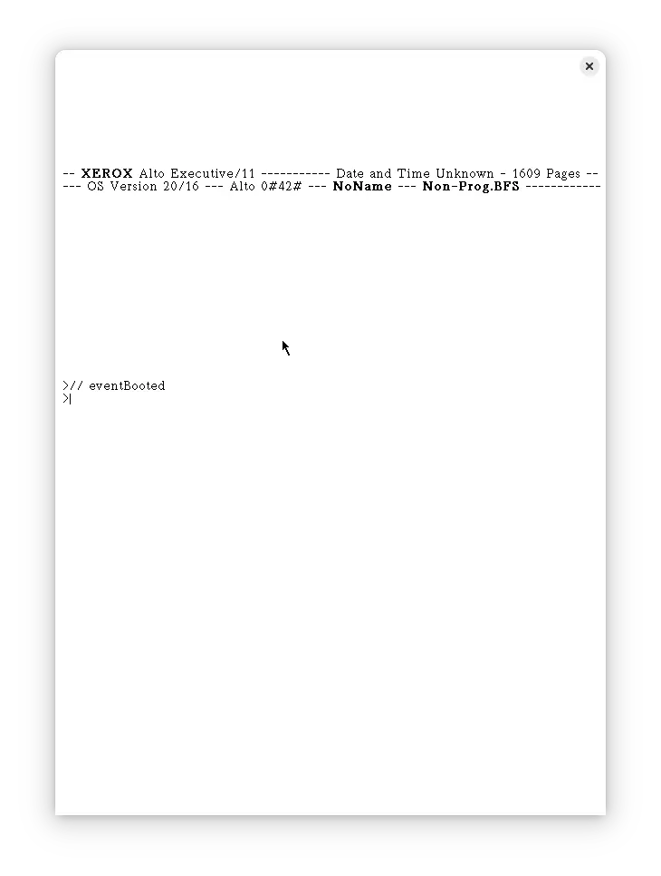
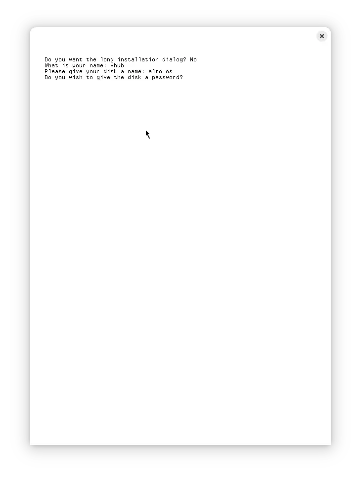
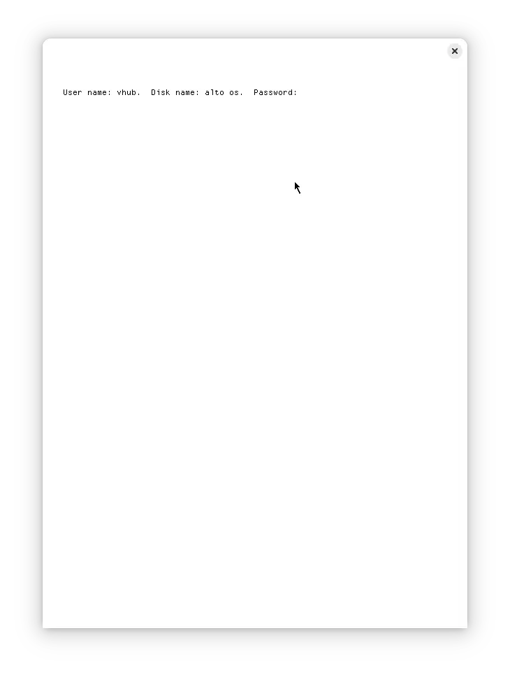

# How to install Alto OS on ContrAlto emulator?



We can run [Alto OS](/1970s/1973/alto-os/) on ContrAlto emulator. First, we need to download a disk image of Alto OS.

## Downloads

You can download the Alto OS Non-programmer's disk image [bitsavers](http://bitsavers.org/bits/Xerox/Alto/simulator/salto/disks/):

- [Alto OS Non-programmer's disk image](http://bitsavers.org/bits/Xerox/Alto/simulator/salto/disks/nonprog.dsk.Z)

If you are on Windows, you may need to install additional software such as [7-Zip](https://www.7-zip.org/) to extract the kit.

## Setting Up

:::tip

If you have not already installed ContrAlto emulator, see [the VirtualHub Setup tutorial on how to do so](https://setup.virtualhub.eu.org/contralto/) on Linux and Windows.

:::

### Linux

Extract the `nonprog.dsk.Z` you downloaded. Inside you will find the `nonprog.dsk` disk image file. Copy that file to where you have stored the files for ContrAlto emulator.

Now open the file called `Contralto.cfg` in a text editor. Find the following line:

```ini
# Drive0Image =
```

and replace it with the following:

```ini
Drive0Image = nonprog.dsk
```



Save and quit the file.

Now open a terminal and move to the ContrAlto folder. Run the following command to start the emulator:

```bash
mono Contralto.exe
```



In the console window that appears, type `start` followed by enter. The main emulation window will turn white, and Alto OS will start.





You can now continue with [installing Alto OS](#installing-alto-os).

### Windows

Start the ContrAlto emulator from Start menu. After it opens, click on `System` > `Drive 0` > `Load`. Choose the `nonprog.dsk` file. Now click on `System` > `Start`. The emulation will start. You can now continue with [installing Alto OS](#installing-alto-os).

## Installing Alto OS

:::tip

To interact with Alto OS, you need to click on the emulation window. Doing so will lock your mouse and keyboard to inside the window. To free them again, press the `Alt` key.

:::

Run `install` in the emulation window to start the installation. When asked whether you want the long installation dialog, press `N`. Enter your username and the name you want to give to the disk.



If you want to set up a password, press `Y` else press `N`. If you choose to set up a password, enter it. You will need the password every time you start Alto OS, so make sure to remember it.

Afterward, Alto OS will restart. If you have set up a password, it will ask for it. Note that while the password is shown as you type when setting it, there is no feedback while you are entering your password now, similar to Unix systems, but the password is being entered.



After entering the password, Alto OS will start and display your username as well as the disk name you gave. You can type `?` to see the list of files:


That's it! We installed Alto OS. See the [manuals section](/1970s/1973/alto-os/#manuals) on the [main Alto OS page](/1970s/1973/alto-os/) to learn how to use it.

There are several preinstalled apps on the disk image. We cover them here:

- [Preinstalled apps in Alto OS](/1970s/1973/alto-os/preinstalled-apps/)

## Credits

- The disk image and other files used above are from [bitsavers](http://bitsavers.org/bits/Xerox/Alto/simulator/salto/disks/). They have disk images of many apps which run on Alto OS. You may want to try them.

## Video tutorial

Do you want to follow the tutorial by watching a video? We will post a video on our [YouTube channel](https://www.youtube.com/@virtua1hub) soon.

Archives of this tutorial are available on [Wayback Machine](https://web.archive.org/web/*/https://virtualhub.eu.org/1970s/1973/alto-os/contralto/).
