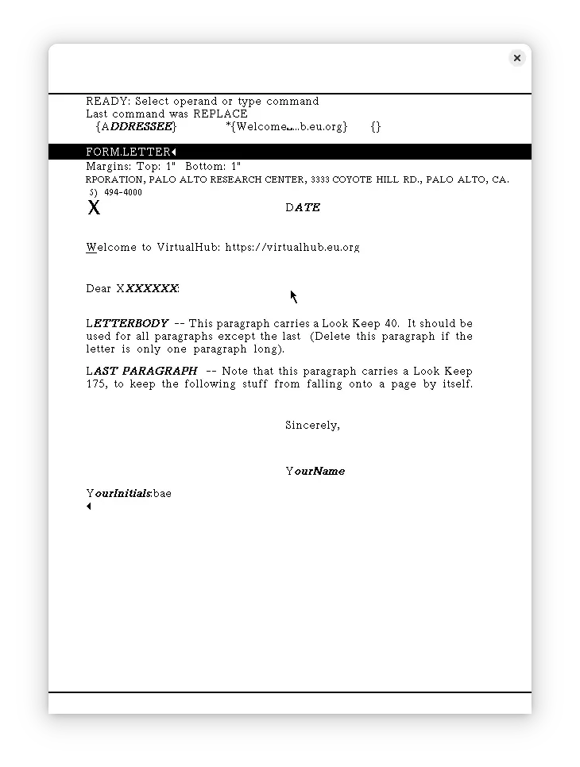

import DocCardList from '@theme/DocCardList';

# Alto OS

The Xerox Alto OS, was the first GUI system. It was way ahead of its time. We can run it on ContrAlto emulator and Salto emulator. The recommended emulator is ContrAlto.

<DocCardList />

## Manuals

:::tip

The manuals refer to the mouse buttons by their color. On a modern 3-button mouse, the colors map as the following:

- Red = Left mouse button
- Yellow = Middle mouse button
- Blue = Right mouse button

On most mouses, pressing the scroll-wheel simulates pressing the middle mouse button.

:::

You can download the Alto OS manuals from [bitsavers](http://bitsavers.org/pdf/xerox/alto/). These are the most useful ones:

- [Alto User's Handbook](http://bitsavers.org/pdf/xerox/alto/Alto_Users_Handbook_Sep79.pdf)
- [Alto Subsystems Manual](http://bitsavers.org/pdf/xerox/alto/AltoSubsystems_Oct79.pdf)
- [Alto Operating System Reference Manual (Part 1)](http://bitsavers.org/pdf/xerox/alto/AltoSWRef.part1.pdf)
- [Alto Operating System Reference Manual (Part 2)](http://bitsavers.org/pdf/xerox/alto/AltoSWRef.part2.pdf)
- [BCPL Reference Manual](http://bitsavers.org/pdf/xerox/alto/bcpl/AltoBCPLdoc.pdf)
- [Bravo Course Outline](http://bitsavers.org/pdf/xerox/alto/BravoCourse.pdf)

You may also be interested in the Alto hardware manual:

- [Alto Hardware Manual (Part 1)](http://bitsavers.org/pdf/xerox/alto/AltoHWRef.part1.pdf)
- [Alto Hardware Manual (Part 2)](http://bitsavers.org/pdf/xerox/alto/AltoHWRef.part2.pdf)

## Apps

- [Preinstalled Apps](/1970s/1973/alto-os/preinstalled-apps/)

## Related Pages

- [VirtualHub Screenshots](https://screenshots.virtualhub.eu.org/1970s/1973/alto-os/)
- [Run Alto OS in your browser: ContrAltoJS](https://archives.loomcom.com/contraltojs/) (Instructions given on page)
- [Run Alto OS in your browser: RetroWeb Vintage Computer Museum ](http://retroweb.maclab.org/articles/Xerox-Alto.html?emulator=salto-alto) (Instructions given on page)
- [Wikipedia](https://en.wikipedia.org/wiki/Xerox_Alto#Software)
- [Computer History Wiki Alto page](https://gunkies.org/wiki/Xerox_Alto)
- [Toasty Tech Xerox Alto page](http://toastytech.com/guis/alto.html)
- [Toasty Tech page on running Alto OS on the older `salto` emulator](http://toastytech.com/guis/salto.html)
- [Computer History Museum: Xerox Alto Source Code Release](https://computerhistory.org/blog/xerox-alto-source-code/)

## Credits

- The manuals were taken from [Bitsavers](http://bitsavers.org).
