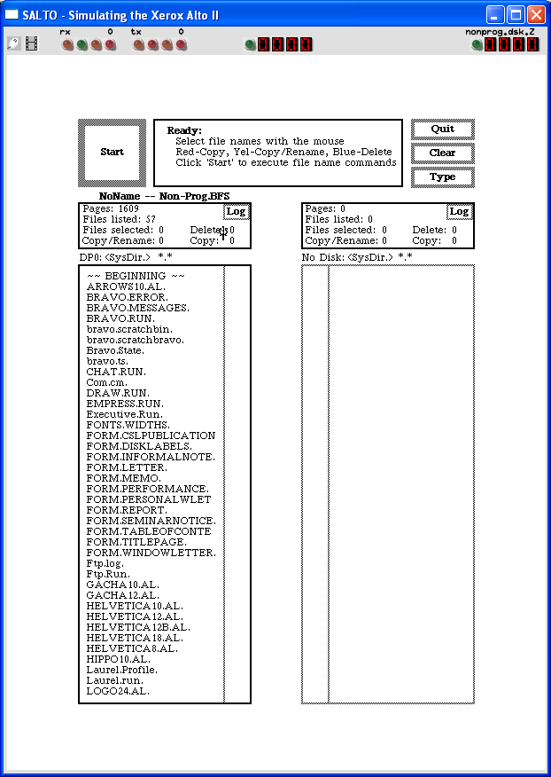

# How to install Alto OS on Salto emulator?



We can run [Alto OS](/1970s/1973/alto-os/) on Salto emulator.

## Setting Up

:::tip

If you have not already installed Salto emulator, see [the VirtualHub Setup tutorial on how to do so](https://setup.virtualhub.eu.org/salto/) on Linux and Windows.

:::

### Linux

:::tip

This section is applicable only if you installed Salto on an old Linux distribution directly. If you are using it with Wine, see the [Windows](#windows) instructions below, and modify them as needed for Wine.

:::

Switch to the folder Salto folder, and run the following command:

```bash
bin/salto disks/nonprog.dsk.Z
```

Salto does not support permanent changes to the disks, so it is useless to *install* Alto OS. You can just use it as it is.

You can make a shell script name `Alto-OS.sh` to make it easier to launch the emulator:

```bash
#!/bin/bash
bin/salto disks/nonprog.dsk.Z
```

Now make the file executable:

```bash
chmod +x Alto-OS.sh
```

Now you can start the emulator using the shell script. For example, on KDE you can right-click the file and choose Run in Konsole or on GNOME, where you can right-click the file and choose Run as executable. The emulator will start.

### Windows

:::tip

You should use Linux. If you don’t know how to install a Linux distro, see [our tutorials on how to install Kubuntu](https://setup.virtualhub.eu.org/tag/os/), a beginner-friendly distro.

:::

Open the Salto folder and double click on the `nonprog.bat` file to start the emulator. Salto does not support permanent changes to the disks, so it is useless to *install* Alto OS. You can just use it as it is.

That's it! We used Alto OS. See the [manuals section](/1970s/1973/alto-os/#manuals) on the [main Alto OS page](/1970s/1973/alto-os/) to learn how to use it.

There are several preinstalled apps on the disk image. We cover them here:

- [Preinstalled apps in Alto OS](/1970s/1973/alto-os/preinstalled-apps/)

## Credits

- [Toasty Tech](http://toastytech.com/) for hosting the Windows version of the Salto emulator and writing excellent articles about the Salto emulator.

## Video tutorial

Do you want to follow the tutorial by watching a video? We will post a video on our [YouTube channel](https://www.youtube.com/@virtua1hub) soon.

Archives of this tutorial are available on [Wayback Machine](https://web.archive.org/web/*/https://virtualhub.eu.org/1970s/1973/alto-os/salto/).
