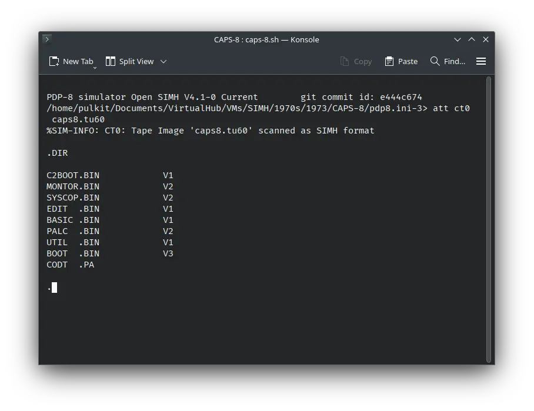

import DocCardList from '@theme/DocCardList';

# ! CAPS-8

! CAPS-8 was an operating system for the DEC PDP-8 computer. We can run it on SIMH emulator.

<DocCardList />

## Manuals

You can download the ! CAPS-8 manuals from here:

- [! CAPS-8 User Manual](http://www.bitsavers.org/pdf/dec/pdp8/caps8/DEC-8E-OCASA-B-D_CAPS8_UG.pdf)

You may also be interested in the PDP-8 manuals. They were the computers on which ! CAPS-8 was supposed to run. You can download them from Bitsavers:

- [PDP-8 Manuals](http://bitsavers.org/pdf/dec/pdp8/)

## Related Pages

- [VirtualHub Screenshots](https://screenshots.virtualhub.eu.org/1970s/1973/caps-8/)
- [Wikipedia PDP-8 page](https://en.wikipedia.org/wiki/PDP-8)
- [Computer History Wiki PDP-8 page](https://gunkies.org/wiki/PDP-8)

## Credits

- The manuals were taken from [Bitsavers](http://bitsavers.org).
