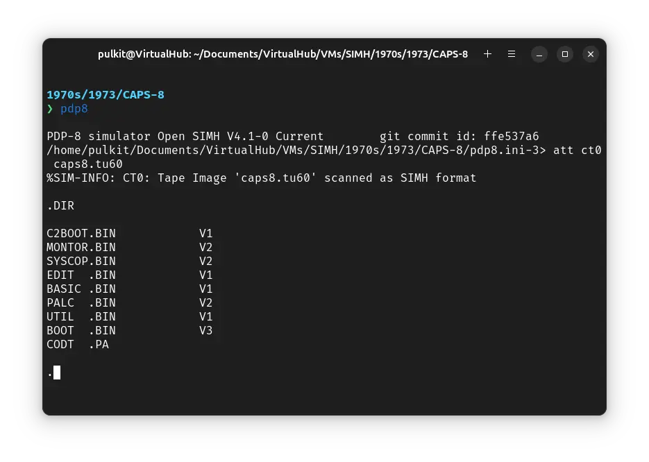
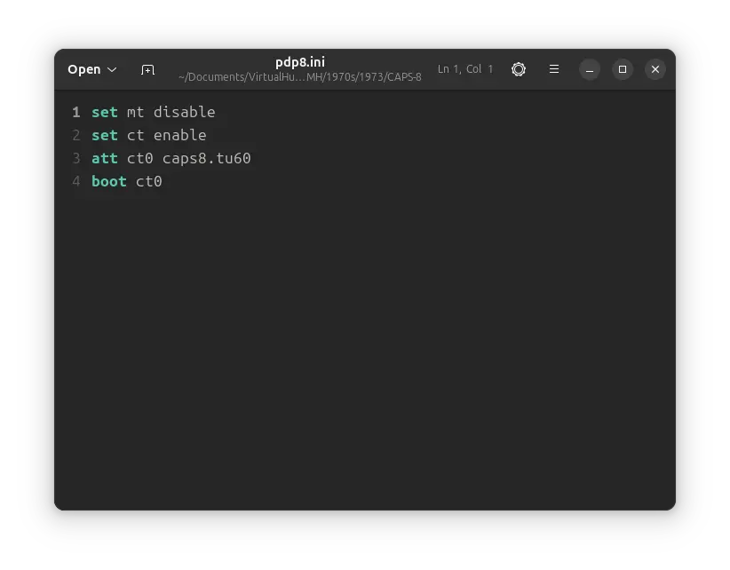
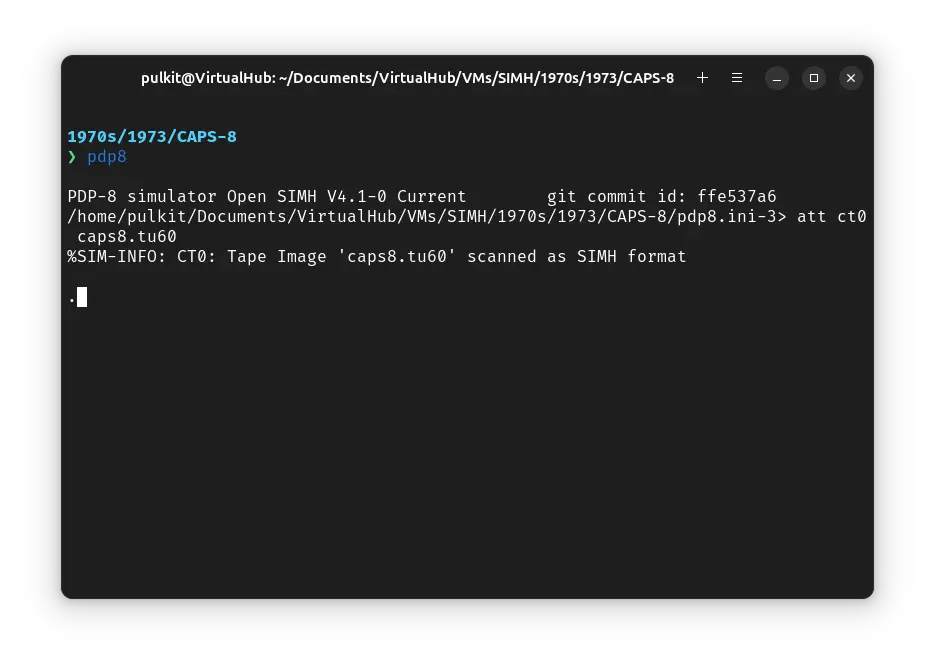

# How to install ! CAPS-8 on SIMH?



We can run [! CAPS-8](/1970s/1973/caps-8) on the SIMH PDP-8 emulator. First, we need to download the ! CAPS-8 kit.

## Downloads

You can download the kit needed to run ! CAPS-8 on the SIMH PDP-8 emulator from the ["SIMH Legacy" website](http://simh.trailing-edge.com/):

- [! CAPS-8 kit](http://simh.trailing-edge.com/kits/caps8_all.zip)

## Using ! CAPS-8

:::tip

If you have not already installed SIMH PDP-8 emulator, see [the VirtualHub Setup tutorial on how to do so](https://setup.virtualhub.eu.org/simh-pdp8/) on Linux and Windows.

:::

Extract the kit you downloaded. Inside you will find several files. Create a folder somewhere to store the files for this VM and move the file named `caps8.tu60` into it.

Now we will create a config file for our VM. Create a text file called `pdp8.ini` with the following content in the VM folder:

```ini
set mt disable
set ct enable
att ct0 caps8.tu60
boot ct0
```



Now open a terminal and move to the VM folder. Run the following command to start the emulator:

```bash
pdp8
```



After the emulator starts, you can enter `DIR` to see a list of files available:


That's it! We used ! CAPS-8. We can create a shell script to make it easy to launch the VM.

### Linux

Create a file called `CAPS-8.sh` with the following content:

```bash
#!/bin/bash
pdp8
```

Now make the file executable:

```bash
chmod +x CAPS-8.sh
```

Now you can start the VM using the shell script. For example, on KDE you can right-click the file and choose `Run in Konsole` or on GNOME, where you can right-click the file and choose `Run as executable`. The VM will start.

See the [manuals section](/1970s/1973/caps-8/#manuals) on the [main ! CAPS-8 page](/1970s/1973/caps-8/) to learn how to use it.

### Windows

Create a file called `CAPS-8.bat` with the following content:

```bash
pdp8
```

Now you can start the VM by double-clicking the shell script. See the [manuals section](/1970s/1973/caps-8/#manuals) on the [main ! CAPS-8 page](/1970s/1973/caps-8/) to learn how to use it.

## Credits

- The disk image and other files used above are from a kit available on [SimH "Classic" website](http://simh.trailing-edge.com/).

## Video tutorial

Do you want to follow the tutorial by watching a video? We will post a video on our [YouTube channel](https://www.youtube.com/@virtua1hub) soon.

Archives of this tutorial may be available on [Wayback Machine](https://web.archive.org/web/*/https://virtualhub.eu.org/1970s/1973/caps-8/simh/).
