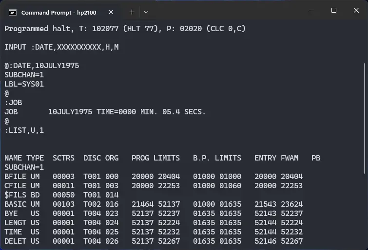
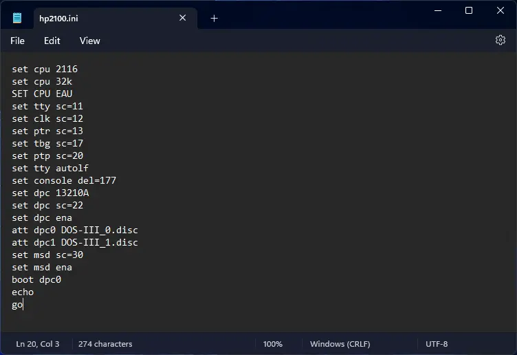
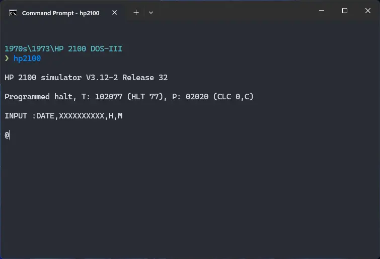

# How to install ! HP 2100 DOS-III on SIMH?



We can run [! HP 2100 DOS-III](/1970s/1973/hp2100dos-iii) on the SIMH HP 2100 emulator. First, we need to download the ! HP 2100 DOS-III kit.

## Downloads

You can download the kit needed to run ! HP 2100 DOS-III on the SIMH HP 2100 emulator from the GitHub user [rsanchovilla's](https://github.com/rsanchovilla/) [software kits repository](https://github.com/rsanchovilla/Software_Kits):

- [! HP 2100 DOS-III kit](https://github.com/rsanchovilla/Software_Kits/raw/master/HP/DOS-III.zip)

## Using ! HP 2100 DOS-III

:::tip

If you have not already installed SIMH HP 2100 emulator, see [the VirtualHub Setup tutorial on how to do so](https://setup.virtualhub.eu.org/simh-hp2100/) on Linux and Windows.

:::

Extract the kit you downloaded. Inside you will find several files. Create a folder somewhere to store the files for this VM and move the files named `DOS-III_0.disc` and `DOS-III_1.disc` into it.

Now we will create a config file for our VM. Create a text file called `hp2100.ini` with the following content in the VM folder:

```ini
set cpu 2116
set cpu 32k
SET CPU EAU
set tty sc=11
set clk sc=12
set ptr sc=13
set tbg sc=17
set ptp sc=20
set tty autolf
set console del=177
set dpc 13210A
set dpc sc=22
set dpc ena
att dpc0 DOS-III_0.disc
att dpc1 DOS-III_1.disc
set msd sc=30
set msd ena
boot dpc0
echo
go
```



Now open a terminal and move to the VM folder. Run the following command to start the emulator:

```bash
hp2100
```



Type `:DATE,10JULY1975` when you encounter the `@` prompt, and press enter. You can change the date as you wish. After you see some lines, and then another `@` prompt, type `:JOB` and press enter.

To see list of user files, run `:LIST,U,1`.


That's it! We used ! HP 2100 DOS-III. We can create a shell script to make it easy to launch the VM.

### Linux

Create a file called `HP-2100-DOS-III.sh` with the following content:

```bash
#!/bin/bash
hp2100
```

Now make the file executable:

```bash
chmod +x HP-2100-DOS-III.sh
```

Now you can start the VM using the shell script. For example, on KDE you can right-click the file and choose `Run in Konsole` or on GNOME, where you can right-click the file and choose `Run as executable`. The VM will start.

See the [manuals section](/1970s/1973/hp2100dos-iii/#manuals) on the [main ! HP 2100 DOS-III page](/1970s/1973/hp2100dos-iii/) to learn how to use it.

### Windows

Create a file called `HP-2100-DOS-III.bat` with the following content:

```bash
hp2100
```

Now you can start the VM by double-clicking the shell script. See the [manuals section](/1970s/1973/hp2100dos-iii/#manuals) on the [main ! HP 2100 DOS-III page](/1970s/1973/hp2100dos-iii/) to learn how to use it.

## Credits

- The disk image and other files used above are from a kit available on the GitHub user [rsanchovilla's](https://github.com/rsanchovilla/) [software kits repository](https://github.com/rsanchovilla/Software_Kits).

## Video tutorial

Do you want to follow the tutorial by watching a video? We will post a video on our [YouTube channel](https://www.youtube.com/@virtua1hub) soon.

Archives of this tutorial are available on [Wayback Machine](https://web.archive.org/web/*/https://virtualhub.eu.org/1970s/1973/hp2100dos-iii/simh/).
