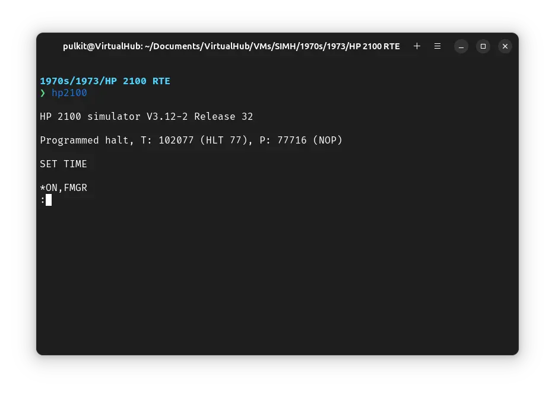
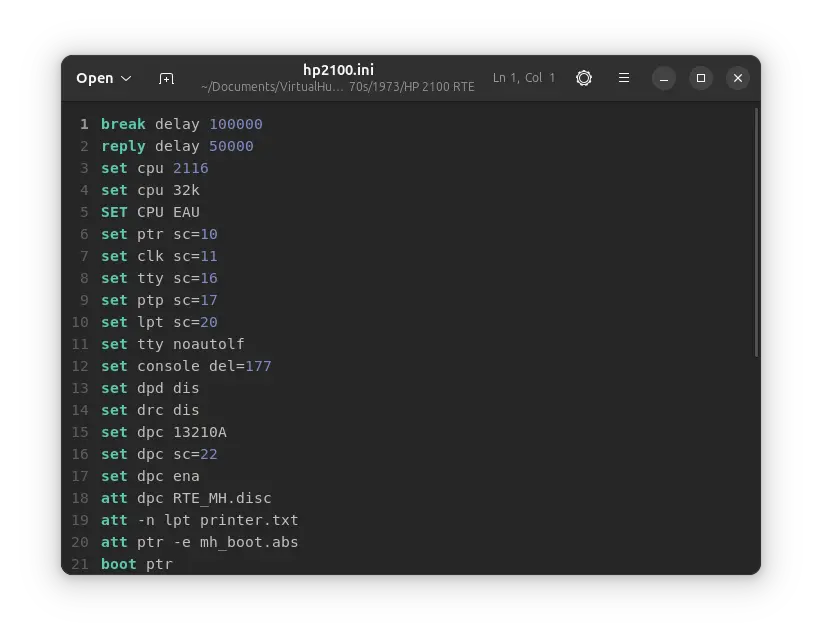
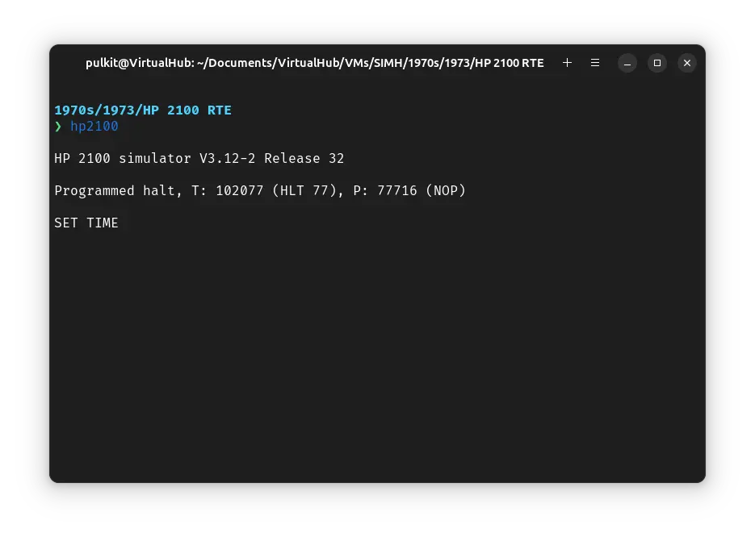

# How to install ! HP 2100 RTE on SIMH?



We can run [! HP 2100 RTE](/1970s/1973/hp2100rte) on the SIMH HP 2100 emulator. First, we need to download the ! HP 2100 RTE kit.

## Downloads

You can download the kit needed to run ! HP 2100 RTE on the SIMH HP 2100 emulator from the ["SIMH Legacy" website](http://simh.trailing-edge.com/):

- [! HP 2100 RTE kit](http://simh.trailing-edge.com/kits/RTE.zip)

## Using ! HP 2100 RTE

:::tip

If you have not already installed SIMH HP 2100 emulator, see [the VirtualHub Setup tutorial on how to do so](https://setup.virtualhub.eu.org/simh-hp2100/) on Linux and Windows.

:::

Extract the kit you downloaded. Inside you will find several files. Create a folder somewhere to store the files for this VM and move the files named `RTE_MH.disc` into it. Open the `rtgen` folder inside the extracted folder and move the file called `mh_boot.abs` to the VM folder.

Now we will create a config file for our VM. Create a text file called `hp2100.ini` with the following content in the VM folder:

```ini
break delay 100000
reply delay 50000
set cpu 2116
set cpu 32k
SET CPU EAU
set ptr sc=10
set clk sc=11
set tty sc=16
set ptp sc=17
set lpt sc=20
set tty noautolf
set console del=177
set dpd dis
set drc dis
set dpc 13210A
set dpc sc=22
set dpc ena
att dpc RTE_MH.disc
att -n lpt printer.txt
att ptr -e mh_boot.abs
boot ptr
d s 0
go
```



Now open a terminal and move to the VM folder. Run the following command to start the emulator:

```bash
hp2100
```



Press enter when asked for time. After you see the `*` prompt, type `ON,FMGR` and press enter to start file manager:


That's it! We used ! HP 2100 RTE. We can create a shell script to make it easy to launch the VM.

### Linux

Create a file called `HP-2100-RTE.sh` with the following content:

```bash
#!/bin/bash
hp2100
```

Now make the file executable:

```bash
chmod +x HP-2100-RTE.sh
```

Now you can start the VM using the shell script. For example, on KDE you can right-click the file and choose `Run in Konsole` or on GNOME, where you can right-click the file and choose `Run as executable`. The VM will start.

See the [manuals section](/1970s/1973/hp2100rte/#manuals) on the [main ! HP 2100 RTE page](/1970s/1973/hp2100rte/) to learn how to use it.

### Windows

Create a file called `HP-2100-RTE.bat` with the following content:

```bash
hp2100
```

Now you can start the VM by double-clicking the shell script. See the [manuals section](/1970s/1973/hp2100rte/#manuals) on the [main ! HP 2100 RTE page](/1970s/1973/hp2100rte/) to learn how to use it.

## Credits

- The disk image and other files used above are from a kit available on [SimH "Classic" website](http://simh.trailing-edge.com/).

## Video tutorial

Do you want to follow the tutorial by watching a video? We will post a video on our [YouTube channel](https://www.youtube.com/@virtua1hub) soon.

Archives of this tutorial are available on [Wayback Machine](https://web.archive.org/web/*/https://virtualhub.eu.org/1970s/1973/hp2100rte/simh/).
