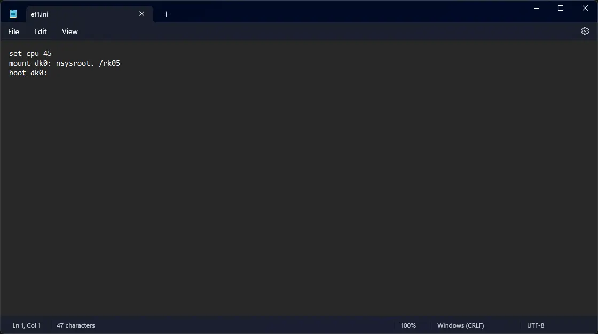
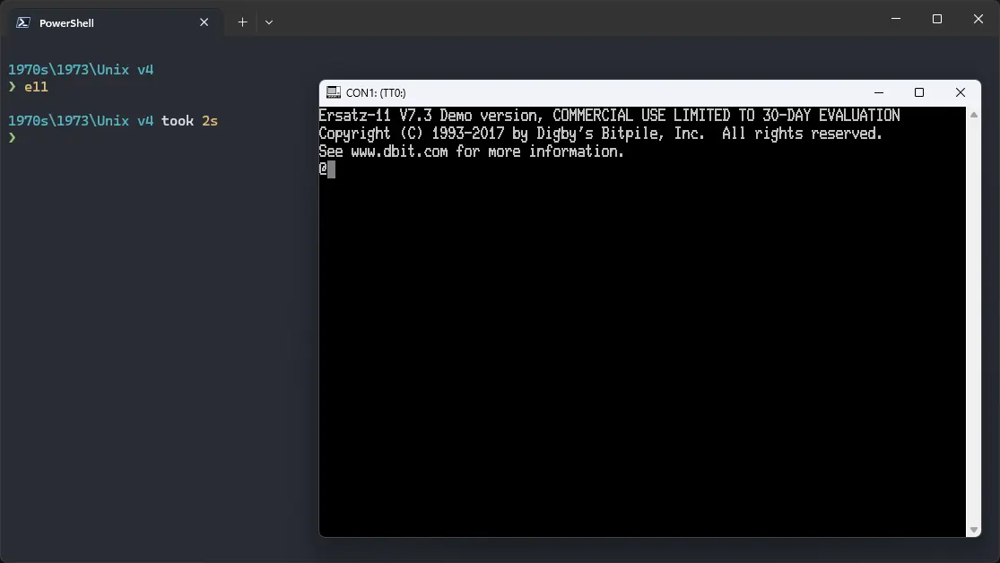

# How to install ! Unix v4 on Ersatz-11?


Sadly, we do not have a complete copy of Unix v4, but we do have a copy of a kernel that is from between v3 and v4. We can use that kernel with v5 userland. It can be used on Ersatz-11 emulator.

## Downloads

First, we need to prepare an image of Unix v5 with the `nsys` kernel. We have prepared such an image for you to download:

- [! Unix-v4 image (v5 root with nsys kernel)](https://github.com/InstallerLegacy/nsys-image/releases/latest/download/nsysroot.zip)

If you want to prepare the image yourself, refer to [our guide on how to do so](/blog/how-to-put-the-nsys-kernel-on-a-disk-image-of-unix-v5/).

## Using ! Unix-v4

:::tip

If you have not already installed Ersatz-11 emulator, see [the VirtualHub Setup tutorial on how to do so](https://setup.virtualhub.eu.org/ersatz-11/) on Linux and Windows.

:::

Extract the archive you downloaded. Inside you will find a file called `nsysroot`. Create a folder somewhere to store the files for this VM and move that file into it.

Now we will create a config file for our VM. Create a text file called `e11.ini` with the following content in the VM folder:

```ini
set cpu 45
mount dk0: nsysroot. /rk05
boot dk0:
```



Now open a terminal and move to the VM folder. Run the following command to start the emulator:

```bash
e11
```



After the emulator starts, you will get a `@` prompt. Type `nsys` and press enter to run the `nsys` kernel. You will be asked to log in. Type `root` and press enter to log in. There is no password.

You can now run `ls` to see the list of files. To change directory, you need to use the `chdir` command, `cd` is not available.


That's it! We used ! Unix-v4. To exit the emulator, press `Shift` + `Enter` and then type `exit` and press enter. We can create a shell script to make it easy to launch the VM.

### Linux

Create a file called `unix-v4.sh` with the following content:

```bash
#!/bin/bash
e11
```

Now make the file executable:

```bash
chmod +x unix-v4.sh
```

Now you can start the VM using the shell script. For example, on KDE you can right-click the file and choose `Run in Konsole` or on GNOME, where you can right-click the file and choose `Run as executable`. The VM will start.

See the [manuals section](/1970s/1973/unix-v4/#manuals) on the [main ! Unix-v4 page](/1970s/1973/unix-v4) to learn how to use it.

### Windows

Create a file called `unix-v4.bat` with the following content:

```bash
e11
```

Now you can start the VM by double-clicking the shell script. See the [manuals section](/1970s/1973/unix-v4/#manuals) on the [main ! Unix-v4 page](/1970s/1973/unix-v4) to learn how to use it.


## Credits

- The Unix v5 image, the `nsys` kernel and other files used above are from [TUHS](https://www.tuhs.org).

## Video tutorial

Do you want to follow the tutorial by watching a video? We will post a video on our [YouTube channel](https://www.youtube.com/@virtua1hub) soon.

Archives of this tutorial are available on [Wayback Machine](https://web.archive.org/web/*/https://virtualhub.eu.org/1970s/1973/unix-v4/ersatz-11/).
