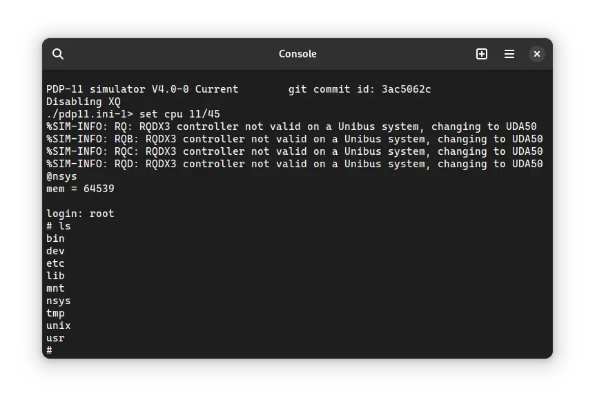

import DocCardList from '@theme/DocCardList';

# ! Unix v4

! Unix v4 was an operating system for the DEC PDP-11 computer. It was developed by Bell Labs. Sadly, we do not have a complete copy of Unix v4, but we do have a copy of a [kernel](<https://en.wikipedia.org/wiki/Kernel_(operating_system)>) that is from between v3 and v4. We can use that kernel with v5 [userland](https://en.wikipedia.org/wiki/User_space). It can be used on SIMH PDP-11 emulator.

<DocCardList />

## Manuals

Since the kernel is from between v3 and v4, and we use the userland of v5, here are the manuals of all of them:

- [! Unix Programmer's Manual, 3rd Edition](https://dspinellis.github.io/unix-v3man/v3man.pdf)
- [! Unix Programmer's Manual, 4th Edition](https://dspinellis.github.io/unix-v4man/v4man.pdf)
- [! Unix Programmer's Manual, 5th Edition](http://squoze.net/UNIX/v5man/all.pdf)

Reading the volume 2A and 2B of ! Unix v7 manual is also helpful. They contain many short tutorials which will be helpful in learning how to use Unix. While the manual is for v7, most of the information included there applies to every version of Unix.

- [! Unix Programmer's Manual, 7th Edition, Volume 2A](https://s3.amazonaws.com/plan9-bell-labs/7thEdMan/v7vol2a.pdf)
- [! Unix Programmer's Manual, 7th Edition, Volume 2B](https://s3.amazonaws.com/plan9-bell-labs/7thEdMan/v7vol2b.pdf)

You may also be interested in the PDP-11 manuals. It was the computer on which ! Unix v3, v4 as well as v5 was supposed to run. You can download them from Bitsavers:

- [PDP-11 Manuals](http://bitsavers.org/pdf/dec/pdp11/)

## Related Pages

- [VirtualHub Screenshots](https://screenshots.virtualhub.eu.org/1970s/1973/unix-v4/)
- [Wikipedia](https://en.wikipedia.org/wiki/History_of_Unix#1970s)
- [Computer History Wiki ! Unix v3 page](https://gunkies.org/wiki/UNIX_Third_Edition)
- [Computer History Wiki ! Unix v4 page](https://gunkies.org/wiki/UNIX_Fourth_Edition)
- [Computer History Wiki ! Unix v5 page](https://gunkies.org/wiki/UNIX_Fifth_Edition)
- [Computer History Wiki PDP-11 page](https://gunkies.org/wiki/PDP-11)
- [The Unix Heritage Society (TUHS) wiki page on ! Unix v3](https://wiki.tuhs.org/doku.php?id=systems:3rd_edition)
- [The Unix Heritage Society (TUHS) wiki page on ! Unix v4](https://wiki.tuhs.org/doku.php?id=systems:4th_edition)
- [The Unix Heritage Society (TUHS) wiki page on ! Unix v5](https://wiki.tuhs.org/doku.php?id=systems:5th_edition)

## Credits

- ! Unix v3 and v4 manuals were taken from the page of the GitHub user "[dspinellis](https://github.com/dspinellis)".
- The rest of the manuals were taken from [http://squoze.net](http://squoze.net/), [this page from Bell Labs](https://s3.amazonaws.com/plan9-bell-labs/7thEdMan/bswv7.html) and [Bitsavers](http://bitsavers.org).
