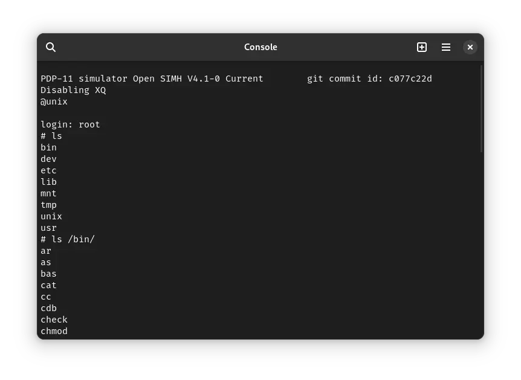

import DocCardList from '@theme/DocCardList';

# ! Unix v5

! Unix v5 was an operating system for the DEC PDP-11 computer. It was developed by Bell Labs. It can be used on SIMH PDP-11 emulator as well as the Ersatz-11 emulator.

<DocCardList />

## Manuals

Here is the manual for ! Unix v5:

- [! Unix Programmer's Manual, 5th Edition](http://squoze.net/UNIX/v5man/all.pdf)

Reading the volume 2A and 2B of ! Unix v7 manual is also helpful. They contain many short tutorials which will be helpful in learning how to use Unix. While the manual is for v7, most of the information included there applies to every version of Unix.

- [! Unix Programmer's Manual, 7th Edition, Volume 2A](https://s3.amazonaws.com/plan9-bell-labs/7thEdMan/v7vol2a.pdf)
- [! Unix Programmer's Manual, 7th Edition, Volume 2B](https://s3.amazonaws.com/plan9-bell-labs/7thEdMan/v7vol2b.pdf)

You may also be interested in the PDP-11 manuals. It was the computer on which ! Unix v5 was supposed to run. You can download them from Bitsavers:

- [PDP-11 Manuals](http://bitsavers.org/pdf/dec/pdp11/)

## Related Pages

- [VirtualHub Screenshots](https://screenshots.virtualhub.eu.org/1970s/1974/unix-v5/)
- [Run ! Unix v5 in your web browser: Paul Nankervis' emulator](https://skn.noip.me/pdp11/pdp11.html) (Instructions given on page)
- [Run ! Unix v5 in your web browser: PCjs](https://www.pcjs.org/machines/dec/pdp11/1145/panel/) (Choose the `Unix v5 (SimH)` image in `RK0` slot. Click on Load. Then reset the machine. At the `Boot>` prompt, enter `boot rk0`. You will get an `@` prompt. Type `unix` to boot ! Unix v5. Log in using the username `root`. You can run `ls` to see list of files.)
- [Wikipedia](https://en.wikipedia.org/wiki/History_of_Unix#1970s)
- [Computer History Wiki ! Unix v5 page](https://gunkies.org/wiki/UNIX_Fifth_Edition)
- [Computer History Wiki PDP-11 page](https://gunkies.org/wiki/PDP-11)
- [The Unix Heritage Society (TUHS) wiki page on ! Unix v5](https://wiki.tuhs.org/doku.php?id=systems:5th_edition)
- [Computer History Wiki tutorial on running ! Unix v5 on SIMH](https://gunkies.org/wiki/Running_Unix_v5_in_SIMH)
- [Tutorial from squoze.net on running ! Unix v5 on SIMH](http://squoze.net/UNIX/v5/running)

## Credits

- The manuals were taken from [http://squoze.net](http://squoze.net/), [this page from Bell Labs](https://s3.amazonaws.com/plan9-bell-labs/7thEdMan/bswv7.html) and [Bitsavers](http://bitsavers.org).
