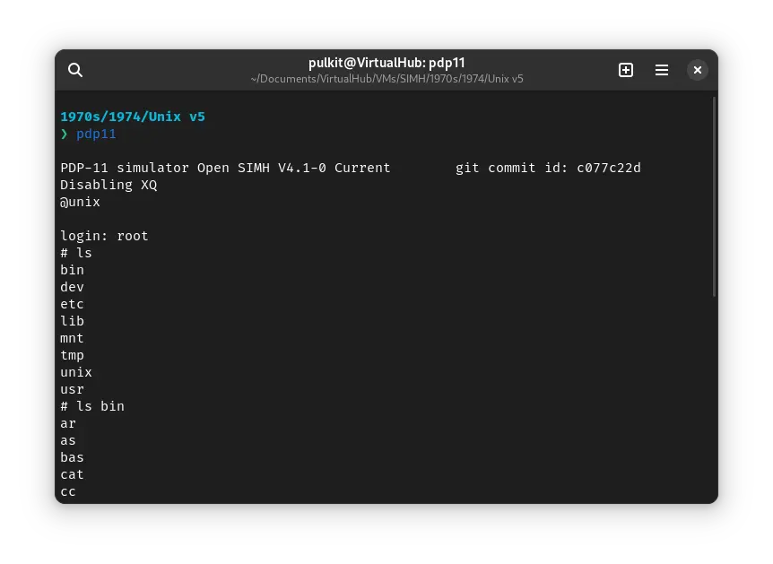
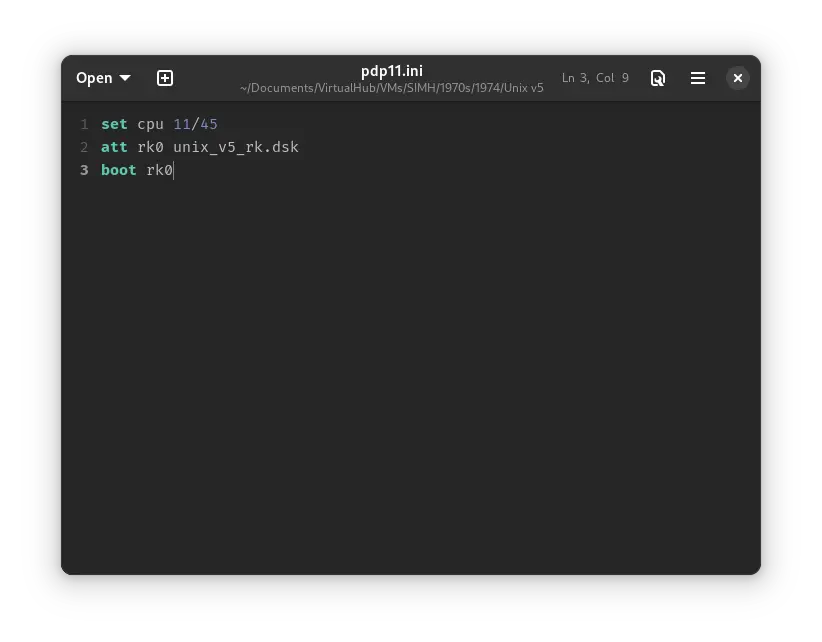
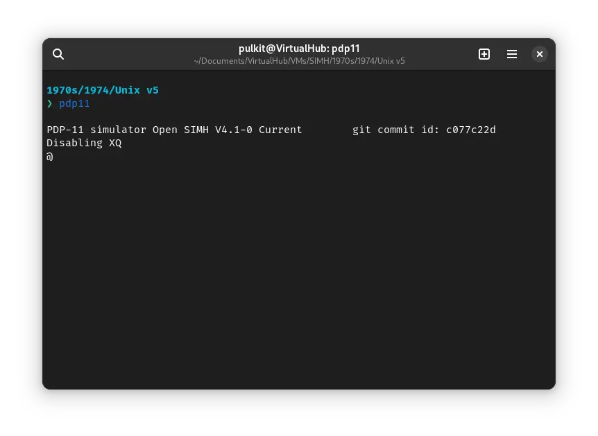
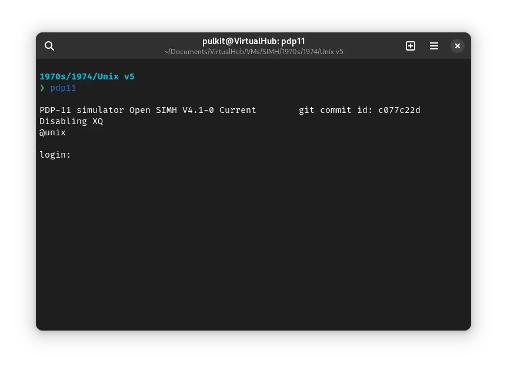
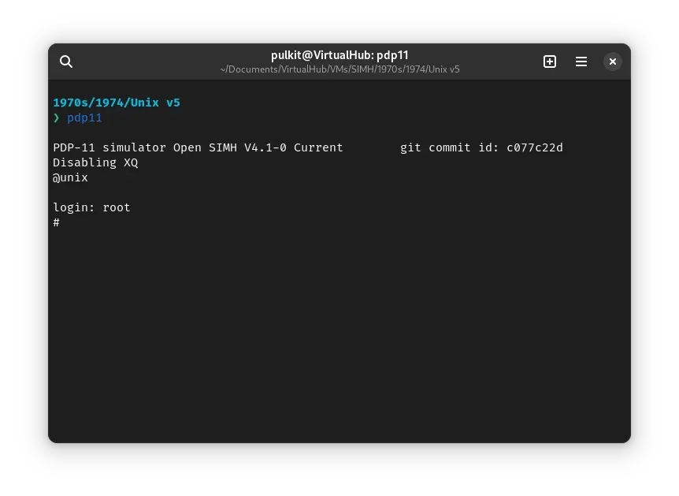

# How to install ! Unix v5 on SIMH?



We can run ! Unix v5 on the SIMH PDP-11 emulator. First, we need to download the ! Unix v5 kit.

## Downloads

You can download the kit needed to run ! Unix v5 on the SIMH PDP-11 emulator from the [“SIMH Legacy” website](http://simh.trailing-edge.com/):

- [! Unix-v5 kit](http://simh.trailing-edge.com/kits/uv5swre.zip)

## Using ! Unix-v5

:::tip

If you have not already installed SIMH PDP-11 emulator, see [the VirtualHub Setup tutorial on how to do so](https://setup.virtualhub.eu.org/simh-pdp11/) on Linux and Windows.

:::

Extract the archive you downloaded. Inside you will find a file called several files. Create a folder somewhere to store the files for this VM and move the `unix_v5_rk.dsk` file into it.

Now we will create a config file for our VM. Create a text file called `pdp11.ini` with the following content in the VM folder:

```ini
set cpu 11/45
att rk0 unix_v5_rk.dsk
boot rk0
```



Now open a terminal and move to the VM folder. Run the following command to start the emulator:

```bash
pdp11
```



After the emulator starts, you will get a `@` prompt. Type `unix` and press enter to run the `unix` kernel.



You will be asked to log in. Type `root` and press enter to log in. There is no password.



You can now run `ls` to see the list of files. To change directory, you need to use the `chdir` command, `cd` is not available.


That's it! We used ! Unix-v5. We can create a shell script to make it easy to launch the VM.

### Linux

Create a file called `unix-v5.sh` with the following content:

```bash
#!/bin/bash
pdp11
```

Now make the file executable:

```bash
chmod +x unix-v5.sh
```

Now you can start the VM using the shell script. For example, on KDE you can right-click the file and choose `Run in Konsole` or on GNOME, where you can right-click the file and choose `Run as executable`. The VM will start.

See the [manuals section](/1970s/1974/unix-v5/#manuals) on the [main ! Unix-v5 page](/1970s/1974/unix-v5) to learn how to use it.

### Windows

Create a file called `unix-v5.bat` with the following content:

```bash
pdp11
```

Now you can start the VM by double-clicking the shell script. See the [manuals section](/1970s/1974/unix-v5/#manuals) on the [main ! Unix-v5 page](/1970s/1974/unix-v5) to learn how to use it.

## Credits

- The disk image and other files used above are from a kit available on [SimH “Classic” website](http://simh.trailing-edge.com/).
- This tutorial is based on [Computer History Wiki tutorial on running ! Unix v5 on SIMH](https://gunkies.org/wiki/Running_Unix_v5_in_SIMH).

## Video tutorial

Do you want to follow the tutorial by watching a video? We will post a video on our [YouTube channel](https://www.youtube.com/@virtua1hub) soon.

Archives of this tutorial are available on [Wayback Machine](https://web.archive.org/web/*/https://virtualhub.eu.org/1970s/1974/unix-v5/simh/).
