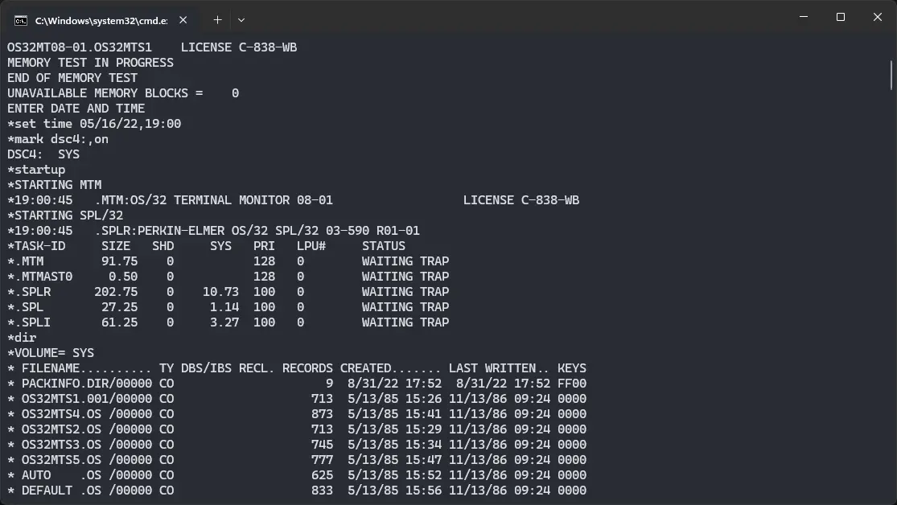

import DocCardList from '@theme/DocCardList';

# ! OS/32

! OS/32 was an operating system for the Interdata 32-bit computers. We can run it on SIMH emulator.

<DocCardList />

## Manuals

You can download a set of ! OS/32 Manuals here:

- [! OS/32 Manuals](https://github.com/davygoat/simh-os32/releases/latest/download/os32doc.zip)

You can find many other manuals about Interdata 32-bit computers, and OS/32 on Bitsavers:

- [Interdata 32-bit page on Bitsavers](https://bitsavers.org/pdf/interdata/32bit/)

## Related Pages

- [VirtualHub Screenshots](https://screenshots.virtualhub.eu.org/1970s/1975/os-32/)
- [A GitHub repository about OS/32](https://github.com/davygoat/simh-os32)
- [Wikipedia Interdata 32-bit page](https://en.wikipedia.org/wiki/Interdata_7/32_and_8/32)
- [Computer History Wiki Interdata 7/32 page](https://gunkies.org/wiki/Interdata_7/32)
- [Computer History Wiki Interdata 8/32 page](https://gunkies.org/wiki/Interdata_8/32)

## Credits

- The manuals were taken from [this GitHub repository](https://github.com/davygoat/simh-os32) and [Bitsavers](https://bitsavers.org).
