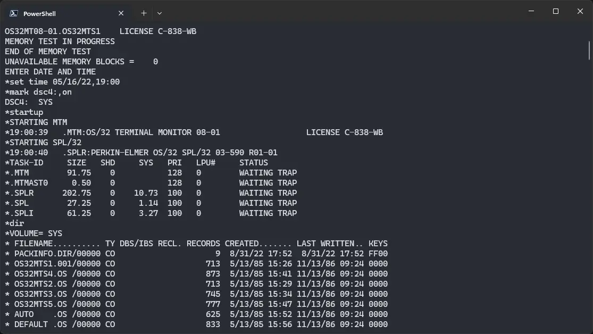
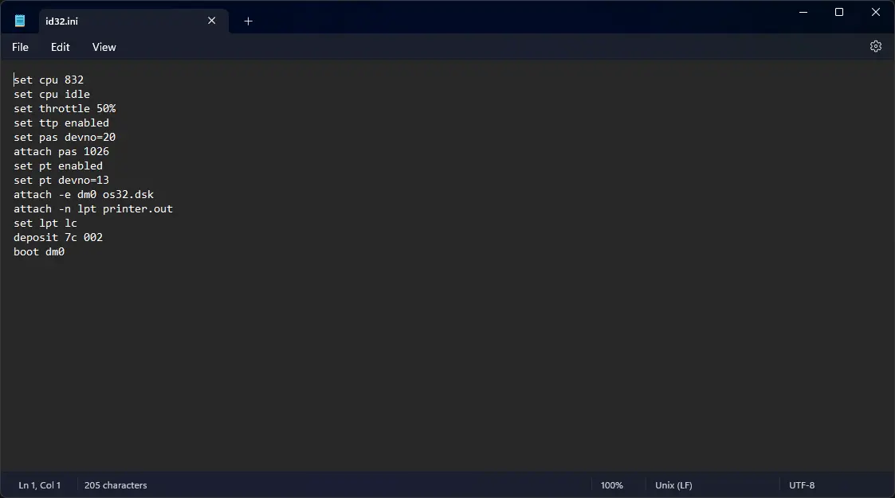
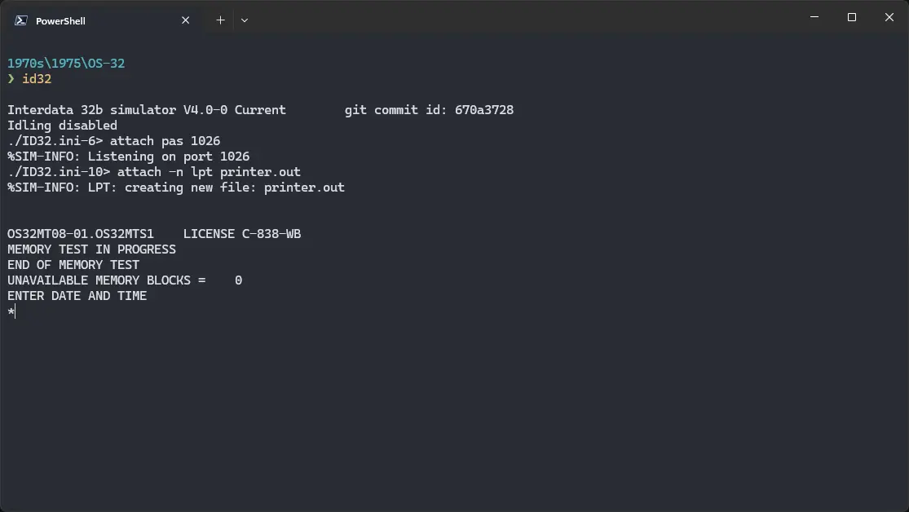

# How to install ! OS/32 on SIMH?



We can run ! OS/32 on the SIMH ID32 emulator. First, we need to download the ! OS/32 kit.

## Downloads

You can download the kit needed to run ! OS/32 from [this GitHub repository](https://github.com/davygoat/simh-os32/):

- [! OS/32 kit](https://github.com/davygoat/simh-os32/releases/latest/download/os32kit.zip)

## Using ! OS/32

:::tip

If you have not already installed SIMH Interdata 7/32 emulator, see [the VirtualHub Setup tutorial on how to do so](https://setup.virtualhub.eu.org/simh-id32/) on Linux and Windows.

:::

Extract the archive you downloaded. Inside you will find a file called several files. Create a folder somewhere to store the files for this VM and move the file named `os32.dsk` into it.

Now we will create a config file for our VM. Create a text file called `id32.ini` with the following content in the VM folder:

```ini
set cpu 832
set cpu idle
set throttle 50%
set ttp enabled
set pas devno=20
attach pas 1026
set pt enabled
set pt devno=13
attach -e dm0 os32.dsk
attach -n lpt printer.out
set lpt lc
deposit 7c 002
boot dm0
```



Now open a terminal and move to the VM folder. Run the following command to start the emulator:

```bash
id32
```



After the emulator starts, you will get a `*` prompt. Run `set time 05/16/22,19:00`. Set the date and time you want, but make sure the syntax remains the same. Try entering a date from 1970s or 80s to avoid any problem.

Then run `mark dsc4:,on`, and at last `startup`. ! OS/32 will start. Run `dir` to see a list of files on the disk.


That's it! We used ! OS/32 on SIMH Interdata 7/32 emulator. You can now run `shutdown` to shut down OS/32. Then run `mark dsc4:,off`. Finally, hit `Ctrl` + `E` and run `exit` to stop the emulator. We can create a shell script to make it easy to launch the VM.

### Linux

Create a file called `os-32.sh` with the following content:

```bash
#!/bin/bash
id32
```

Now make the file executable:

```bash
chmod +x os-32.sh
```

Now you can start the VM using the shell script. For example, on KDE you can right-click the file and choose `Run in Konsole` or on GNOME, where you can right-click the file and choose `Run as executable`. The VM will start.

See the [manuals section](/1970s/1975/os-32/#manuals) on the [main ! OS/32 page](/1970s/1975/os-32) to learn how to use it.

### Windows

Create a file called `os-32.bat` with the following content:

```bash
id32
```

Now you can start the VM by double-clicking the shell script. See the [manuals section](/1970s/1975/os-32/#manuals) on the [main ! OS/32 page](/1970s/1975/os-32) to learn how to use it.

## Credits

- The disk image and other files used above are from a kit available on [this GitHub repository](https://github.com/davygoat/simh-os32/).

## Video tutorial

Do you want to follow the tutorial by watching a video? We will post a video on our [YouTube channel](https://www.youtube.com/@virtua1hub) soon.

Archives of this tutorial are available on [Wayback Machine](https://web.archive.org/web/*/https://virtualhub.eu.org/1970s/1975/os-32/simh/).
