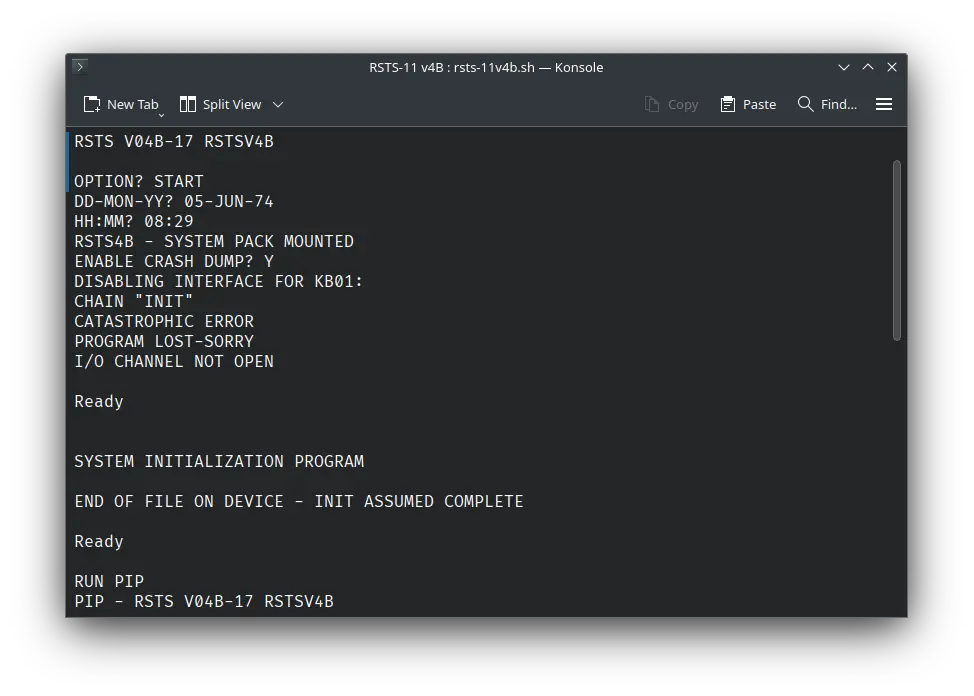

# ! RSTS-11 v4B

! RSTS-11 v4B was an operating system for the DEC PDP-11 computer. We can run it on SIMH PDP-11 emulator.

## Manuals

You can download the ! RSTS-11 v4B manuals from here:

- [! RSTS-11 System Manager's Guide](http://www.bitsavers.org/pdf/dec/pdp11/rsts-11/V004/DEC-11-ORSMA-B-D_RSTSmgr_73.pdf)
- [! RSTS-11 System User's Guide](http://www.bitsavers.org/pdf/dec/pdp11/rsts-11/V004/DEC-11-ORSUA-A-D_RSTS_UserMan_Sep72.pdf)
- [Basic-PLUS Language Manual](http://www.bitsavers.org/pdf/dec/pdp11/rsts-11/V004/DEC-11-ORBPA-A-D_BASIC-PLUS_LangMan_Oct72.pdf)

You may also be interested in the PDP-11 manuals. It was the computer on which ! RSTS-11 was supposed to run. You can download them from Bitsavers:

- [PDP-11 Manuals](http://bitsavers.org/pdf/dec/pdp11/)

## Related Pages

- [VirtualHub Screenshots](https://screenshots.virtualhub.eu.org/1970s/1975/rsts-11-v4b/)
- [A guide providing instructions on how to install ! RSTS-11 v4B manually on SIMH PDP-11 emulator](https://iamvirtual.ca/PDP-11/RSTS-11/Install.htm)
- [Run ! RSTS-11 v4B in your web browser (Not working as of 05-June-2024)](https://skn.noip.me/pdp11/pdp11.html) (Instructions given on that page)
- [Computer History Wiki page](https://gunkies.org/wiki/RSTS/E)
- [Wikipedia page](https://en.wikipedia.org/wiki/RSTS/E)
- [Computer History Wiki PDP-11 page](https://gunkies.org/wiki/PDP-11)
- [Wikipedia PDP-11 page](https://gunkies.org/wiki/PDP-11)

## Credits

- The manuals were taken from [Bitsavers](http://bitsavers.org).
