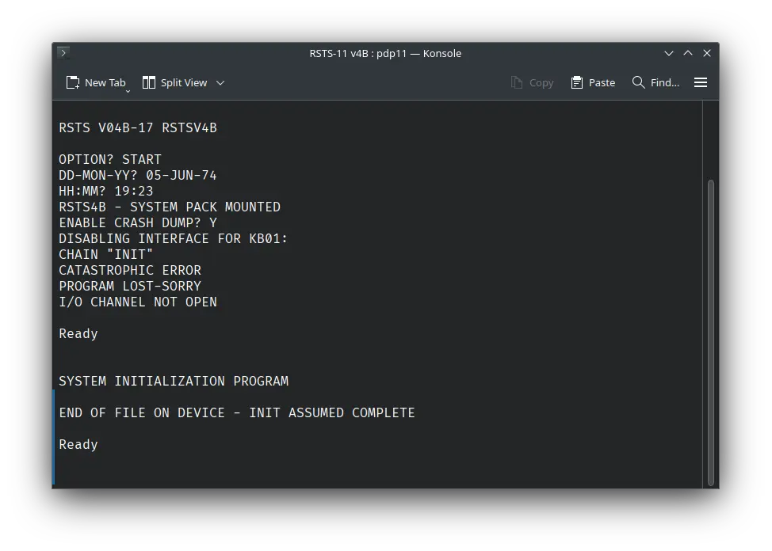
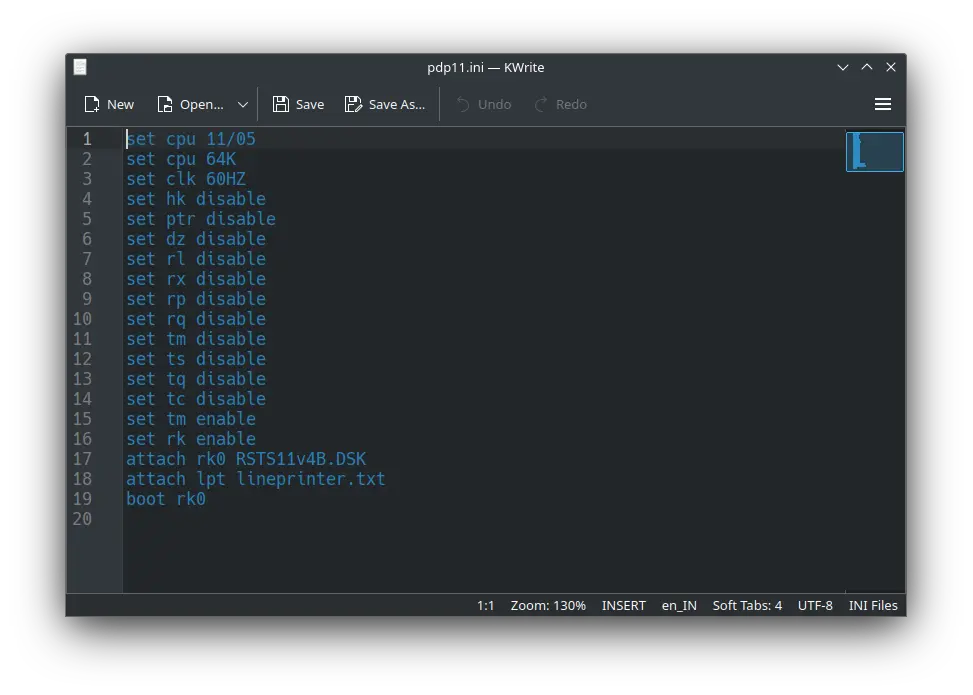
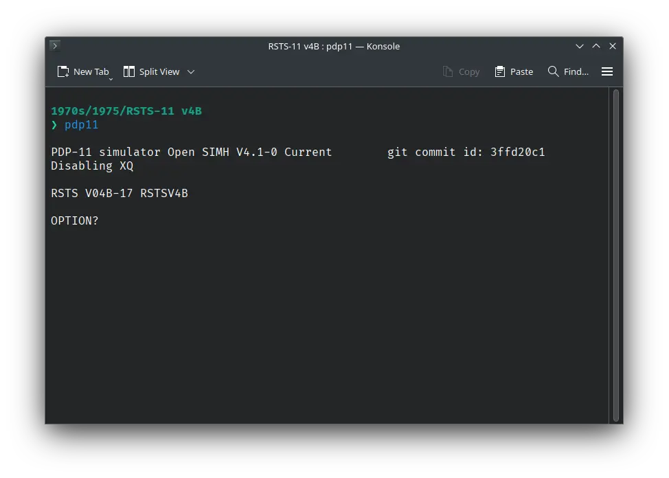
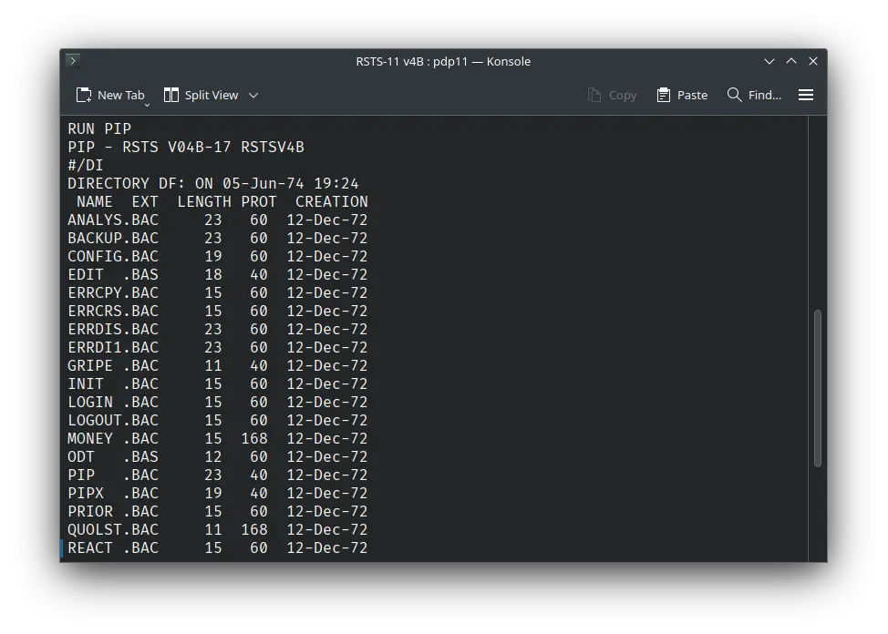

# How to install ! RSTS-11 v4B on SIMH?



We can run [! RSTS-11 v4B](/1970s/1975/rsts-11-v4b) on the SIMH PDP-11 emulator. First, we need to download the ! RSTS-11 v4B image.

## Downloads

:::tip

This tutorial covers how to use ! RSTS-11 v4B on SIMH PDP-11 emulator using a pre-installed image. If you want to manually install RSTS-11 v4B from its tape image, visit [this page](https://iamvirtual.ca/PDP-11/RSTS-11/Install.htm).

:::

You can download the image needed to run ! RSTS-11 v4B on the SIMH PDP-11 emulator from here:

- [! RSTS-11 v4B image](https://iamvirtual.ca/PDP-11/RSTS-11/RSTS11v4B.DSK)

## Using ! RSTS-11 v4B

:::tip

If you have not already installed SIMH PDP-11 emulator, see [the VirtualHub Setup tutorial on how to do so](https://setup.virtualhub.eu.org/simh-pdp11/) on Linux and Windows.

:::

Create a folder somewhere to store the files for this VM, and move the file named `RSTS11v4B.DSK` into it.

Now we will create a config file for our VM. Create a text file called `pdp11.ini` with the following content in the VM folder:

```ini
set cpu 11/05
set cpu 64K
set clk 60HZ
set hk disable
set ptr disable
set dz disable
set rl disable
set rx disable
set rp disable
set rq disable
set tm disable
set ts disable
set tq disable
set tc disable
set tm enable
set rk enable
attach rk0 RSTS11v4B.DSK
attach lpt lineprinter.txt
boot rk0
```



Now open a terminal and move to the VM folder. Run the following command to start the emulator:

```bash
pdp11
```



After the emulator starts, you will get a `OPTION?` prompt. Type `START` and press enter. Next, you will be asked for date. Provide the date in `DD-MMM-YY` format. For example, `05-JUN-74`. Try entering a date before the year 2000, to avoid problems related to [Y2K](https://en.wikipedia.org/wiki/Year_2000_problem).

After that, you will be asked for time. Enter the time in `HH:MM` format. For example, `19:23`. You will be asked if you want to enable crash dump. Type `Y` and press enter.


Now start PIP by executing `RUN PIP`. After PIP starts, you will get a `#` prompt. You can now type `/DI` followed by enter. It will list all the files available on the disk.



That's it! We used ! RSTS-11 v4B. We can create a shell script to make it easy to launch the VM.

### Linux

Create a file called `rsts-11-v4b.sh` with the following content:

```bash
#!/bin/bash
pdp11
```

Now make the file executable:

```bash
chmod +x rsts-11-v4b.sh
```

Now you can start the VM using the shell script. For example, on KDE you can right-click the file and choose `Run in Konsole` or on GNOME, where you can right-click the file and choose `Run as executable`. The VM will start.

See the [manuals section](/1970s/1975/rsts-11-v4b/#manuals) on the [main ! RSTS-11 v4B page](/1970s/1975/rsts-11-v4b) to learn how to use it.

### Windows

Create a file called `rsts-11-v4b.bat` with the following content:

```bash
pdp11
```

Now you can start the VM by double-clicking the shell script. See the [manuals section](/1970s/1975/rsts-11-v4b/#manuals) on the [main ! RSTS-11 v4B page](/1970s/1975/rsts-11-v4b) to learn how to use it.

## Credits

- The disk image and other files used above are from [https://iamvirtual.ca/PDP-11/RSTS-11/Install.htm](https://iamvirtual.ca/PDP-11/RSTS-11/Install.htm).

## Video tutorial

Do you want to follow the tutorial by watching a video? We will post a video on our [YouTube channel](https://www.youtube.com/@virtua1hub) soon.

Archives of this tutorial are available on [Wayback Machine](https://web.archive.org/web/*/https://virtualhub.eu.org/1970s/1975/rsts-11-v4b/simh/).
