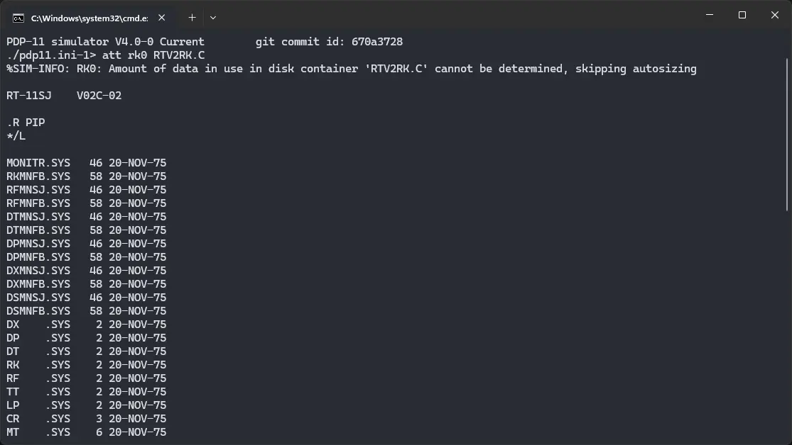

import DocCardList from '@theme/DocCardList';

# ! RT-11 v2

! RT-11 v2 was an operating system for the DEC PDP-11 computer. We can run it on SIMH PDP-11 emulator as well as the Ersatz-11 emulator.

<DocCardList />

## Manuals

You can download the ! RT-11 v2 manuals from here:

- [! RT-11 v2 System Reference Manual](http://www.bitsavers.org/pdf/dec/pdp11/rt11/v2c_Jan76/RT11v2C_SysRefJan1976.pdf)
- [! RT-11 v2 Software Support Manual](http://www.bitsavers.org/pdf/dec/pdp11/rt11/v2c_Jan76/DEC-11-ORPGA-B-D_RT11v2cSup.pdf)
- [! RT-11 v2 System Generation Manual](http://www.bitsavers.org/pdf/dec/pdp11/rt11/v2c_Jan76/DEC-11-ORGMA-A-D_RT11v2Sysg.pdf)
- [! RT-11 v2 Software Product Description](http://www.bitsavers.org/pdf/dec/pdp11/rt11/v2c_Jan76/DEC-11-XPDAS-D-D_V2C_SPD.pdf)
- [! RT-11 v2 System Release Notes](http://www.bitsavers.org/pdf/dec/pdp11/rt11/v2c_Jan76/DEC-11-ORNRA-A-D_V2C_RelNot.pdf)

You may also be interested in the PDP-11 manuals. It was the computer on which ! RT-11 was supposed to run. You can download them from Bitsavers:

- [PDP-11 Manuals](http://bitsavers.org/pdf/dec/pdp11/)

## Related Pages

- [VirtualHub Screenshots](https://screenshots.virtualhub.eu.org/1970s/1975/rt-11-v2/)
- [Computer History Wiki page](https://gunkies.org/wiki/RT-11)
- [Wikipedia page](https://en.wikipedia.org/wiki/RT-11)
- [Computer History Wiki PDP-11 page](https://gunkies.org/wiki/PDP-11)
- [Wikipedia PDP-11 page](https://gunkies.org/wiki/PDP-11)

## Credits

- The manuals were taken from [Bitsavers](http://bitsavers.org).
