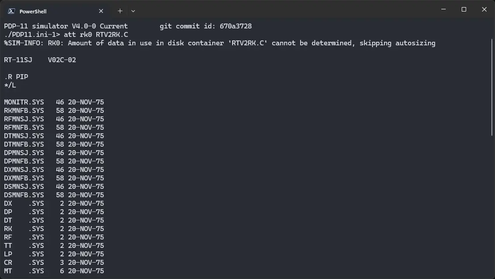
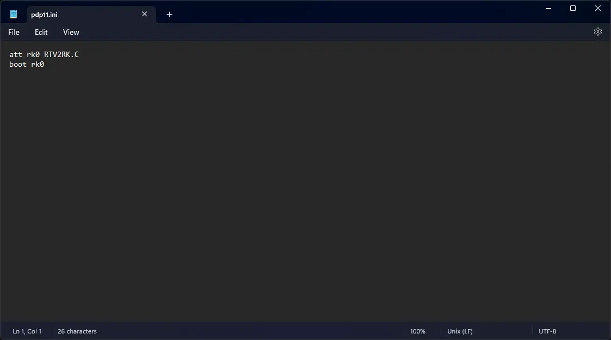
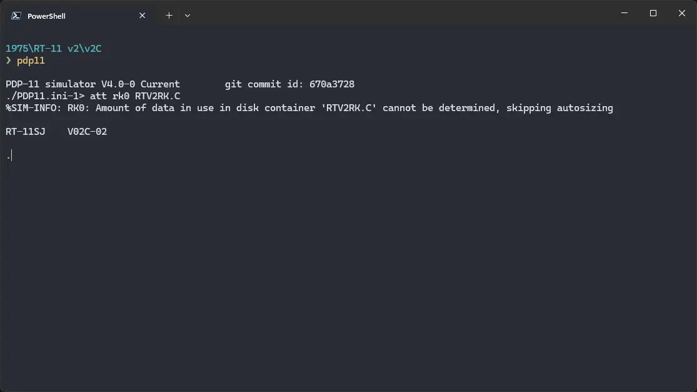

# How to install ! RT-11 v2 on SIMH?



We can run [! RT-11 v2](/1970s/1975/rt-11-v2) on the SIMH PDP-11 emulator. First, we need to download the ! RT-11 v2 image.

## Downloads

There are two different versions of RT-11 v2, whose image is available for us to use. They are RT-11 v2B and v2C. Both of them are mostly same, and you can use either. You can download the image needed to run ! RT-11 v2 on the SIMH PDP-11 emulator from here:

:::tip

These images come from [this ISO file](https://bitsavers.org/bits/DEC/pdp11/rt-11/Fine_RT-11_collection/RT11DV50.ISO.zip) on [bitsavers](https://bitsavers.org/). If you want, you can download the ISO file, and extract these images yourself.

:::

- [! RT-11 v2B image](https://github.com/InstallerLegacy/RT11DV50/raw/main/RTV2RK.B)
- [! RT-11 v2C image](https://github.com/InstallerLegacy/RT11DV50/raw/main/RTV2RK.C)

## Using ! RT-11 v2

:::tip

If you have not already installed SIMH PDP-11 emulator, see [the VirtualHub Setup tutorial on how to do so](https://setup.virtualhub.eu.org/simh-pdp11/) on Linux and Windows.

:::

Create a folder somewhere to store the files for this VM, and move the disk image file into it.

Now we will create a config file for our VM. Create a text file called `pdp11.ini` with the following content in the VM folder, if you chose the v2B image:

```ini
att rk0 RTV2RK.B
boot rk0
```

If you chose v2C instead, make your `pdp11.ini` file like this:

```ini
att rk0 RTV2RK.C
boot rk0
```



Now open a terminal and move to the VM folder. Run the following command to start the emulator:

```bash
pdp11
```



After the emulator starts, you will get a `.` prompt. Type `R PIP` and press enter to start PIP. Now run `/L` to get a list of files.


To exit PIP, press `Ctrl` + `C`. To exit the emulator, type `Ctrl` + `E`, and then run `exit`.

That's it! We used ! RT-11 v2. We can create a shell script to make it easy to launch the VM.

### Linux

Create a file called `rt-11-v2.sh` with the following content:

```bash
#!/bin/bash
pdp11
```

Now make the file executable:

```bash
chmod +x rt-11-v2.sh
```

Now you can start the VM using the shell script. For example, on KDE you can right-click the file and choose `Run in Konsole` or on GNOME, where you can right-click the file and choose `Run as executable`. The VM will start.

See the [manuals section](/1970s/1975/rt-11-v2/#manuals) on the [main ! RT-11 v2 page](/1970s/1975/rt-11-v2) to learn how to use it.

### Windows

Create a file called `rt-11-v2.bat` with the following content:

```bash
pdp11
```

Now you can start the VM by double-clicking the shell script. See the [manuals section](/1970s/1975/rt-11-v2/#manuals) on the [main ! RT-11 v2 page](/1970s/1975/rt-11-v2) to learn how to use it.

## Credits

- The disk image and other files used above were extracted from [this ISO file](https://bitsavers.org/bits/DEC/pdp11/rt-11/Fine_RT-11_collection/RT11DV50.ISO.zip) on [Bitsavers](https://bitsavers.org/).

## Video tutorial

Do you want to follow the tutorial by watching a video? We will post a video on our [YouTube channel](https://www.youtube.com/@virtua1hub) soon.

Archives of this tutorial are available on [Wayback Machine](https://web.archive.org/web/*/https://virtualhub.eu.org/1970s/1975/rt-11-v2/simh/).
