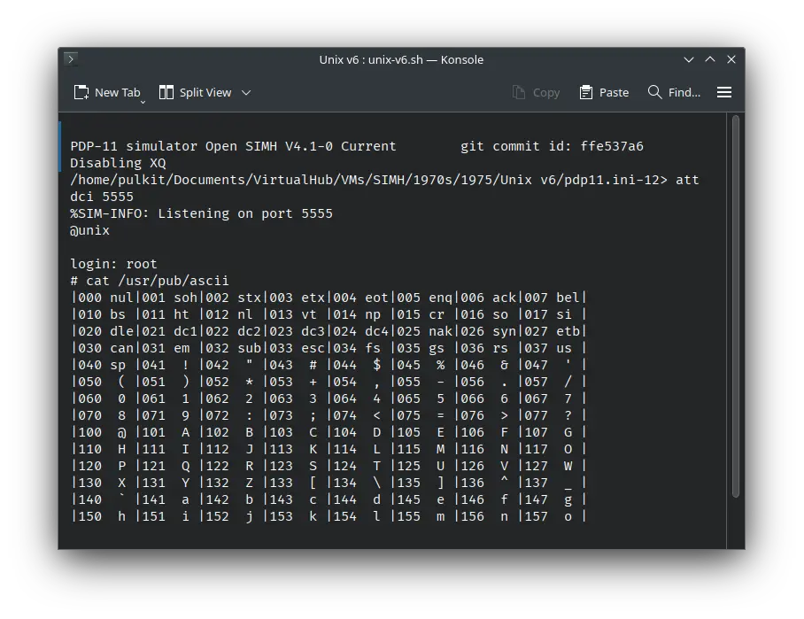

import DocCardList from '@theme/DocCardList';

# ! Unix v6

! Unix v6 was an operating system for the DEC PDP-11 computer. It was later ported to Interdata 7/32 computer. It was developed by Bell Labs. It can be used on SIMH PDP-11 and Interdata 7/32 emulators as well as the Ersatz-11 emulator.

<DocCardList />

For instructions on how to install ! Unix v6 on Ersatz-11 emulator, see the [Related Pages section](#related-pages) below.
 
## Manuals

Here is the manual for ! Unix v6:

- [! Unix Programmer's Manual, 6th Edition](http://squoze.net/UNIX/v6man/all.pdf)

There were a bunch of short documents for use with ! Unix v6. Some of them are available today:

- [Unix for Beginners](http://squoze.net/UNIX/v6/files/doc/beg.pdf)
- [A Tutorial Introduction to the Unix Text Editor](http://squoze.net/UNIX/v6/files/doc/ed.pdf)
- [Programming in C − A Tutorial](http://squoze.net/UNIX/v6/files/doc/ctut.pdf)
- [C Reference Manual](http://squoze.net/UNIX/v6/files/doc/c.pdf)
- [Unix Assembler Reference Manual](http://squoze.net/UNIX/v6/files/doc/as.pdf)
- [The Unix I/O System](http://squoze.net/UNIX/v6/files/doc/iosys.pdf)
- [YACC − Yet Another Compiler-Compiler](http://squoze.net/UNIX/v6/files/doc/yacc.pdf)
- [Setting Up Unix - Sixth Edition](http://squoze.net/UNIX/v6/files/doc/start.pdf)
- [The Unix Time-Sharing System](http://squoze.net/UNIX/v6/files/doc/unix.pdf)

Many of the other short documents are not available today, but they are available in the volume 2A and 2B of ! Unix v7 manual. While the manual is for v7, most of the information included there applies to every version of Unix.

- [! Unix Programmer's Manual, 7th Edition, Volume 2A](https://s3.amazonaws.com/plan9-bell-labs/7thEdMan/v7vol2a.pdf)
- [! Unix Programmer's Manual, 7th Edition, Volume 2B](https://s3.amazonaws.com/plan9-bell-labs/7thEdMan/v7vol2b.pdf)

You may also be interested in the PDP-11 manuals. It was the computer on which ! Unix v6 was supposed to run. You can download them from Bitsavers:

- [PDP-11 Manuals](http://bitsavers.org/pdf/dec/pdp11/)

A famous book about the ! Unix v6 source code is "A Commentary on the Sixth Edition Unix Operating System" by J. Lions. You can download the book and the associated source code booklet from here:

- [A Commentary on the Sixth Edition Unix Operating System](http://www.lemis.com/grog/Documentation/Lions/book.pdf)
- [Source Code Booklet](http://v6.cuzuco.com/v6.pdf)

### Interdata 7/32-specific Documentation

These documents were extracted from the Interdata 7/32 Unix port's installation, and converted to PDF. They only cover the differences in the Interdata 7/32 port. For the full manuals, see above.

- [! Unix Programmer's Manual, 6th Edition](https://archive.org/download/unix_v6_id32_docs/man.pdf)
- [Programming in C − A Tutorial](https://archive.org/download/unix_v6_id32_docs/ctut.pdf)
- [C Reference Manual](https://archive.org/download/unix_v6_id32_docs/cman.pdf)
- [A tour through the Unix C compiler](https://archive.org/download/unix_v6_id32_docs/cdoc.pdf)
  - [A new Input-Output package](https://archive.org/download/unix_v6_id32_docs/ios.pdf)
  - [New C Compiler Features](https://archive.org/download/unix_v6_id32_docs/newstuff.pdf)

## Related Pages

- [VirtualHub Screenshots](https://screenshots.virtualhub.eu.org/1970s/1975/unix-v6/)
- [Run ! Unix v6 in your web browser](http://takahirox.github.io/pdp11-js/unixv6.html) (Instructions on page)
- [Run ! Unix v6 on Ersatz-11 Emulator](http://mercury.lcs.mit.edu/~jnc/tech/V6Unix.html)
- [Wikipedia](https://en.wikipedia.org/wiki/Version_6_Unix)
- [Wikipedia PDP-11 page](https://en.wikipedia.org/wiki/PDP-11)
- [Computer History Wiki ! Unix v6 page](https://gunkies.org/wiki/UNIX_Sixth_Edition)
- [Computer History Wiki PDP-11 page](https://gunkies.org/wiki/PDP-11)
- [The Unix Heritage Society (TUHS) wiki page on ! Unix v6](https://wiki.tuhs.org/doku.php?id=systems:6th_edition)
- [Computer History Wiki tutorial on running ! Unix v6 on SIMH](https://gunkies.org/wiki/Installing_UNIX_v6_(PDP-11)_on_SIMH)
- [Tutorial from squoze.net on running ! Unix v6 on SIMH](http://squoze.net/UNIX/v6/installation)

## Credits

- The manuals were taken from [http://squoze.net](http://squoze.net/), [this page from Bell Labs](https://s3.amazonaws.com/plan9-bell-labs/7thEdMan/bswv7.html) and [Bitsavers](http://bitsavers.org).

- The Lions book is available from [http://www.lemis.com/](http://www.lemis.com/) and the associated source code booklet from [http://v6.cuzuco.com/](http://v6.cuzuco.com/).
