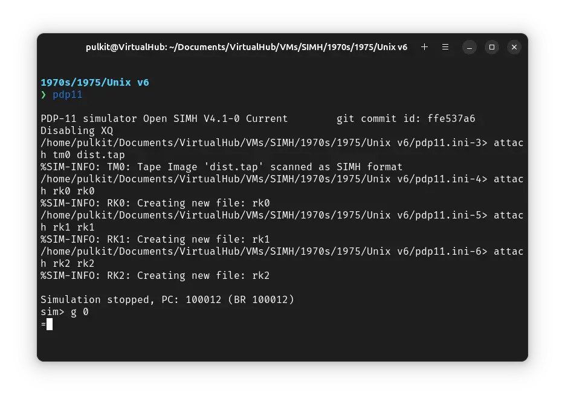
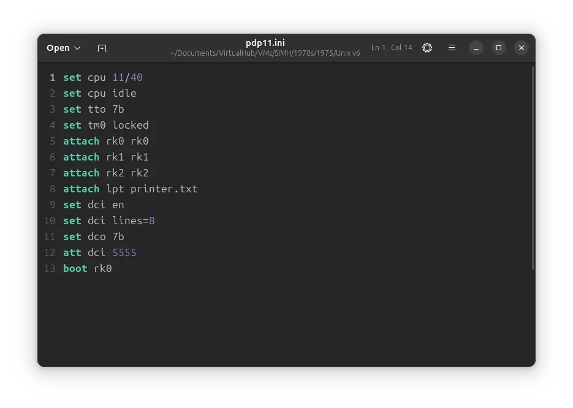

# How to install ! Unix v6 on SIMH PDP-11 emulator?


We can run ! Unix v6 on the SIMH PDP-11 emulator. First, we need to download the ! Unix v6 tape.

## Downloads

You can download the tape needed to run ! Unix v6 on the SIMH PDP-11 emulator from the [squoze.net](http://squoze.net/) website:

- [! Unix v6 tape](http://squoze.net/UNIX/v6/files/dist.tap)

## Installing ! Unix v6

:::tip

If you have not already installed SIMH PDP-11 emulator, see [the VirtualHub Setup tutorial on how to do so](https://setup.virtualhub.eu.org/simh-pdp11/) on Linux and Windows.

:::

Create a folder somewhere to store the files for this VM and move the `dist.tap` file into it.

Now we will create a temporary config file for our VM. Create a text file called `pdp11.ini` with the following content in the VM folder:

```ini
set cpu 11/40
set tm0 locked
attach tm0 dist.tap
attach rk0 rk0
attach rk1 rk1
attach rk2 rk2
d cpu 100000 012700
d cpu 100002 172526
d cpu 100004 010040
d cpu 100006 012740
d cpu 100010 060003
d cpu 100012 000777
g 100000
```


Now open a terminal and move to the VM folder. Run the following command to start the emulator:

```bash
pdp11
```


After the emulator starts, press `Ctrl` + `e`. You will get a `sim>` prompt. Type `g 0` to start the emulation.



You will get an `=` prompt. Type `tmrk` and press enter. When asked for disk offset, type `0` and press enter. For tape offset, enter `100` and for count `1`.


You will get back to an `=` prompt. Run `tmrk` again. This time, for disk offset, enter `1`, for tape offset `101` and for count `3999`.


We have successfully copied the base ! Unix files to our disk. Now press `Ctrl` + `e` and enter `exit` to quit the emulator.


Now we modify the `pdp11.ini` file and make it as follow:

```ini
set cpu 11/40
set tto 7b
set tm0 locked
attach tm0 dist.tap
attach rk0 rk0
attach rk1 rk1
attach rk2 rk2
dep system sr 173030
boot rk0
```


Once again, open a terminal and move to the VM folder. Run the following command to start the emulator:

```bash
pdp11
```


At the `@` prompt, type `rkunix` and press enter. ! Unix will start.


Now we will rebuild the kernel to support the devices supported bu SIMH. First run `STTY -LCASE` to make ! Unix use lowercase. Now run the following commands (pressing enter after each lines) to build the mkconf executable:

```bash
chdir /usr/sys/conf
cc mkconf.c
mv a.out mkconf
```


Now we will use mkconf. Run `mkconf` and then type the following, pressing enter after each line:

```bash
rk
tm
tc
8dc
lp
done
```


We will now build the kernel and move it to root. Run the following commands:

```bash
as m40.s
mv a.out m40.o
cc -c c.c
as l.s
ld -x a.out m40.o c.o ../lib1 ../lib2
mv a.out /unix
```


To verify that the kernel is successfully installed in root, run the following command:

```bash
ls -l /unix
```


We will configure the device files now. Run the following commands one by one:

```bash
/etc/mknod /dev/rk0 b 0 0
/etc/mknod /dev/rk1 b 0 1
/etc/mknod /dev/rk2 b 0 2
/etc/mknod /dev/mt0 b 3 0
/etc/mknod /dev/tap0 b 4 0
/etc/mknod /dev/rrk0 c 9 0
/etc/mknod /dev/rrk1 c 9 1
/etc/mknod /dev/rrk2 c 9 2
/etc/mknod /dev/rmt0 c 12 0
/etc/mknod /dev/lp0 c 2 0
/etc/mknod /dev/tty0 c 3 0
/etc/mknod /dev/tty1 c 3 1
/etc/mknod /dev/tty2 c 3 2
/etc/mknod /dev/tty3 c 3 3
/etc/mknod /dev/tty4 c 3 4
/etc/mknod /dev/tty5 c 3 5
/etc/mknod /dev/tty6 c 3 6
/etc/mknod /dev/tty7 c 3 7
chmod 640 /dev/*rk*
chmod 640 /dev/*mt*
chmod 640 /dev/*tap*
```


We will copy the source and documentation of ! Unix v6 from the tape to disks now. Run the following commands:

```bash
dd if=/dev/mt0 of=/dev/rk1 count=4000 skip=4100
/etc/mount /dev/rk1 /usr/source
dd if=/dev/mt0 of=/dev/rk2 count=4000 skip=8100
mkdir /usr/doc
```


We will add configuration to mount the source and doc disk to correct location on each boot. To do so, run `cat >> /etc/rc` and then type the following two lines (pressing enter after each line):

```bash
/etc/mount /dev/rk1 /usr/source
/etc/mount /dev/rk2 /usr/doc
```

Then press `Ctrl` + `D`.


Now we will rebuild the `df` command. To configure `df`, run `chdir /usr/source/s1` to change to appropriate directory, and then run `ed df.c`. Then type the following lines, pressing enter after each line (taking care of the whitespace):

```bash
/rp0/d
.-2a
  "/dev/rk0",
  "/dev/rk1",
.
w
q
```

Then compile `df` by running `cc -s -O df.c`. Then run the following commands to install it in the correct location:

```bash
cp a.out /bin/df
rm a.out
```


You can check the filesystem by running these commands:

```bash
icheck /dev/rrk0
dcheck /dev/rrk0
icheck /dev/rrk1
dcheck /dev/rrk1
icheck /dev/rrk2
dcheck /dev/rrk2
```


At last we will enable multiuser access for ! Unix. Run `ed /etc/ttys`, and type the following lines, pressing enter after each line:

```bash
1,8s/^0/1/p
w
q
```


That's it. Now run `sync` a few times, and then press `Ctrl` + `e` to pause the emulation. Enter `exit` to quit the emulator

We have successfully installed ! Unix v6. Now you can delete the `pdp11.ini` and `dist.tap` file.

## Running Unix v6

Create a fresh `pdp11.ini` file with the following contents:

```ini
set cpu 11/40
set cpu idle
set tto 7b
set tm0 locked
attach rk0 rk0
attach rk1 rk1
attach rk2 rk2
attach lpt printer.txt
set dci en
set dci lines=8
set dco 7b
att dci 5555
boot rk0
```



Open a terminal and move to the VM folder. Run the following command to start the emulator:

```bash
pdp11
```

At the `@` prompt, type `unix` and press enter. ! Unix v6 will start.

You will be asked to log in. Type `root` and press enter to log in. There is no password.


You can now run `ls` to see the list of files. To change directory, you need to use the `chdir` command, `cd` is not available.


That's it! We used ! Unix v6. We can create a shell script to make it easy to launch the VM.

### Linux

Create a file called `unix-v6.sh` with the following content:

```bash
#!/bin/bash
pdp11
```

Now make the file executable:

```bash
chmod +x unix-v6.sh
```

Now you can start the VM using the shell script. For example, on KDE you can right-click the file and choose `Run in Konsole` or on GNOME, where you can right-click the file and choose `Run as executable`. The VM will start.

See the [manuals section](/1970s/1975/unix-v6/#manuals) on the [main ! Unix v6 page](/1970s/1975/unix-v6) to learn how to use it.

### Windows

Create a file called `unix-v6.bat` with the following content:

```bash
pdp11
```

Now you can start the VM by double-clicking the shell script. See the [manuals section](/1970s/1975/unix-v6/#manuals) on the [main ! Unix v6 page](/1970s/1975/unix-v6) to learn how to use it.

## Credits

- The tape image above are from the [squoze.net](http://squoze.net/) website.
- This tutorial is based on [Computer History Wiki tutorial on running ! Unix v6 on SIMH](https://gunkies.org/wiki/Installing_UNIX_v6_(PDP-11)_on_SIMH).

## Video tutorial

Do you want to follow the tutorial by watching a video? We will post a video on our [YouTube channel](https://www.youtube.com/@virtua1hub) soon.

Archives of this tutorial are available on [Wayback Machine](https://web.archive.org/web/*/https://virtualhub.eu.org/1970s/1975/unix-v6/simh/).
