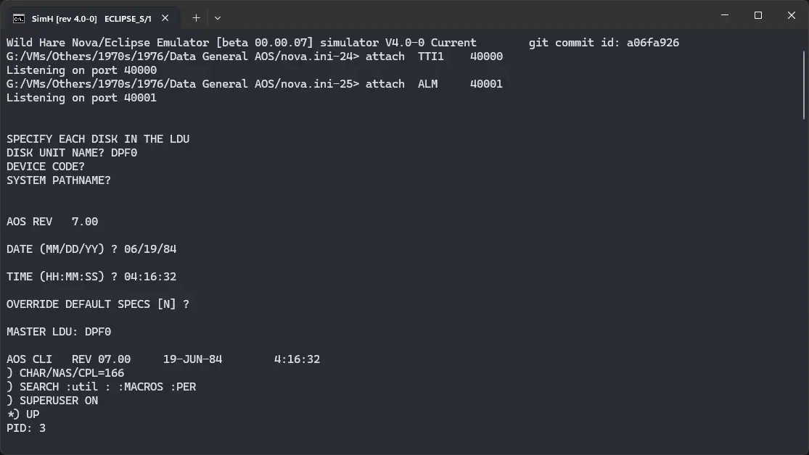

# ! Data General AOS

import DocCardList from '@theme/DocCardList';

! Data General AOS, as the name suggests, was an operating system for the Data General computers. We can run it using the Wild Hare emulator.

<DocCardList />

## Manuals

You can download the ! Nova RDOS manuals from here:

- [! AOS User Self Study Course](http://www.novasareforever.org/archive/public/docs/dg/sw/os/aos/053-000032-00__AOS_AOS-VS_User_Self-Study_Course__1982-1984.pdf)
- [! AOS Operator Self Study Course](http://www.novasareforever.org/archive/public/docs/dg/sw/os/aos/053-000045-00__AOS_AOS-VS_Operator_Self-Study_Course__1983.pdf)
- [Introduction to ! AOS](http://www.novasareforever.org/archive/public/docs/dg/sw/os/aos/069-000016-01__Introduction_to_the_AOS__1976-1984.pdf)
- [Learning to use your ! AOS](http://www.novasareforever.org/archive/public/docs/dg/sw/os/aos/069-000018-02__Learning_to_Use_Your_AOS__1978-1983.pdf)
- [Using ! AOS on desktop generating systems](http://www.novasareforever.org/archive/public/docs/dg/sw/os/aos/069-000058-01A__Using_AOS_on_Desktop_Generation_Systems__1983-1984.pdf)
- [! AOS Programmer's Manual](http://www.novasareforever.org/archive/public/docs/dg/sw/os/aos/093-000120-05__AOS_Programmers_Manual__1976-1984.pdf)
- [! AOS CLI Manual](http://www.novasareforever.org/archive/public/docs/dg/sw/os/aos/093-000122-07__CLI_Users_Manual_AOS_and_AOS-VS.pdf)
- [! AOS User's Handbook](http://www.novasareforever.org/archive/public/docs/dg/sw/os/aos/093-000150-02__AOS_and_AOS-VS_Users_Handbook__1978-1982.pdf)
- [! AOS Binder User's Manual](http://www.novasareforever.org/archive/public/docs/dg/sw/os/aos/093-000190-03__AOS_Binder_Users_Manual__1984.pdf)
- [! AOS Shared Library Builder User's Manual](http://www.novasareforever.org/archive/public/docs/dg/sw/os/aos/093-000191-02__AOS_Shared_Library_Builder_Users_Manual__1976-1978.pdf)
- [! AOS MASM Reference Manual](http://www.novasareforever.org/archive/public/docs/dg/sw/os/aos/093-000192-04__AOS_Macroassembler_MASM_Reference__1976-1984.pdf)
- [! AOS Debugger and DIsk FIle Editor User's Manual](http://www.novasareforever.org/archive/public/docs/dg/sw/os/aos/093-000195-03__AOS_Debugger_and_Disk_File_Editor__1976-1984.pdf)
- [! AOS Speed Text Editor User's Manual](http://www.novasareforever.org/archive/public/docs/dg/sw/os/aos/093-000197-03__SPEED_Text_Editor_Users_Manual_AOS_and_AOS-VS__1976-1980.pdf)
- [How to generate and run ! AOS](http://www.novasareforever.org/archive/public/docs/dg/sw/os/aos/093-000217-06__How_to_Generate_and_Run_AOS__1985.pdf)
- [! AOS SED text editor User's Manual](http://www.novasareforever.org/archive/public/docs/dg/sw/os/aos/093-000249-02__SED_Text_Editor_Users_Manual_AOS_and_AOS-VS__1980-1984.pdf)
- [! AOS LFE User's Manual](http://www.novasareforever.org/archive/public/docs/dg/sw/os/aos/093-000254-02__AOS_Link_and_Library_File_Editor_LFE_Users_Manual__1979-1984.pdf)
- [! AOS SWAT Debugger User's Manual](http://www.novasareforever.org/archive/public/docs/dg/sw/os/aos/093-000258-01A__SWAT_Debugger_Users_Manual__1982.c.p.pdf)
- [! AOS SWAT Debugger User's Manual Addendum](http://www.novasareforever.org/archive/public/docs/dg/sw/os/aos/086-000045-00__Addendum_to_SWAT_Debugger_Users_Manual_093-000258-01__1982.c.pdf)

You may be interested in the Data General computers' manuals. They were the computers on which ! Nova RDOS was supposed to run. You can download them from here:

- [Data General Hardware Manuals](http://www.novasareforever.org/dgdocs.hw/)

## Related Pages

- [VirtualHub Screenshots](https://screenshots.virtualhub.eu.org/1970s/1976/dg-aos/)
- [Data General Eclipse Wikipedia Page](https://en.wikipedia.org/wiki/Data_General_Eclipse)
- [Data General Eclipse Computer History Wiki page](https://gunkies.org/wiki/Data_General_Eclipse)
- [History of Nova - Wild Hare Legacy Preservation Website](http://www.novasareforever.org/gallery/index.php?nova)

## Credits

- The manuals were taken from [Wild Hare Legacy Preservation Website](http://www.novasareforever.org).
